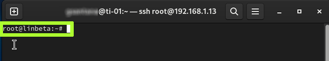
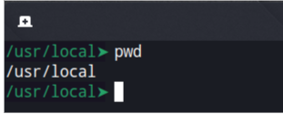
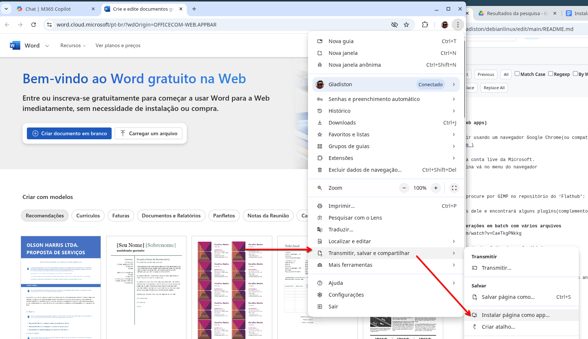

# PREPARAÇÃO DO AMBIENTE UBUNTU PARA DESENVOLVEDORES E PROFISSIONAIS DE TI

Este documento tem como objetivo preparar um ambiente Ubuntu sólido e funcional para desenvolvedores, administradores de sistemas e demais profissionais de TI.  
Não se trata apenas de uma sequência de comandos — aqui você também entenderá **como e por que** cada parte do sistema é configurada da maneira proposta.

A ideia é que, ao final, você não apenas tenha um ambiente pronto para trabalhar, mas também compreenda o que está por trás de cada ajuste:  
desde o gerenciamento de pacotes e permissões, até a montagem de partições, configuração de compartilhamentos de rede e automação de tarefas.  

Quando chegar ao final do artigo desde a intalação e apenas pulando o que realmente não necessita em seu computador, então parabens, você fez a jornada do heroi e podemos dizer que você é um usuário avançado de Linux.  

Cada seção foi escrita para ser **autoexplicativa e prática**, apresentando o comando, o motivo de usá-lo e o que esperar de seu resultado.  
Assim, mesmo que você esteja acostumado a copiar instruções da internet, este guia vai além — ele busca **fortalecer seu entendimento** sobre o funcionamento do sistema Linux e seus principais utilitários.

As instruções foram testadas em versões recentes do Ubuntu (25.10 e derivadas), mas também servem como referência para outras distribuições baseadas em Debian.  
O foco é a eficiência, a estabilidade e o domínio do ambiente de desenvolvimento, sem depender de ferramentas gráficas para tarefas que podem (e devem) ser entendidas pelo terminal.

Prepare-se para não apenas configurar o seu sistema, mas **aprender o Linux de verdade**, enquanto monta um ambiente de trabalho robusto e otimizado para o dia a dia.  

---

## Sobre o particionamento (Btrfs vs ext4)
Se o seu foco for virtualização e você pretende usar snapshots (recurso em que o Btrfs brilha), o Btrfs pode ser excelente — mas há nuances para VMs (desempenho, CoW, layout de subvolumes) que exigem atenção.
Se você não precisa de snapshots ou prefere o caminho mais simples, ext4 é uma escolha direta e estável. No tópico específico de Btrfs explico quando e por que usá-lo (e como ajustar para uso de VMs).  
Se possivel, todas as partições que contêm dados importantes devem ter um *label* como #dados1, #dados2, #disco1, #home e assim por diante, sempre sendo fáceis de serem identificados quando executarmos o comando **lsblk -f**. Colocar labels em disco é vida!  

---

## Como usar este guia
A proposta deste guia não é **decorar comandos**, mas servir como um **repositório pessoal de referência**.  
Você lê este guia passo a passo e além de instalar, aprende para quê servem o que está instalando.  

Embora você possa ler este Guia passo a Passo diretamente do github, existe a opção de baixá-lo para lê-lo offline caso precise, eu recomendo fortemente que você **clone este projeto** localmente porque eu usei imagens nela e o github em planos gratuítos tem um limite mensal então se por acaso este limite for ultrapassado, não irá ver as imagens. Para clonar, execute:  
```bash
git clone https://github.com/gladiston/debianlinux.git
```
Para ler, execute:  
```bash
sudo apt install grip -y
cd debianlinux
grip
```
Você verá algo como:  
> * Serving Flask app 'grip.app'  
> * Debug mode: off  
> * Running on http://localhost:6419  

Então no seu navegador, aponte para o endereço acima e verá o conteúdo desse guia.  Pessoalmente eu gosto do jeito que o github renderiza porque eles colocam um botão de copiar que economiza tempo e a renderização local não faz isso. Em contrapartida, numa cópia local, você verá sempre as imagens sem depender dos limites impostos pelo github.  

A propósito, sinta-se à vontade para **adaptar os scripts ao seu cenário** pulando o que for indesejado.  

---

## Resultado esperado
Um sistema previsível e repetível, com configurações documentadas, pronto para trabalho diário, testes e virtualização.

---

## Os padrões usados neste guia
Para o correto entendimento deste guia, usarei alguns padrões:  
**Nome do host**: ti-01  
**Nome do usuário**: gsantana  
**Nome do dominio local**: localdomain.lan  
**Debian-Like**: É o termo que uso para distro Linux baseadas em Debian que pode se referir aos vários sabores do Ubuntu e também Linux Mint, Zorin OS,... quando algo for específico para o Debian, irei realçar.   
**Ubuntu-Like**: É o termo que uso para distro Linux baseadas em Ubuntu que pode se referir aos vários sabores do Ubuntu e também Linux Mint, Zorin OS,...   
**HowTo**: É o termo que designamos para este guia passo-a-passo.    

As vezes, comandos que precisam ser executados no terminal são mesclados com o texto da saída do comando, quando isso acontecer, para que você diferencie, qual que é o comando e qual é a saída de texto dele, os comandos serão precedidos de "$", por exemplo:  
```
$ sudo apt update -y
Obter:1 https://dl.google.com/linux/chrome/deb stable InRelease [1.825 B]
Obter:2 https://dl.google.com/linux/chrome/deb stable/main amd64 Packages [1.210 B]                                           
Atingido:3 http://archive.ubuntu.com/ubuntu questing InRelease                                             
Atingido:4 http://security.ubuntu.com/ubuntu questing-security InRelease
Atingido:5 http://archive.ubuntu.com/ubuntu questing-updates InRelease
Atingido:6 http://archive.ubuntu.com/ubuntu questing-backports InRelease
Obter:7 http://archive.ubuntu.com/ubuntu questing/main Translation-pt_BR [349 kB]
Obter:8 http://archive.ubuntu.com/ubuntu questing/main Translation-pt [161 kB]
Obter:9 http://archive.ubuntu.com/ubuntu questing/universe Translation-pt [823 kB]
Obter:10 http://archive.ubuntu.com/ubuntu questing/universe Translation-pt_BR [1.668 kB]
Obter:11 http://archive.ubuntu.com/ubuntu questing/restricted Translation-pt_BR [584 B]
Obter:12 http://archive.ubuntu.com/ubuntu questing/restricted Translation-pt [588 B]
Obter:13 http://archive.ubuntu.com/ubuntu questing/multiverse Translation-pt [7.720 B]
Obter:14 http://archive.ubuntu.com/ubuntu questing/multiverse Translation-pt_BR [18,3 kB]
Obtidos 3.031 kB em 4s (848 kB/s)                                              
Todos os pacotes estão atualizados.         
Nota: Algumas fontes podem ser modernizadas. Execute 'apt modernize-sources' para fazer isso.
```

---

## NOTEBOOKs DA LINHA ACER NITRO
Se tiver um ACER NITRO ou outro computador similar com “Secure Boot”, siga essas instruções:  

[Se tiver um ACER NITRO, siga as instruções aqui](https://github.com/gladiston/fedorainstallonacernitro)

---

## UBUNTU vs DEBIAN: Qual Escolher para Sua Produtividade?
As duas distribuições mais influentes no ecossistema Linux são **Debian** e **Ubuntu**, sendo o Ubuntu uma derivação direta do Debian otimizada para usuários domésticos e corporativos.  Você conhece as diferenças? Qual escolher para sua produtividade?  No link abaixo, respondo esta pergunta.  


[UBUNTU vs DEBIAN: Qual Escolher para Sua Produtividade?](docs/debian_ubuntu.md)  

---

## GNOME ou KDE PLASMA: Qual Ambiente de Trabalho Escolher?
Em sistemas Linux, o **ambiente de trabalho** (ou **Desktop Environment - DE**) é a camada gráfica que interage diretamente com o usuário. Diferentemente do Windows ou macOS, que possuem uma interface fixa, **Linux oferece múltiplas opções de ambientes gráficos**, cada um com filosofia, funcionalidade e estética próprias. As mais populares no Linux são: KDE e GNOME, mas qual as diferenças?

Curioso para saber minha opinião? Clique  no link abaixo:  
[GNOME ou KDE PLASMA: Qual Ambiente de Trabalho Escolher?](docs/debian_kde_gnome.md)  


---

## PARTICIONAMENTO DURANTE A INSTALAÇÃO DO DEBIAN/UBUNTU
A instalação do Debian/Ubuntu não tem grandes mistérios — o ponto mais delicado é mesmo o **particionamento do disco**.  
No link abaixo explico melhor essa questão, é bom que leia antes de fazer a instalação. Segue:  

[Particionamento durante a instalação do Debian/Ubuntu](docs/debian_part.md)  


---

## 'SUDO' - SOMENTE PARA O DEBIAN  
O sudoers e seu utilitário de linha de comando chamado `sudo` é o responsável por elevar as permissões do usuário para que ele consiga executar comandos que apenas o **root** teria acesso.  

Por padrão, o usuario comum não é do mesmo grupo do `sudo`, isso impossibilitará de usar o comando `sudo`, vamos resolver essa situação.  

Se você está usando o Debian, é imprescindivel que façamos isso, siga as orientações abaixo:  
[Fazendo a configuração do sudoers no Debian](docs/debian_sudoers_user.md).  

---  

## 'SUDO' - PERSONALIZANDO OPÇÕES
O sudoers e seu utilitário de linha de comando chamado `sudo` é o responsável por elevar as permissões do usuário para que ele consiga executar comandos que apenas o **root** teria acesso.  Se você é desenvolver ou administrador de sistemas, tem duas opções que flexibiizam o uso do comando `sudo`, e vou demonstrar cada uma delas.

Se você gostaria de personalizar as opções do sudoers, siga as orientações abaixo:  
[Fazendo a configuração do sudoers no Debian](docs/debian_sudoers_opt.md).  

---  

## PERMISSÃO AO JOURNAL 
O journal é o mecanismo de logs do systemd. Ele registra praticamente tudo o que ocorre no sistema — mensagens do kernel, inicialização de serviços, eventos de segurança, entre outros. Antigamente, esses registros eram armazenados em simples arquivos texto (como /var/log/syslog), acessíveis a qualquer usuário. Hoje, o journal é um serviço binário centralizado com restrições de acesso.
Essa restrição afeta alguns comandos como o **systemctrl status [serviço]**, veja este exemplo:  
```bash
systemctl status systemd-journald
```
Se você observar um aviso como este:
> Warning: some journal files were not opened due to insufficient permissions.

É porque o Debian explicita a mensagem, mas outras distros derivativas do Debian como os sabores do Ubuntu, LinuxMint, ZorinOS e assim por diante, podem tanto já vir com esse problema corrigido como também simplesmente não mostrar logs em comandos como o `systemctrl` e isso não é bom. Então o que iremos fazer é verificar se temos acesso ao **journal** e se não tivermos, iremos acrescentar.

[Concedendo acesso ao journal](docs/debian_journal.md).  

---  

## BACKUP/RESTORE DA CONFIGURAÇÃO ORIGINAL DE REDE
Vamos ser cautelosos e fazer um backup de nossa configuração de rede atual, assim se algo der errado, restauramos.

É imprescindivel que façamos isso, siga as orientações abaixo:  
[Fazendo o backup da configuração de rede](docs/debian_backup_restore_network.md).  

---  

## BLOQUEIO DE TELA AUTOMÁTICO
O sistema normalmente é ajustado automaticamente para bloquear após 5 minutos de atividade, mas ‘falta de atividade’ é um termo incorreto, o correto seria ‘tempo sem interatividade’, isto é, o tempo que você fica sem ter que interagir com o computador. Às vezes estamos processando algo demorado e temos de esperar ou acompanhar a movimentação de log de status e o computador durante este tempo estará tendo muito trabalho, porém com pouca interatividade, a tela será bloqueada. Então precisamos saber quanto tempo precisamos nas tarefas do dia a dia ou então desligá-la.  

Neste guia passo a passo, em algumas opotunidades ficará sem interatividade esperando downloads e aguardando procedimentos serem finalizados, então é uma boa ideia fazer esse ajuste agora.  Então, este é um bom momento para ajustá-la, siga as instruções:  

[Ajustando o bloqueio de tela automático](docs/debian_lock_screen.md).  

---  

## INSTALANDO O GOOGLE CHROME
Cada distro geralmente acompanha seu próprio navegador, mas geralmente é o Firefox. No entanto, o Google Chrome é muito popular e, de fato, alguns sites só funcionam bem com o motor dele, por essa razão recomendo sua instalação, siga as instruções no link abaixo:    
[Instalando o Google Chrome](docs/debian_google_chrome.md).  

---  

## INSTALANDO O MICROSOFT EDGE
Algumas pessoas são apaixonados pelo navegador da Microsoft, se este é o seu caso, o navegador Microsoft Edge também está disponível para Linux, os procedimentos de instalação são similares ao Google Chrome, o que muda é basicamente o link para download, então se for do seu interesse obter este navegador então siga as instruções no link abaixo:  

[Instalando o Microsoft EDGE](docs/debian_msedge.md).  

---  

## ADICIONANDO OS REPOSITORIOS 'CONTRIB' e 'NON-FREE' NO DEBIAN (SOMENTE PARA DEBIAN)

Primeiro, vamos fazer um backup do arquivo original sources.list:
```
sudo cp /etc/apt/sources.list /etc/apt/sources.list.ori
```
Depois edite o arquivo sources.list:
```
sudo editor /etc/apt/sources.list
```

A depender do repositório que escolheu durante a instalação, o sources.list estará parecido como este:  
>deb http://deb.debian.org/debian/ trixie main non-free-firmware  
>deb-src http://deb.debian.org/debian/ trixie main non-free-firmware  
>deb http://security.debian.org/debian-security trixie-security main non-free-firmware  
>deb-src http://security.debian.org/debian-security trixie-security main non-free-firmware  
>  
>\# trixie-updates, to get updates before a point release is made;  
>\# see https://www.debian.org/doc/manuals/debian-reference/ch02.en.html#_updates_and_backports  
>deb http://deb.debian.org/debian/ trixie-updates main non-free-firmware  
>deb-src http://deb.debian.org/debian/ trixie-updates main non-free-firmware  

Como poderá notar, em cada linha cita **main** e  **non-free-firmware**, precisaremos acrescenter às essas linhas também os repositórios **contrib** e **non-free** na mesma linha, ficando assim:
```
deb http://deb.debian.org/debian/ trixie main non-free-firmware contrib non-free 
deb-src http://deb.debian.org/debian/ trixie main non-free-firmware contrib non-free 

deb http://security.debian.org/debian-security trixie-security main non-free-firmware contrib non-free 
deb-src http://security.debian.org/debian-security trixie-security main non-free-firmware contrib non-free 

# trixie-updates, to get updates before a point release is made;
# see https://www.debian.org/doc/manuals/debian-reference/ch02.en.html#_updates_and_backports
deb http://deb.debian.org/debian/ trixie-updates main non-free-firmware contrib non-free 
deb-src http://deb.debian.org/debian/ trixie-updates main non-free-firmware contrib non-free 
```
Se não pretende fazer construção de pacotes (build) a partir dos fontes, poderá comentar a linhas que começam com 'deb-src', isso tornará os comandos de atualização mais rápidos. Enfim, agora precisaremos atualizar o banco de dados de pacotes, execute:  
```
sudo apt update -y
```
E todos os repositórios seráo verificados, inclusive os recém acrescentados:   

>Atingido:1 http://security.debian.org/debian-security trixie-security InRelease  
>Atingido:2 http://deb.debian.org/debian trixie InRelease      
>Atingido:3 http://deb.debian.org/debian trixie-updates InRelease              
>Obter:4 http://deb.debian.org/debian trixie/non-free Sources [75,8 kB]        
>Obter:5 http://deb.debian.org/debian trixie/contrib Sources [52,3 kB]          
>Obter:6 http://deb.debian.org/debian trixie/contrib amd64 Packages [53,8 kB]  
>Obter:7 http://deb.debian.org/debian trixie/contrib Translation-en [49,6 kB]                            
>Obter:8 http://deb.debian.org/debian trixie/contrib amd64 Components [41,5 kB]                                  
>Obter:9 http://deb.debian.org/debian trixie/contrib Icons (48x48) [60,1 kB]                                           
>Obter:10 http://deb.debian.org/debian trixie/contrib Icons (64x64) [132 kB]                      
>Obter:11 http://deb.debian.org/debian trixie/contrib Icons (128x128) [281 kB]               
>Obter:12 http://deb.debian.org/debian trixie/non-free amd64 Packages [100 kB]                  
>Obter:13 http://deb.debian.org/debian trixie/non-free Translation-en [67,1 kB]               
>Obter:14 http://deb.debian.org/debian trixie/non-free amd64 Components [3.784 B]              
>Obter:15 http://deb.debian.org/debian trixie/non-free Icons (48x48) [578 B]                       
>Obter:16 http://deb.debian.org/debian trixie/non-free Icons (64x64) [10,4 kB]            
>Obter:17 http://deb.debian.org/debian trixie/non-free Icons (128x128) [2.167 B]             
>Obter:18 https://dl.google.com/linux/chrome/deb stable InRelease [1.825 B]          
>Obter:19 https://dl.google.com/linux/chrome/deb stable/main amd64 Packages [1.206 B]
>Obtidos 933 kB em 1s (1.856 kB/s)      
>Todos os pacotes estão atualizados.  

---  

## APT
A partir do Debian 13 e do Ubuntu 25.04, or **APT** foi atualizado, e toda vez que você usar o comando `apt` poderá surgir uma nova mensagem ao final, veja este exemplo:

```bash
$ sudo apt update -y
Obter:1 https://dl.google.com/linux/chrome/deb stable InRelease [1.825 B]
Obter:2 https://dl.google.com/linux/chrome/deb stable/main amd64 Packages [1.210 B]                                           
Atingido:3 http://archive.ubuntu.com/ubuntu questing InRelease                                             
Atingido:4 http://security.ubuntu.com/ubuntu questing-security InRelease
Atingido:5 http://archive.ubuntu.com/ubuntu questing-updates InRelease
Atingido:6 http://archive.ubuntu.com/ubuntu questing-backports InRelease
Obter:7 http://archive.ubuntu.com/ubuntu questing/main Translation-pt_BR [349 kB]
Obter:8 http://archive.ubuntu.com/ubuntu questing/main Translation-pt [161 kB]
Obter:9 http://archive.ubuntu.com/ubuntu questing/universe Translation-pt [823 kB]
Obter:10 http://archive.ubuntu.com/ubuntu questing/universe Translation-pt_BR [1.668 kB]
Obter:11 http://archive.ubuntu.com/ubuntu questing/restricted Translation-pt_BR [584 B]
Obter:12 http://archive.ubuntu.com/ubuntu questing/restricted Translation-pt [588 B]
Obter:13 http://archive.ubuntu.com/ubuntu questing/multiverse Translation-pt [7.720 B]
Obter:14 http://archive.ubuntu.com/ubuntu questing/multiverse Translation-pt_BR [18,3 kB]
Obtidos 3.031 kB em 4s (848 kB/s)                                              
Todos os pacotes estão atualizados.         
Nota: Algumas fontes podem ser modernizadas. Execute 'apt modernize-sources' para fazer isso.
```

> **OBSERVE A NOTA:**  
> *Nota: Algumas fontes podem ser modernizadas. Execute 'apt modernize-sources' para fazer isso.*

### O que significa “modernizar fontes” (modernize sources)

O sistema provavelmente detectou em `/etc/apt/sources.list` ou algum arquivo dentro de `/etc/apt/sources.list.d/` usando o formato **antigo** do APT, em vez do novo formato **deb822**, que é mais estruturado — organizado em “blocos” com chaves como `Types:`, `URIs:`, etc.  
Esse novo formato torna os arquivos mais legíveis, seguros e flexíveis. O Debian embora esteja usando a nova versão APT, não sugere a migração do formato de arquivo. Caso não modernize, não há problemas, tanto o Debian como Ubuntu e derivados vão aceitar o "jeito" antigo.  

No meu caso, a mensagem apareceu porque a instalação do **Google Chrome** adicionou um repositório usando o formato antigo.  
Para resolver, basta executar:

```bash
sudo apt modernize-sources
```

Saída típica do comando:

```
The following files need modernizing:
  - /etc/apt/sources.list.d/google-chrome.list

Modernizing will replace .list files with the new .sources format,
add Signed-By values where they can be determined automatically,
and save the old files into .list.bak files.

This command supports the 'signed-by' and 'trusted' options. If you
have specified other options inside [] brackets, please transfer them
manually to the output files; see sources.list(5) for a mapping.

For a simulation, respond N in the following .
Reescrever 1 fontes? [S/n] s
Modernizing /etc/apt/sources.list.d/google-chrome.list...
- Writing /etc/apt/sources.list.d/google-chrome.sources
```

Daqui em diante, toda vez que você acrescentar um novo repositório ou editar algum arquivo em `/etc/apt/sources.list` ou `/etc/apt/sources.list.d`, se desejar, use o comando `sudo apt modernize-sources`, mas não irei mais comentar sobre ele no restante do tutorial para ele não ficar tão grande.  

---  

## NVIDIA NO DEBIAN

Sistemas com GPUs Intel ou AMD não precisam de procedimentos extras para funcionarem, pois essas empresas fornecem drivers 100% open source já integrados ao kernel e ao Mesa. A NVIDIA, porém, funciona de maneira diferente.

A NVIDIA recentemente integrou parte do seu driver ao kernel, mas essa integração é parcial e não inclui o restante do stack gráfico (OpenGL, Vulkan, CUDA, NVENC etc.), que ainda depende do driver proprietário completo.  

Se o seu computador ou notebook possui uma placa de vídeo NVIDIA, esses drivers **não são instalados por padrão no Debian**. Na verdade, é muito comum o sistema carregar automaticamente o driver `nouveau`, que é limitado, instável, não oferece aceleração completa e não tem suporte aos recursos modernos da NVIDIA.  

Por isso, é **imprescindível instalar o driver proprietário da NVIDIA** caso você tenha:

- uma GPU NVIDIA dedicada  
- um notebook com tecnologia **NVIDIA Prime** (Intel + NVIDIA), onde o sistema usa a GPU Intel por padrão, mas permite executar aplicativos com “Executar com NVIDIA”.  

Siga o link a seguir:  
[Instruções para instalação dos drivers NVIDIA para Debian](docs/debian_nvidia.md)

**OBSERVAÇÃO**: Distros baseadas em Ubuntu já incluem uma opção em seu painel de configurações para fazer essa instalação  de maneira fácil.  

---

## INCLUINDO O REPOSITÓRIO DA MICROSOFT
Sim, a Microsoft tem um repositório para distribuições *Debian-like*, o que inclui também as outras derivações como **Ubuntu** e seus sabores, **Linux Mint**, **ZorinOS**, entre outras.  
Não vamos instalar nada de lá ainda; vamos apenas incluir o repositório. E, por mais paradoxal que seja, há um *download* e instalação necessários justamente para que possamos ter esse repositório.  

Descubra a versão do seu Ubuntu executando:
```bash
cat /etc/issue
```
Exemplo de saída:
```
Debian GNU/Linux 13 \n \l
```
No exemplo acima, a versão é o **Debian 13**.  
Agora visite a página:  
[https://packages.microsoft.com/config/](https://packages.microsoft.com/config/)  
Você verá algo assim:  
```
Index of config/
../
alma/                                                                                                 
amazonlinux/                                                                                          
centos/                                                                                               
debian/                                                                                               
fedora/                                                                                               
opensuse/                                                                                             
rhel/                                                                                                 
rocky/                                                                                                
sles/                                                                                                 
ubuntu/                                                                                               
```
Se for Ubuntu ou Debian, acesse a página correspondente a sua distribuição e uma vez que escolhê-la, aparecerá então pastas com as versões suportadas pela distro escolhida e então acesse a pasta correspondente à sua versão, e baixe o arquivo **packages-microsoft-prod.deb**.  
Depois, dê um duplo clique nele para instalá-lo.  

Atualize os repositórios:
```bash
sudo apt update -y
```

Isso criará o arquivo **/etc/apt/sources.list.d/microsoft-prod.list**, que aponta para o repositório oficial da Microsoft.  

Está curioso para saber o que a Microsoft está compartilhando?  
Então execute:
```bash
apt-cache policy | grep packages.microsoft.com
```
Mas antecipando, temos essencialmente as bibliotecas do `mono`.  

É curioso que a atualização do repositório da Microsoft seja mantida por um pacote que precisa ser instalado manualmente — e depois ele mesmo passa a ser atualizado pelo próprio repositório.  
Isso sim é uma implementação diferenciada.  
O time da Microsoft claramente não conhece a oração dos programadores em C/C++:  
> “Salve-nos da recursividade; main().”  - hahahhahahah.

---  

## REPOSITÓTIOS RESTRICTED E MULTIVERSE - APENAS PARA UBUNTU E DERIVADOS
Durante a instalação do Ubuntu, há uma opção para incluir os repositórios adicionais.  
Se você **não** habilitou essa opção, é recomendável fazê-lo agora.  

Abra o menu de configurações e procure por **“Repositórios”**.  
Provavelmente você encontrará o aplicativo **“Programas e Atualizações”** (no GNOME) ou o **Discover** (no KDE).  
Qualquer um desses programas possui uma seção chamada **“Configurações”** ou **“Repositórios”**, onde é possível habilitar os repositórios extras.  

No caso do Ubuntu e derivações, precisamos habilitar os repositórios **restricted** e **multiverse**.  
Esses repositórios **estendem o repertório de pacotes e programas** disponíveis no sistema, incluindo codecs, drivers e utilitários não livres.  

Com os repositórios adicionais ativados, podemos instalar alguns pacotes importantes que liberarão codecs e *players* de áudio e vídeo no sistema.

---  

## ATUALIZAÇÃO DO SISTEMA
Vamos atualizar o repositório de programas e atualizar o sistema:  
```  
sudo apt update -y
sudo apt upgrade -y 
```  
E então observe o resultado:  
>Resumo:                                     
>  Atualizando: 0, Instalando: 0, Removendo: 0, Não atualizando: 0

No meu exemplo, não há atualizações, mas talvez em seu computador seja direferente.  

---  

## EDITOR DE TEXTO VIM
O **Vim (Vi IMproved)** é um editor de texto poderoso e altamente configurável, baseado no clássico **Vi**, presente em praticamente todas as distribuições Unix e Linux.  
É amplamente utilizado por administradores de sistema e desenvolvedores por ser leve, rápido e disponível mesmo em ambientes sem interface gráfica.  

Para saber mais e como fazer, siga as instruções no link abaixo:  
[Instalando e usufruindo do editor vim](docs/debian_vim.md).  

---  

## EDITOR DE TEXTO PADRÃO PARA O TERMINAL
Por padrão, Debian e Ubuntu (e muitas distros derivadas) definem o **nano** como editor de texto padrão do terminal. Embora o **nano** seja simples e intuitivo, muitos administradores e desenvolvedores preferem editores mais avançados, como o **Vim**, **Neovim** ou **Micro**, que oferecem recursos adicionais — realce de sintaxe, atalhos poderosos e suporte a múltiplos modos de edição. Sempre que o sistema precisar abrir um editor — por exemplo, ao executar comandos como `crontab -e`, `visudo` ou `git commit` — ele usará o editor definido na variável de ambiente **EDITOR** (ou **VISUAL**).  

Para saber mais e como fazer, siga as instruções no link abaixo:  
[Selecionando o editor de texto padrão para o terminal](docs/debian_terminal_editor.md).  

---  

## INSTALANDO O GPARTED
O `gparted` é o programa mais eficiente para gerenciar discos permitindo criar, editar e excluir partições. Seria inapropriada não instalá-lo, execute:  

```bash
sudo apt install -y gparted
```

---  

## INSTALANDO CODECS E PLAYERS DE AUDIO/VIDEO
Com os repositórios adicionais ativados, podemos instalar alguns pacotes importantes que liberarão codecs e *players* de áudio e vídeo no sistema, ENTÃO EXECUTE:  

```bash
sudo apt install -y libavcodec-extra ffmpeg vlc
```

---  

## INSTALANDO O STRACE
O **strace** mostra as chamadas de sistema (útil para ver onde o erro ocorre) e também detectar recursos que estão sendo usados por outros programas.  
Para saber mais e como fazer, siga as instruções no link abaixo:  
[Instalando e usufruindo do strace](docs/debian_strace.md).  

---  

## MONITORANDO O SISTEMA COM O HTOP
O **htop** é um monitor interativo de processos para Linux, uma versão aprimorada e muito mais amigável do clássico comando `top`.  
Ele exibe em tempo real o uso da CPU, memória, swap, tarefas em execução, processos e suas prioridades, tudo com cores e atalhos intuitivos.  
Ao contrário do `top`, o **htop** permite **navegar com o teclado** pelas listas, **matar processos** com um clique ou tecla e **organizar colunas** conforme sua preferência.

Para saber mais e como fazer, siga as instruções no link abaixo:  
[Instalando e usufruindo do htop](docs/debian_htop.md).  

---  

## MONITORANDO TEMPERATURAS COM O LM-SENSORS
O **lm-sensors** mostra as temperaturas, tensões e rotações das ventoinhas da sua placa-mãe e processador.  
É leve, simples e ótimo para acompanhar o aquecimento do sistema.

Para saber mais e como fazer, siga as instruções no link abaixo:  
[Instalando e usufruindo do lmsensors](docs/debian_lmsensors.md).  

---  

## INSTALANDO O NOTIFY-SEND
O **notify-send** é um utilitário geralmente usado para enviar mensagens de um usuário para outro dentro do mesmo sistema.  
Ele é análogo ao comando `wall`, que exibe mensagens diretamente no terminal.  

Muitos scripts utilizam o **notify-send** para exibir notificações gráficas na área de trabalho — por exemplo, alertas de sistema ou lembretes automáticos.  
Vamos instalá-lo:

```bash
sudo apt install -y libnotify-bin
```

---  

## INSTALANDO O SILVERSEARCH-AG(ag)
O **Silversearcher-ag**, também conhecido simplesmente como **ag**, é uma ferramenta de busca extremamente rápida para código-fonte e arquivos de texto.  
Ele é similar ao comando `grep`, porém muito mais veloz e prático — ideal para desenvolvedores e administradores que precisam localizar trechos de texto em grandes projetos.

Instale-o com:
```bash
sudo apt install -y silversearcher-ag
```
O `silversearch`ou simplesmente `ag` é um comando relativamente novo, mas gradualmente, substitua o uso do `grep` por ele, e perceberá gradualmente as vantagens e especialmente velocidade quando se lida com arquivos grandes.  

---  

## INSTALANDO ADICIONAIS PARA O APT
O programa **apt** já está instalado por padrão, mas para algumas operações ele precisa de pacotes adicionais.  
Eles não são instalados automaticamente, mas — em minha opinião — são obrigatórios:

```bash
sudo apt install -y apt-transport-https gpg
```

---  

## INSTALAÇÃO DE FERRAMENTAS DE DOWNLOAD (WGET E CURL)
O comando abaixo instala duas ferramentas essenciais para realizar downloads e requisições web diretamente pelo terminal Linux:

```bash
sudo apt install -y wget curl
```

**Descrição dos componentes:**
- **WGET**: utilitário simples e confiável para baixar arquivos via HTTP, HTTPS e FTP.  
- **CURL**: ferramenta mais avançada para transferir dados ou interagir com APIs, compatível com diversos protocolos (HTTP, HTTPS, FTP, SCP, entre outros).  

Esses programas são amplamente usados em **scripts**, **automações** e **testes de conectividade**.

---  

## INSTALANDO COMPACTADORES/DESCOMPACTADORES DE ARQUIVOS
São instalados poucos formatos por padrão; portanto, é recomendável instalar os pacotes abaixo para garantir suporte aos formatos mais comuns e também a outros que, embora pouco usados por usuários comuns, são bastante utilizados por desenvolvedores — por exemplo, o formato **RAR**.

```bash
sudo apt install -y tar zip unzip p7zip-full p7zip-rar rar unrar lzip lzma xz-utils bzip2 gzip squashfs-tools cabextract
```

|Pacote|Função / Formato|
|:--|:--|
|tar|Criação e extração de arquivos `.tar` e `.tar.gz`|
|zip, unzip|Manipulação de arquivos `.zip`|
|p7zip-full|Suporte a arquivos `.7z` (formato 7-Zip)|
|p7zip-rar, rar, unrar|Suporte a arquivos `.rar`|
|lzip, lzma, xz-utils, bzip2, gzip|Compactações livres amplamente usadas em pacotes Linux|
|squashfs-tools|Criação e extração de arquivos `.squashfs`|

---  

## INSTALANDO PROGRAMAS BASICOS PARA COMPILAÇÃO DE FONTES
Os pacotes a seguir são essenciais para quem pretende compilar programas ou bibliotecas no ambiente Linux.  
Neste guia, vamos precisar deles, portanto execute:

```bash
sudo apt install -y build-essential
sudo apt install -y dh-make exuberant-ctags dpkg-dev debhelper fakeroot
sudo apt install -y exuberant-ctags module-assistant dkms patch libssl-dev
sudo apt install -y libncurses-dev ack fontconfig imagemagick git meson sassc tree
```

---  

## SUPORTE A NOVAS FONTES
A aparência das fontes influencia diretamente a legibilidade, o conforto visual e até mesmo a produtividade durante o uso do sistema. No Linux, especialmente em distribuições como Debian e Ubuntu, é possível personalizar facilmente o conjunto de fontes disponíveis — seja para o ambiente gráfico, terminais ou IDEs de programação.

Este tutorial mostra como instalar e gerenciar fontes no sistema, incluindo opções populares entre desenvolvedores e usuários avançados. Também aborda a instalação de fontes de terceiros (como as da Microsoft) e alternativas modernas e livres que oferecem excelente qualidade visual e compatibilidade.  

Para instalá-las, siga estas instruções:  
[Instalando suporte a novas fontes](docs/debian_new_fonts.md)  

---  

## ATIVE O SUPORTE A FLATPAK CENTRAL
Flatpak é um sistema de empacotamento e distribuição de aplicativos para Linux que permite instalar programas de forma isolada do restante do sistema, em um sandbox. Isso garante maior segurança e compatibilidade entre diferentes distribuições (como Debian, Fedora, Ubuntu, etc.), já que o aplicativo traz junto todas as suas dependências e Flathub é o repositório oficial e mais popular de aplicativos distribuídos via Flatpak.
Não são todas as distros que habilitam este repositório, especialmente o Ubuntu.   

Para habilitá-lo, siga estas instruções:  
[Instalando e habilitando o suporte a flatpak](docs/debian_flatpak.md)  

---  

## INSTALANDO O VSCODE
O **Visual Studio Code (VS Code)** é uma IDE leve, poderosa e multiplataforma desenvolvida pela Microsoft.  
Ele combina a simplicidade de um editor de texto com recursos avançados de programação, como **autocompletar inteligente (IntelliSense)**, **depuração integrada**, **controle de versão com Git** e uma ampla variedade de extensões para praticamente qualquer linguagem.  

Para instalar-lo, siga estas instruções:  
[Instalando o vscode](docs/debian_vscode.md)  

---  

## OBTENHA O KDE COMPLETO (OPCIONAL)  
A versão do **KDE** que acompanha o Debian, Ubuntu e outras distros derivadas costuma ser uma edição reduzida e personalizada pelos mantenedores da distribuição, contendo apenas os componentes essenciais e alguns ajustes visuais como papéis de parede, ícones e logotipos próprios que julgaram necessários. Por isso, muitos módulos e aplicativos originais do projeto KDE não vêm instalados por padrão. 

A versão completa inclui uma grande variedade de ferramentas — desde jogos simples (como o Paciência) até programas educativos e utilitários diversos. Embora boa parte deles seja dispensável para programadores e administradores de sistema, ela oferece uma experiência mais rica e próxima do que o time do KDE idealizou, lembrando em alguns aspectos o conforto visual do Windows.  

Minha recomendação como programador e administrador de sistemas, é que o `kde-full` é dispensável em ambientes corporativos, mas no seu computador de casa é bacana ver o que o time do KDE acha necessário.

Se você deseja instalar o ambiente KDE completo, execute:

```bash
sudo apt install -y kde-full
```

Depois disso, *recomendo que reinicie o computador*.

---  

## PRELOAD (OPCIONAL)
Se estiver usando **discos mecânicos**, provavelmente sente muita **latência** ao carregar certos programas.  
Numa situação assim, é bom instalar um serviço chamado **preload**: ele monitora os programas que você mais utiliza e, durante o boot, já os carrega antecipadamente.  

A vantagem é a **velocidade** para abrir esses programas pela primeira vez.  

Para saber mais e como fazer, siga as instruções no link abaixo:  
[Instalando e usufruindo do preload](docs/debian_preload.md).

---  


## INSTALANDO PERFIS DE PERFORMANCE (TUNED)
O **tuned** é um programa que permite trocar, em tempo real, o perfil de desempenho do computador por outro.  
Por exemplo, você pode usar o perfil **balanceado** enquanto navega na internet e, em seguida, alternar para o perfil **realtime** quando quiser maximizar a performance.  
Para instalar e entender melho, siga as orientações no link abaixo:  
[Instalando e usufruindo de perfis de performance](docs/debian_performance_tuned.md).

## COMPLETANDO O IDIOMA PORTUGUÊS
O idioma português-brasil não está completamente instalado, e nem o corretor ortográfico. Vamos corrigir isso, siga o link abaixo:  
[Completando o idioma português do Brasil](docs/debian_pt_br.md).  

---  

## GIT
O Git é um dos sistemas de controle de versão mais utilizados no mundo do desenvolvimento de software. Ele permite gerenciar projetos de forma colaborativa, acompanhar alterações no código e garantir segurança e rastreabilidade em cada modificação.

No Linux, especialmente nas distribuições Debian e Ubuntu, a instalação e configuração do Git são simples, mas recentes mudanças no GitHub exigem ajustes adicionais para autenticação segura. Este tutorial mostrará como preparar seu ambiente corretamente, compilar o suporte ao libsecret (necessário para armazenar credenciais com segurança) e configurar o Git para utilizar tokens de acesso pessoal, substituindo o antigo método de login por senha.

Vamos configurar e corrigir alguns problemas, siga o link abaixo:  
[Configurar e corrigir alguns problemas](docs/debian_git.md).  

---  

## MUDANDO O NOME DO HOST  
Durante a instalação, você provavelmente definiu um nome para o seu computador (**hostname**).  
Entretanto, caso queira modificá-lo depois, é possível fazer isso facilmente.  

Pelo ambiente gráfico (**KDE** ou **GNOME**), abra o aplicativo **Configurações do Sistema** e, na barra de pesquisa, digite “host”, “sistema” ou algo similar — essas informações serão exibidas e poderão ser modificadas.  

A cada nova versão do KDE e do GNOME, essas opções podem mudar de lugar ou ser traduzidas de forma diferente, o que impede a inclusão de uma captura de tela precisa.  

Pelo terminal, no entanto, o processo é mais direto e confiável. Basta executar:

```bash
sudo hostnamectl set-hostname novo-nome
```

---  

## COMPARTILHAMENTO DE ARQUIVOS
O Samba é o componente responsável por permitir que sistemas Linux e Windows troquem arquivos e pastas através da rede local, utilizando o protocolo SMB/CIFS. Ele possibilita tanto o acesso a compartilhamentos de outros computadores quanto a criação de compartilhamentos próprios, tornando a integração entre diferentes sistemas fluida e transparente.

Nas distribuições Debian e Ubuntu, o Samba costuma vir parcialmente instalado, mas requer alguns ajustes para funcionar de forma completa e adequada em ambientes domésticos ou corporativos.
Este tutorial mostrará como instalar os pacotes necessários, ajustar o workgroup ou domínio da rede, evitar que o serviço atue como controlador de domínio e configurar corretamente o compartilhamento de arquivos, garantindo compatibilidade com máquinas Windows e o melhor desempenho possível no seu sistema Linux:

[Compartilhamento de arquivos usando samba](docs/debian_samba.md)  

---  

## CRONTAB
No Linux, o crontab é um dos recursos mais práticos e poderosos para automatizar tarefas. Ele permite que comandos e scripts sejam executados automaticamente em horários pré-definidos, sem necessidade de intervenção do usuário.  
Com ele, é possível agendar desde tarefas simples — como enviar lembretes — até rotinas administrativas complexas, como backups, sincronizações, atualizações de sistema ou limpeza de arquivos temporários.  

O serviço responsável por isso é o cron daemon (crond), que fica em execução contínua no sistema, verificando minuto a minuto se há algo a ser executado.
Cada usuário possui seu próprio agendador pessoal, enquanto o sistema mantém um crontab global, permitindo tanto automações individuais quanto tarefas administrativas que beneficiam todos os usuários.  

Neste tutorial, você aprenderá a editar, configurar e testar seus agendamentos no formato correto, além de compreender as diferenças entre o crontab de usuário e o crontab do sistema:  
[Agendador de tarefas no Linux](docs/debian_crontab.md)  

---  

## FIREWALL 
O firewall é uma camada essencial de segurança responsável por controlar o tráfego de rede, permitindo ou bloqueando conexões conforme regras definidas. Embora o Linux já inclua o poderoso iptables, ele não vem ativado por padrão e geralmente não possui interface gráfica, o que evita problemas de conectividade para usuários iniciantes.

Neste tutorial, optamos pelo firewalld, uma solução moderna, compatível com Debian, Ubuntu e diversas outras distribuições. Ele oferece comandos padronizados, perfis de rede (zones) e integração com KDE e GNOME, tornando o gerenciamento de portas e serviços mais simples, seguro e alinhado com ambientes profissionais.

[Instalando e configurando o firewall no Linux](docs/debian_firewall.md)  

---  

## AJUSTANDO ALIASES PARA COMANDOS REPETITIVOS
Os aliases são atalhos criados para simplificar comandos repetitivos no terminal. Em vez de digitar longas instruções toda vez, você pode definir abreviações personalizadas — tornando o uso do sistema mais rápido e produtivo.  
Este recurso existe desde os primeiros sistemas Unix e continua sendo amplamente usado no Linux moderno, permitindo ajustar o ambiente de terminal ao seu estilo de trabalho. Neste tutorial, você aprenderá a criar, editar e ativar seus próprios aliases no arquivo ~/.bashrc.  

[Ajustando aliases para comandos repetitivos](docs/debian_cmd_aliases.md)  

---  

## AJUSTANDO O PROMPT DO TERMINAL
Às vezes o prompt do terminal pode incomodar alguns usuários.  
Por exemplo, é justo que ao logarmos em servidores o terminal revele no prompt o **usuário** e o **nome do computador**:  
  
que tal deixá-lo assim:  
  

Então, vamos ajustar o terminal para que o prompt possa ser personalizado conforme nossas necessidades, siga as instruções no link abaixo:    
[Ajustando o prompt do terminal](docs/debian_set_prompt.md).

---  

## ACESSAR PARTIÇÕES LINUX NO SISTEMA
Se você utiliza uma ou mais partições Linux que não são automaticamente montadas, pode usar o gerenciador de arquivos do KDE ou GNOME para acessá-las.  
No entanto, toda vez que fizer isso provavelmente será solicitada uma senha — e isso cansa até o desenvolvedor mais paciente.  

Para entender melhor e ajustar seu sistema de acordo, siga as orientações no link abaixo:  
[Acessando partições linux](docs/debian_fstab_linux.md).


## ACESSAR PARTIÇÕES NTFS NO SISTEMA
Se você utiliza uma partição Windows (NTFS) para gravar seus arquivos e dados a partir do Linux, pode simplesmente não fazer nada e usar o gerenciador de arquivos do GNOME, KDE e afins para entrar e sair do disco NTFS quando quiser.  

---  

Para entender melhor e ajustar seu sistema de acordo, siga as orientações no link abaixo:  
[Acessando partições Windows/NTFS](docs/debian_fstab_ntfs.md).

---  

## ACESSANDO ARQUIVOS NA REDE
O Linux é muito versátil ao acessar arquivos pela rede. Diferente do Windows onde o compartilhamento de arquivos se dá apenas pelo protocolo smb/cifs do próprio Windows, no Linux, qualquer tipo de compartilhamento que tenha um protocolo de comunicação aberto pode ser montado em forma de pasta em seu sistema.  
Vamos considerar agora alguns tipos de compartilhamentos no link abaixo:  
[Acessando compartilhamentos na rede Windows/outros](docs/debian_fstab_network.md).

---  

## INSTALANDO O UTILITÁRIO DE EMAIL Thunderbird
O Thunderbird é um cliente de email, calendário e gerenciador de contatos multiplataforma, desenvolvido pela Mozilla. Para administradores de sistemas, desenvolvedores e equipes de TI, o Thunderbird oferece suporte a múltiplos protocolos de email (IMAP, POP3, SMTP), integração com calendários (CalDAV), gerenciamento avançado de identidades e filtros automáticos. Sua arquitetura modular permite extensões que facilitam a organização corporativa, criptografia de mensagens (OpenPGP) e sincronização de dados entre múltiplos dispositivos.  

Para instalar siga as instruções no link abaixo:  
[Instalando o utiitário de e-mail Thunderbird'](docs/debian_thunderbird.md).


## INSTALANDO O UTILITÁRIO DE BACKUP E RESTAURAÇÃO TimeShift
O Timeshift é um utilitário de backup e restauração de sistemas de arquivos baseado em snapshots incrementais, desenvolvido especificamente para distribuições Linux. Para administradores de sistemas e desenvolvedores, o Timeshift oferece a capacidade de criar pontos de restauração automáticos ou manuais, permitindo reverter o sistema para um estado anterior em caso de falhas críticas, atualizações problemáticas ou corrupção de arquivos. Diferentemente de ferramentas de backup tradicionais, o Timeshift trabalha diretamente com o sistema de arquivos, proporcionando rapidez e eficiência operacional.  

Para instalar siga as instruções no link abaixo:  
[Instalando o utilitário de backup TimeShift](docs/debian_timeshift.md).

---  

## BANCO DE DADOS FIREBIRD
O FirebirdSQL é um banco de dados relacional open source, leve e poderoso, derivado do InterBase da Borland. Ele roda em Windows, Linux, macOS e ARM, e é amplamente usado em sistemas comerciais, ERP e aplicações embarcadas. 

Pontos positivos do FirebirdSQL:  
* Desempenho elevado — Trabalha bem com bancos grandes e muitos usuários simultâneos, mesmo em hardware modesto.
* Zero administração — Dispensa serviços complexos; pode funcionar como embedded, sem instalação de servidor.
* Segurança robusta — Criptografia nativa de dados e autenticação integrada.
* Transações completas — Suporte total a ACID, com isolamento configurável (Read Committed, Snapshot, Serializable).
* Portabilidade — Um único arquivo .fdb contém todo o banco, facilitando backup e migração.
* Ferramentas familiares — Linguagem SQL padrão, PSQL para stored procedures e triggers.
* Configuração simples — Fácil de instalar e manter; ideal para sistemas que exigem confiabilidade sem administração constante.

Para instalá-lo, siga as orientações no link abaixo:  
[Instalação do Firebird](docs/debian_firebird.md).

---  

## HABILITANDO AREA DE TRABALHO REMOTA
Vez ou outra precisaremos acessar nossa area de trabalho, as mais experientes recomendarão usar o 'ssh -x' ou usar 'xserver' e logar-se no ip de nosso desktop, no entanto, isso não é tão simples para novos usuários do linux e também não permite o acesso onde a origem é um desktop Windows. Portanto, minha recomendação é instalar o xrdp, um protocolo de compartilhamento de sessões compativel com o 'rdp' da Microsoft e assim poderemos acessar nosso terminal Linux até mesmo de um Windows através do programa 'Remote Deskop'. 

Para instalá-lo, siga as orientações no link abaixo:  
[Habilitando a Area de Trabalho Remota no Debian(rdp)](docs/debian_rdp.md).

---  

## INSTALANDO O CLIENTE DE ACESSO REMOTO 'REMMINA'
O Remmina é um cliente de acesso remoto versátil e leve, desenvolvido em GTK+, que suporta múltiplos protocolos de conexão remota (RDP, SSH, VNC, SPICE, X2Go, entre outros). Para ambientes corporativos que necessitam gerenciar múltiplas sessões remotas a partir de uma única aplicação, o Remmina oferece uma solução integrada e de fácil configuração. Se você é um administrador de sistemas ou desenvolvedor que precisa acessar outras máquinas seja Windows ou Linux, o Remmina é indispensável.  

Neste guia, utilizaremos a distribuição Flathub para a instalação, garantindo uma versão atualizada e isolada em containerização, evitando conflitos com dependências do sistema base do Debian. Além disso, abordaremos a migração de configurações de instalações anteriores.  

Para instalá-lo, siga as orientações no link abaixo:  
[Instalando o cliente de acesso remoto Remmina](docs/debian_remmina.md).

---  

## EXECUTANDO REMOTE-APPS NO WINDOWS
RemoteApps são aplicativos que são instalados num servidor ou Desktop Windows e que podem ser *exportados*  para rodarem em qualquer estação de trabalho, seja Windows, Mac ou Linux. O serviço mais famoso desse tipo é o RDS Server da Microsoft também conhecido como Terminal Services, mas existem muitos outros que usam protocolos diferentes.  Se você não tem um servidor de terminal, pule esta etapa, mas se você tem e gostaria de executar os aplicativos *exportados* no Linux então siga as instruções no link abaixo:  

[Executando remote-apps no Linux](docs/debian_remoteapps_windows.md).

---  

## INSTALANDO O CLIENTE DE MENSAGERIA 'TELEGRAM'
O Telegram é um aplicativo de mensageria instantânea baseado em nuvem, reconhecido por sua segurança, velocidade e recursos avançados de comunicação. Para administradores de sistemas, desenvolvedores e equipes de TI, o Telegram oferece canais, grupos privados e bots automatizados que facilitam a colaboração, notificações de sistemas e automação de processos operacionais. A compatibilidade multiplataforma (Windows, macOS, Linux, iOS e Android) o torna uma solução ideal para comunicação corporativa distribuída.

Neste guia, utilizaremos a distribuição Flathub para a instalação, garantindo uma versão atualizada e isolada em containerização, evitando conflitos com dependências do sistema base do Debian. Além disso, abordaremos a migração de configurações de instalações anteriores.  

Para instalá-lo, siga as orientações no link abaixo:  
[Instalando o Telegram](docs/debian_telegram.md).

---  

## VIRTUALIZAÇÃO NATIVA QEMU+KVM
O Linux é capaz de criar máquinas virtuais e ele mesmo ser o hypervisor. Será um servidor de virtualização nivel 1, o mais rápido possivel, no entanto com algumas ausencia de recursos que facilitam a configuração que existem no VirtualBox e VMWare, por exemplo, criar redes virtuais com vários tipos de topologias, clipboard e transferencia de arquivos entre host e anfitrião e outras coisas.  

Para instalá-lo, siga as orientações no link abaixo:  
[Guia de instalação do QEMU/KVM](docs/debian_qemu_kvm.md)

---  

## VIRTUALBOX
O VirtualBox é outro virtualizador, ele é do tipo "2" e isto significa que é um pouco inferior em performance ao qemu+kvm, no entanto, ele tem muito mais recursos para desktop do que o QEMU+KVM, por exemplo, o SEAMLESS que permite puxar um aplicativo Windows dentro da VM para fora, isto é, para o sistema hospedeiro, causando a impressão que estamos rodando uma aplicação Linux nativa.
No entanto, ele enfrenta alguns bugs chatos desde que os ambientes Linux estão migrando do Xorg para o Wayland. Alguns são problemas grandes, o SEAMLESS não funciona mais, e outros são problemas aleatórios e irritantes como o conteúdo da área de clipboard entre anfitrião e convidado deixar de funcionar, cursor do mouse que deixa de funcionar e coisas assim. Espero que as próximas versões corrijam isso, afinal o VirtualBox é um bom virtualizador e tem uma opção que qemu+kvm não tem: transportar a VM para outros sistemas operacionais, isto é, você pode copiar a VM criado no Linux para rodar num hospedeiro Windows ou Mac OS.  

Para instalá-lo, siga as orientações no link abaixo:  
[Guia de instalação do VirtualBox no Debian](docs/debian_virtualbox.md)

---  


\#  
\#  
## DAQUI EM DIANTE SÃO PROGRAMAS RECOMENDADOS PARA USO PESSOAL QUE PODEM SER IGNORADOS
\#  
\#  

---  

## INSTALANDO IDE DE PROGRAMAÇÃO PASCAL COM A IDE LAZARUS
O Lazarus é uma IDE completa para desenvolvimento em Object Pascal, baseada no compilador Free Pascal (FPC).
Ela é multiplataforma (Linux, Windows e macOS) e oferece uma experiência muito próxima do antigo Delphi, com formulários visuais, depurador integrado e suporte a componentes visuais compatíveis com diversos sistemas gráficos (GTK, Qt, Win32, Cocoa etc.).   

Este tutorial mostra como instalar o Lazarus de forma limpa e moderna usando o fpcupdeluxe, uma ferramenta que automatiza a obtenção do código-fonte mais recente diretamente do repositório oficial e compila tudo localmente, sem interferir no sistema. O método é especialmente útil para quem deseja ter múltiplas versões do Lazarus, fazer cross-compile ou manter um ambiente isolado por usuário.   

Antes de começar, é importante garantir que o sistema esteja atualizado e que todas as dependências necessárias para o ambiente gráfico (Qt ou GTK) estejam instaladas. Nos passos a seguir, você verá como preparar o ambiente e instalar o Lazarus sem precisar de permissões administrativas (homeuser install), ideal para desenvolvedores que preferem manter o sistema limpo e facilmente reversível.   

Para instalá-lo, siga as orientações no link abaixo:   
[Guia de instalação do Lazarus](docs/debian_lazarus.md)

---  

## SOFTWARE PARA TREINAMENTO DRAWONYOURSCREEN
O **DrawOnYourScreen** é um aplicativo simples e útil projetado para permitir que o usuário **desenhe ou faça anotações diretamente sobre qualquer parte da tela** do seu desktop Linux. Ele é muito utilizado em apresentações, tutoriais ou videoconferências (como no Zoom, que acabamos de mencionar) para destacar elementos, traçar setas ou fazer anotações rápidas sem interferir no conteúdo original da janela.

Para instalá-lo, siga as instruções abaixo:  
(docs/debian_drawonyourscreen.md)

---  

## ZOOM CLOUD MEETINGS

O **Zoom Cloud Meetings** é uma das plataformas de **videoconferência** e **comunicação unificada** mais populares do mundo. Ele oferece serviços de reuniões online por vídeo e áudio de alta qualidade, chat, e colaboração em conteúdo, sendo amplamente utilizado por empresas, instituições de ensino e usuários individuais para comunicação remota.

Este tutorial demonstra o método mais simples e isolado para instalar o **Zoom Client** (o aplicativo de desktop) no seu sistema Linux, utilizando o **Flatpak**, garantindo que o software e todas as suas dependências sejam instaladas de forma confinada e **sem a necessidade de permissões de administrador** (`sudo`). Para instalar, execute no terminal:

```bash
flatpak install flathub us.zoom.Zoom
```

O Zoom Cloud Meetings estará agora instalado e deve aparecer no menu de seu ambiente gráfico.

---  

## IMPRESSORA PDF
É muito útil instalar uma impressora PDF no sistema, pode ser usado para economizar impressões e arquivá-las ao escanear um documento e depois armazená-lo como PDF. 
Na realidade isso já vem instalado no sistema, apenas muda o método caso esteja usando KDE ou GNOME.

---  

## INSTALANDO A IMPRESSORA EPSON L355 LOCALIZADA NA REDE
Da ultima vez que verifiquei, essa impressora é reconhecida automaticamente.

---  

## INSTALANDO O SCANNER EPSON L355
Da ultima vez que verifiquei, o scanner integrado é reconhecida automaticamente.

---  

## INSTALANDO O LEITOR OCR
(todo)

---  

## LEITOR DE CERTIFICADO DIGITAL
Cada leitor e modelo pode ter instruções diferentes, é melhor procurar um guia na internet apropriado.

---  

## MICROSOFT OFFICE (web apps)
Visite a página a seguir usando um navegador Google Chrome(ou compatível com webapps):
[Site do office.com](office.com)   
E autentique-se com uma conta live da Microsoft.
Estando na home da página, precisará de usar o navegador para transformar a página em um aplicativo WEB. Usando o Google Chrome você iria nos 3 pontinhos no canto superior direito>Transmitir, salvar e compartilhar>Instalar página como app...   

  

Na realidade, para qualquer aplicativo WEB, você seguiria estas mesmas instruções.  

---  

## INSTALANDO O GIMP

O **GIMP** (GNU Image Manipulation Program) é um **editor de imagens** de código aberto e gratuito, considerado a alternativa mais completa e poderosa ao Adobe Photoshop no ambiente Linux e em outras plataformas. Ele é utilizado por designers gráficos, fotógrafos e ilustradores para diversas tarefas de manipulação e retoque de imagens, composição e autoria de imagens.  
Para instalá-lo, siga as instruções no link abaixo:   
(docs/debian_gimp.md)  

---

## ESPELHAMENTO DE CELULAR (SCRCPY)

O **scrcpy** (Screen Copy) é uma aplicação de código aberto que permite espelhar e controlar dispositivos Android (celular ou tablet) em um desktop Linux, macOS ou Windows. O programa foca em **desempenho** e **baixa latência**, fornecendo controle total do dispositivo via teclado e mouse sem a necessidade de *root*.

O link a seguir explica como fazer:  
(docs/debain_mobile_espelho.md)  

---  

## USANDO O CELULAR COMO WEBCAM (DROIDCAM)

O **DroidCam** é uma solução popular que permite transformar seu celular ou tablet Android em uma **webcam de alta qualidade** para seu computador Linux, utilizando a conexão **USB** ou **Wi-Fi**. Isso é útil para quem precisa de melhor qualidade de vídeo do que as webcams embutidas ou para quem não tem uma webcam dedicada.

O link a seguir explica como fazer:  
(docs/debian_droidcam.md)  

---  

## OBS STUDIO

O **OBS Studio** (Open Broadcaster Software) é o programa de código aberto mais popular e poderoso para **gravação de tela** e **transmissão ao vivo (streaming)**. É amplamente utilizado por profissionais e criadores de conteúdo devido à sua capacidade de lidar com múltiplas cenas, fontes de áudio e vídeo, e diversas plataformas de streaming.

Para instalar, execute no terminal:

```bash
flatpak install flathub com.obsproject.Studio
```

O OBS Studio estará agora instalado e deve aparecer no menu de seu ambiente gráfico.  

---  

## MINDER

O **Minder** é um excelente programa de código aberto dedicado à criação de **mapas mentais** (mind maps) no formato de aplicação desktop nativa. Ele oferece recursos robustos para estruturar ideias, notas e conceitos de forma hierárquica e visual, sendo muito similar a outras ferramentas de mapeamento mental.

Este tutorial apresenta duas formas de instalação: via Flatpak (recomendado para isolamento e uso no `$HOME`) e via repositório APT do Ubuntu (recomendado para integração mais profunda com o sistema).

### Opção 1: Instalação via Flatpak (Recomendada)

O Flatpak garante que o programa seja instalado de forma isolada, apenas para o seu usuário (`--user`), e facilita a obtenção da versão mais recente do software:

1.  **Instale o Minder:**

    ```bash
    flatpak install --user https://flathub.org/repo/appstream/com.github.phase1geo.minder.flatpakref
    ```

2.  **Atualize o programa (opcional, mas recomendado):**

    ```bash
    flatpak --user update com.github.phase1geo.minder
    ```

### Opção 2: Instalação via Repositório APT (Ubuntu e Derivados)

Se você utiliza Ubuntu ou uma distribuição derivada e prefere a integração tradicional do sistema de pacotes, use o APT:

1.  **Instale o Minder:**
    ```bash
    sudo apt install minder
    ```

O Minder estará agora instalado e deve aparecer no menu de seu ambiente gráfico.

---  

## OPENTV

O **OpenTV** é um programa desenvolvido para assistir a canais de televisão através do protocolo IPTV (Televisão por Protocolo de Internet). Ele permite ao usuário adicionar e gerenciar suas próprias listas de canais (.m3u ou outros formatos compatíveis) para consumir conteúdo de TV e streaming. Para usar o programa, você precisará de uma lista de canais M3U, como a mantida pelo projeto IPTV-ORG, que agrega canais de acesso livre globalmente.. Para instalar, siga as instruções no link abaixo:  
(docs/debian_opentv.md)  

---  

## INSYNC

O **Insync** é reconhecido como um dos melhores clientes de sincronização para o Google Drive e OneDrive. Ele simula uma **unidade de disco local**, permitindo que você gerencie arquivos e realize **backups diretamente no Google Drive** ou OneDrive sem a necessidade de utilizar o navegador web.

A instalação do Insync é notavelmente diferente das anteriores, pois trata-se de um **software proprietário** que não está disponível no repositório Flatpak. Devido à sua natureza proprietária, a instalação requer confiança no fornecedor, já que o código não pode ser auditado publicamente.

Existem duas formas principais de instalar o Insync no seu sistema Linux:

### Opção 1: Instalação via Instalador Direto (Dois Cliques)

Para uma instalação mais direta, você pode baixar o pacote específico para sua distribuição (por exemplo, `.deb` para Debian/Ubuntu ou `.rpm` para Fedora/Red Hat) e iniciar a instalação gráfica:

1.  **Visite a página de downloads oficial:**
    [https://www.insynchq.com/downloads](https://www.insynchq.com/downloads)

2.  **Baixe o instalador** compatível com sua distribuição Linux.

3.  **Execute a instalação:** Dê **dois cliques** sobre o arquivo baixado (por exemplo, o arquivo `.deb`). O processo de instalação será iniciado pelo gerenciador de pacotes gráfico do seu sistema.

### Opção 2: Instalação via Repositório Oficial do Fornecedor

Para garantir que o Insync receba **atualizações automáticas** junto com o restante dos seus programas, a instalação via repositório é a mais recomendada. Neste caso, o repositório é fornecido oficialmente pelo publicador do Insync.

* As instruções detalhadas para adicionar o repositório e instalar o Insync via terminal estão disponíveis na mesma **página de downloads** do Insync. Você deve seguir os comandos fornecidos na seção correspondente à sua distribuição Linux (Debian, Ubuntu, Fedora, etc.).

Ao instalar via repositório, o Insync será atualizado como qualquer outro programa advindo dos repositórios oficiais.

---  

## BLANKET

O Blanket é um programa de produtividade projetado para exibir **sons de fundo** (ou *white noise*) no ambiente, sendo frequentemente utilizado para ajudar a **focar no trabalho**, relaxar ou mascarar ruídos indesejados. Ele oferece uma variedade de sons ambiente, como sons da natureza, chuva, ou sons urbanos como os de uma cafeteria.

Este tutorial demonstra o método mais simples e isolado para instalar o Blanket no seu sistema Linux, utilizando o **Flatpak**, garantindo que o software e todas as suas suas dependências sejam instaladas de forma confinada e **sem a necessidade de permissões de administrador** (`sudo`). Para instalar, execute no terminal:

```bash
flatpak install flathub com.rafaelmardojai.Blanket
```

O Blanket estará agora instalado e deve aparecer no menu de seu ambiente gráfico.

---  

## HOMESERVER

O **HomeServer** (servidor doméstico), neste contexto, refere-se a um aplicativo leve e temporário projetado para **compartilhar uma ou mais pastas** de forma simples e rápida com outros dispositivos na mesma rede local. Você inicia o programa, indica as pastas a serem compartilhadas e elas ficam disponíveis via navegador. Quando os clientes copiarem o que queriam, você fecha o aplicativo e o compartilhamento estará encerrado ou pode encerrar pasta a pasta.

**Observação:** Geralmente, se você já habilitou o compartilhamento de arquivos nativo do sistema operacional (como Samba no Linux ou compartilhamento de rede no Windows), talvez não precise do HomeServer.

Este tutorial demonstra o método mais simples e isolado para instalar o HomeServer no seu sistema Linux, utilizando o **Flatpak**, garantindo que o software e todas as suas dependências sejam instaladas de forma confinada e **sem a necessidade de permissões de administrador** (`sudo`). Para instalar, execute no terminal:

```bash
flatpak install --user flathub com.gitlab.HomeServer
```

O HomeServer estará agora instalado e deve aparecer no menu de seu ambiente gráfico.

---  

## HANDBRAKE

O HandBrake é um conversor de vídeo de código aberto, gratuito e amplamente utilizado, conhecido por sua capacidade de transcodificar arquivos de vídeo de quase todos os formatos para um conjunto selecionado de codecs modernos e amplamente suportados. Este tutorial demonstra o método mais simples e isolado para instalar o HandBrake no seu sistema Linux, utilizando o **Flatpak**, garantindo que o software e todas as suas dependências sejam instaladas de forma confinada e **sem a necessidade de permissões de administrador** (`sudo`). Para instalar, execute no terminal:

```bash
flatpak install --user flathub fr.handbrake.ghb
```

O HandBrake estará agora instalado e deve aparecer no menu de seu ambiente gráfico.

---  

## FORMATLAB

O FormatLab é um conversor de vídeo que se destaca pela sua **simplicidade de operação**, sendo considerado um dos mais promissores programas da categoria, com funcionalidades semelhantes às do popular HandBrake. Ele é ideal para usuários que precisam converter, compactar ou redimensionar arquivos de mídia de forma rápida e intuitiva. Este tutorial demonstra o método mais simples e isolado para instalar o FormatLab no seu sistema Linux, utilizando o **Flatpak**, garantindo que o software e todas as suas dependências sejam instaladas de forma confinada e **sem a necessidade de permissões de administrador** (`sudo`). Para instalar, execute no terminal:

```bash
flatpak install --user flathub com.warlordsoftwares.formatlab
```

O FormatLab estará agora instalado e deve aparecer no menu de seu ambiente gráfico.


---  

## BLENDER

O Blender é um software de código aberto, gratuito e de ponta, utilizado para modelagem 3D, animação, renderização, composição, edição de vídeo, criação de jogos e muito mais. Este tutorial demonstra o método mais simples e isolado para instalar o Blender no seu sistema Linux, utilizando o **Flatpak**, garantindo que o software e todas as suas dependências sejam instaladas de forma confinada e **sem a necessidade de permissões de administrador** (`sudo`). Para instalar, execute no terminal:  

```bash
flatpak install --user flathub org.blender.Blender
```

O Blender estará agora instalado e deve aparecer no menu de seu ambiente gráfico.  

---  

## VIDCUTTER

O VidCutter é um programa de código aberto, rápido e eficiente, projetado para cortar e juntar segmentos de arquivos de vídeo e áudio em diversos formatos. Este tutorial demonstra o método mais simples e isolado para instalar o VidCutter no seu sistema Linux, utilizando o **Flatpak**, garantindo que o software e todas as suas dependências sejam instaladas de forma confinada e **sem a necessidade de permissões de administrador** (`sudo`). Para instalar, execute no terminal:

```bash
flatpak install --user flathub com.ozmartians.VidCutter
```
Caso ache interessante, poderá estudá-lo no site [http://bluegriffon.org](http://bluegriffon.org).  

O VidCutter estará agora instalado e deve aparecer no menu de seu ambiente gráfico.


---  

## INKSCAPE

O Inkscape é um software de código aberto para a criação de gráficos vetoriais escaláveis (SVG), amplamente utilizado por designers e ilustradores. Este tutorial demonstra o método mais simples e isolado para instalar o Inkscape no seu sistema Linux, utilizando o **Flatpak**, garantindo que o software e todas as suas dependências sejam instaladas de forma confinada e **sem a necessidade de permissões de administrador** (`sudo`). Para instalar, execute no terminal:  
```bash
flatpak install --user flathub org.inkscape.Inkscape
```

O Inkscape estará agora instalado e deve aparecer no menu de seu ambiente gráfico.


