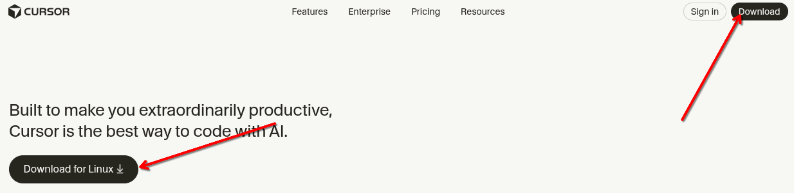

# INSTALANDO O CURSOR
O **Cursor** é um editor de código inovador, construído sobre a base do VS Code, mas redesenhado para colocar a **Inteligência Artificial** no centro do fluxo de trabalho. 

Ele combina a experiência familiar do VS Code com recursos avançados de IA, como **edição preditiva**, **chat contextual com o projeto** e a capacidade de **gerar código** instantaneamente, suportando inclusive a importação de todas as suas extensões habituais.

O Cursor disponibiliza um arquivo .deb para Debian e derivados. Visite a página oficial:  

[Site oficial para download do Cursor](https://cursor.com/download)  

E faça o download da versão Linux (.deb):  
  

Depois, apenas dê um duplo clique no arquivo e siga as instruções na tela. Ao final do processo, o Cursor estará instalado e disponível no seu menu de aplicativos. Assim como o vscode, a instalação acrescenta um repositório oficial para receber as atualizações automaticamente, mas não se anime, o programa mostra que há atualizações, mas quando voce usa o `apt` para recebê-los, não há nenhum! Ocorre que as atualizações aparecem primeiro no próprio site e depois de algum tempo para os repositórios.  

## IMPORTANDO CONFIGURAÇÕES E EXTENSÕES DO VSCODE
Uma das maiores vantagens do Cursor é a transição suave para quem já utiliza o VS Code. Na primeira execução, o editor oferecerá um assistente de configuração (Setup Wizard).

* **Importação Automática**: Você verá a opção para importar todas as extensões, temas, atalhos de teclado e configurações do seu VS Code instalado.
* **Sincronização**: Caso utilize o "Settings Sync" da Microsoft, você também pode fazer login para manter suas preferências alinhadas.
* **Manual**: Se preferir fazer depois, você pode acessar o comando `Ctrl+Shift+P` e digitar "Import VS Code Extensions".

---

## CONFIGURAÇÕES RECOMENDADAS  
Após a instalação, você pode ajustar o arquivo `~/.config/Cursor/User/settings.json` para manter o comportamento desejado:

```json
{
  "editor.formatOnSave": true,
  "[shellscript]": {
    "editor.defaultFormatter": "foxundermoon.shell-format"
  },
  "code-runner.executorMap": {
    "bash": "bash"
  },
  "shellformat.flag": "-i 2"
}

```

Essas opções ativam:

* Formatação automática ao salvar
* Execução direta de scripts (Ctrl+Alt+N)
* Indentação de 2 espaços padrão


---

[Clique aqui para retornar a página principal](../README.md#instalando-o-cursor)
