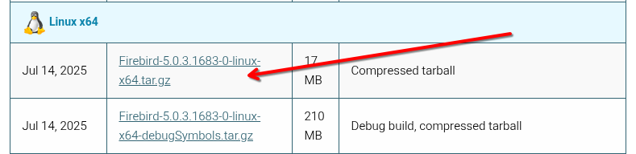

# FIREBIRDSQL
O FirebirdSQL é um banco de dados relacional open source, leve e poderoso, derivado do InterBase da Borland. Ele roda em Windows, Linux, macOS e ARM, e é amplamente usado em sistemas comerciais, ERP e aplicações embarcadas. 

Pontos positivos do FirebirdSQL:  
* Desempenho elevado — Trabalha bem com bancos grandes e muitos usuários simultâneos, mesmo em hardware modesto.  
* Zero administração — Dispensa serviços complexos; pode funcionar como embedded, sem instalação de servidor.  
* Segurança robusta — Criptografia nativa de dados e autenticação integrada.  
* Transações completas — Suporte total a ACID, com isolamento configurável (Read Committed, Snapshot, Serializable).  
* Portabilidade — Um único arquivo .fdb contém todo o banco, facilitando backup e migração.  
* Ferramentas familiares — Linguagem SQL padrão, PSQL para stored procedures e triggers.  
* Configuração simples — Fácil de instalar e manter; ideal para sistemas que exigem confiabilidade sem administração constante.  
  
O FirebirdSQL não é empacotado para Debian, RedHat ou outras distros, isso já aconteceu no passado, mas atualmente o FirebirdSQL inclui seu próprio instalador, mas antes de prosseguir com a instalação dele, vamos instalar a lib 'libtommath' que é uma dependencia, execute:
```
sudo apt install -y libtommath-dev
```
Agora vá até a [página oficial do FirebirdSQL](https://firebirdsql.org/downloads) e baixe a ultima versão para Linux:  



Digamos que tenha baixado em ~/Downloads, vamos descompactá-lo:

```
tar zxvf Firebird-5.0.3.1683-0-linux-x64.tar.gz
```
E então alguns arquivos serão extraídos:  
>Firebird-5.0.3.1683-0-linux-x64/
>Firebird-5.0.3.1683-0-linux-x64/manifest.txt
>Firebird-5.0.3.1683-0-linux-x64/buildroot.tar.gz
>Firebird-5.0.3.1683-0-linux-x64/install.sh

A descompressão irá criar uma subpasta, vamos entrar nela e executar o instalador:  
```
cd Firebird-5.0.3.1683-0-linux-x64/
```
E executo o instalador:  
```
sudo ./install.sh
```
Durante a instalação lhe será questionado qual será a senha do SYSDBA, informe o que desejar, inclusive 'masterkey' se for usá-lo como desenvolvimento.

### BANCO DE DADOS FIREBIRD - GRUPO FIREBIRD
O serviço de banco de dados FirebirdSQL é mantido por usuário criado com permissões restritas chamado 'firebird', isso é uma medida de segurança em sistemas posix para impedir que um hacker do mal aproveite-se de alguma falha neste serviço e tente escalar permissões maiores. Isso funciona muito bem, porém impede que outras pessoas se conectem localmente (não confundir com acesso ao localhost) a qualquer banco de dados porque apenas o usuário/grupo 'firebird' tem acesso a eles. Para que você possa contornar esta situação, seu login precisa estar no grupo 'firebird', então execute:
```bash 
sudo usermod -aG firebird "$USER"
newgrp firebird
```
Agora, para conferir, execute:
```bash 
getent group firebird
```
Observe o resultado do comando:  
> firebird:x:84:gsantana   

Se o seu login aparaceu no grupo **firebird**  então é um excelente indicativo que a operação foi realizada com sucesso.   

### BANCO DE DADOS FIREBIRD - CLIENTE
Cliente de banco de dados ou `SQL Client` é a biblioteca que estabelece conectividade com o banco de dados, sem ela, nenhum aplicativo local ou remoto consegue conectar-se a base. Depois de instalado, confira se a mesma está presente no sistema:
```bash
ls -l /lib64/libfbclient.so
```
Caso a resposta seja:
>ls: não foi possível acessar '/lib64/libfbclient.so': Arquivo ou diretório inexistente

Então a biblioteca não existe no PATH do sistema e isso pode ser um problema para outros programas acessarem base de dados, então vamos criar um link simbolico para ela:
```bash
[ -f /opt/firebird/lib/libfbclient.so ] && sudo ln -s /opt/firebird/lib/libfbclient.so /lib64/libfbclient.so
```
Agora, confira novamente:
```bash
ls -l /lib64/libfbclient.so
```
O resultado esperado é:  
```
lrwxrwxrwx 1 root root 32 out 22 11:20 /lib64/libfbclient.so -> /opt/firebird/lib/libfbclient.so
```
Concluímos aqui a instalação do `SQL Client`.  

### BANCO DE DADOS FIREBIRD - ALTERANDO A SENHA DO 'SYSDBA'
O SYSDBA é o equivalente ao 'root' no Linux ou 'sa' no MSSQL, isto é, tem plenos poderes e pode realizar qualquer coisa no banco.  
Quando você instala o FirebirdSQL pela primeira vez, ele pergunta qual será a senha e partir daí, você só conseguirá alterá-la por meio do `isql`.  
Vamos exemplificar porque eventualmente você poderá precisar alterar a senha do SYSDBA ou de qualquer outro usuário:  
```bash
sudo /opt/firebird/bin/isql /opt/firebird/security5.fdb
```
Você não precisa de usuário+senha neste tipo de conexão porque ela é uma conexão local, mas não uma conexão 'localhost', ela é local no sentido de que você esta acessando a base diretamente sem a necessidade da `SQL Client` equivalente a uma conexão embarcada. Uma vez conectado, agora vamos fazer a alteração:  
```pgsql
alter user SYSDBA password 'masterkey';
commit;
quit;
```
Se não souber exatamente o nome do usuário que deseja alterar a senha, mas deseja varrer todos que começem com a letra 'A' então faça um select assim:
```pgsql
SELECT sec$user_name FROM sec$users
where sec$user_name like 'a%'  ;
```
Isso é mais eficiente do que usar `SHOW USERS` que mostraria todos os usuários.  


### BANCO DE DADOS FIREBIRD - PERMISSÕES
Se for copiar arquivos de banco de dados - geralmente .fdb - para seu sistema, não os copie para seu $HOME, pois o firebird não tem acesso lá, ele até poderia se ajustado de acordo, mas isso violaria a parte de segurança. Então sempre que for copiar arquivos .fdb para este servidor, localize uma pasta externa ao $HOME, por exemplo, /var/banco, se ele não existir, crie-o:  
```  
sudo mkdir -p /var/fdb
```  
Vamos dar permissão com bitstick para que as subpastas herdem a pasta do pai, onde apenas apenas o usuário 'firebird' tem acesso de leitura e escrita e os demais(outros) somente leitura, execute:
```  
sudo chmod 2775 /var/fdb
```  
Pronto, agora você pode copiar arquivos .fdb para essa pasta, em alguns casos, depois que copiar, é muito provavel que também precise repetir este comando:
```  
sudo chown -R firebird:firebird /var/fdb/*
sudo chmod -R 664 /var/fdb/*
```  
Pois o arquivo copiado pode ter outro 'dono' e este mantêm-se, ao invés de ter como dono o usuário 'firebird' e com isso, causando problema de acesso.  

### BANCO DE DADOS FIREBIRD - ALIASES PARA ESCONDER OS BANCOS
Ao conectar-se ao banco de dados, geralmente usamos algo como:
|String de conexão:|
|:--|
|localhost/3050:/var/banco/banco.fdb|
 
Qual o problema disso? Essa string revela de forma cruel onde nosso banco de dados está localizado dentro do servidor. Qual a maneira correta? A maneira correta é criar um alias e usá-lo na string de conexão do banco no lugar do caminho do banco. 
Edite o arquivo /opt/firebird/databases.conf, execute:  
```  
sudo editor /opt/firebird/databases.conf
```  
E acrescente ao final do arquivo:  
```  
banco.link = /var/fdb/banco.fdb 
```  
Agora, poderá usar a seguinte string de conexão:  
|String de conexão:|
|:--|
|localhost/3050:banco.link|

E assim, nenhum caminho para nossos arquivos de dados serão revelados, isso serve muito bem para o ambiente de produção como também o de desenvolvimento porque geralmente desenvolvimento espelha a forma de produção. Caso seu banco de dados precise de parametros de ajustes associados ao banco, o /opt/firebird/databases.conf deverá ser modificado como o exemplo abaixo:  
```  
banco.link = /var/fdb/banco.fdb 
{
  RemoteAccess = true
  DefaultDbCachePages = 131072
  LockMemSize = 30M
  TempCacheLimit  = 512M  
  StatementTimeout = 0 # 0=ilimitado
}
```  
E assim, cada banco de dados, além de possuir seu alias, terá também sua parametrização.  

### BANCO DE DADOS FIREBIRD - VARIAVEIS DE AMBIENTE
Essas variaveis serão usadas para ao inves de logar-se digitando a usuário e senha, elas sejam suprimidas, você pode achar que isso é um risco, mas o vamos colocá-la no nosso perfil onde somente nós mesmos e o root tem acesso, então não há riscos. Edite o arquivo ~/.bash_profile:
```  
sudo editor ~/.bash_profile
```
E acrescente as linhas:  
```  
export FIREBIRD_MSG=/opt/firebird
export ISC_USER=SYSDBA
export ISC_PASSWORD=masterkey
```  
Salve e feche o arquivo (`Ctrl+O`, `Enter`, `Ctrl+X`).    
Agora, toda vez que abrir o terminal 'bash' as variaveis acima já estarão prontas.  
Inclusive muitos serviços de rest/api são iniciados dessa maneira, usando variaveis de ambiente ao inves de agendar a execução no inicio do boot e os seus parametros porque esses comandos com o uso de uma 'ps auxwww' seriam revelá-los e se houverem parametros de usuário e senha, então seriam revelados.  
Para testar, execute:  
```  
echo $ISC_USER
```
Observe o resultado:  
> SYSDBA  
Indicando que a variavel já está com cnoteúdo.  

### BANCO DE DADOS FIREBIRD - VARIAVEIS DE AMBIENTE GLOBAIS
Também podemos criar variaveis de ambiente globalmente, neste caso, todos os usuários se beneficiam dessas variaiveis, faça isso quando todos os usuários e/ou serviços precisam se beneficiar dessas variaveis. Edite o arquivo /etc/environment.d/999-firebird.conf:
```  
sudo editor /etc/environment.d/999-firebird.conf 
```
A pasta /etc/environment.d contêm arquivos `.conf` que o sistema lerá durante o processo de boot, novamente colocamos o prefixo "999" porque a lista de arquivos é lida alfabeticamente e desejamos que nosso arquivo fique por ultimo. Depois acrescente as linhas:  
```  
FIREBIRD_MSG=/opt/firebird
ISC_USER=SYSDBA
ISC_PASSWORD=masterkey
```  
Note que não precisamos do comando "export" porque isso não é um script, mas um arquivo de configuração que criará as variaveis de ambiente para nós durante o boot.
Agora *salve* o arquivo e feche o editor (Ctrl+O, Enter, Ctrl+X) e estará pronto, basta apenas reiniciar o sistema para que as modificações entrem em vigor, depois disso, se quiser testar, execute:

Para testar, execute:
```  
echo $ISC_USER
```
Observe o resultado:  
> SYSDBA  
Indicando que a variavel já está com cnoteúdo.  


### BANCO DE DADOS FIREBIRD - AJUSTANDO PATH
Vez ou outra, alguns programas são instalados em diretórios não convencionais, e isso inclui seus binários executáveis.
Um exemplo típico é o FirebirdSQL, que é instalado em /opt/firebird, e seus utilitários (como isql e gbak) ficam em /opt/firebird/bin.

O problema é que, ao tentar executar um desses utilitários, você precisa digitar o caminho completo e as vezes usando 'sudo', por exemplo:
```
sudo /opt/firebird/bin/gbak (...)
```
Como bons programadores, sabemos que digitar caminhos longos repetidamente não é nada prático.  
Para resolver isso, existem duas abordagens:  
1. Criar links simbólicos dos executáveis em /usr/bin; ou  
2. Acrescentar o diretório dos binários ao $PATH do sistema.  

A segunda opção é a mais limpa e flexível, pois o caminho será reconhecido automaticamente por todos os usuários e sessões.
Para configurá-la, crie (ou edite) um script Bash em: 
```  
sudo editor /etc/profile.d/999-firebird-path.sh
```
E insira o seguinte conteúdo:
```  
# Adiciona o Firebird ao PATH do sistema
# Torna o caminho acessível a todos os usuários de login
if [ -d /opt/firebird/bin ]; then
  PATH="$PATH:/opt/firebird/bin"
  export PATH
fi
```
Salve e feche o arquivo (`Ctrl+O`, `Enter`, `Ctrl+X`).    
Então, dê permissão de leitura global:
```  
sudo chmod 644 /etc/profile.d/999-firebird-path.sh
```  
Note que a permissão "644" não dá poder de execução, e a ideia é essa mesma, o próprio sistema se encarregará de carregá-lo por uma sucessão de scripts, não precisando de "alguém" para executá-lo. Para uma outra pessoa poder executar manualmente, seria:
```  
source /etc/profile.d/999-firebird-path.sh
```
Agora vamos conferir o PATH, execute:  
```  
echo $PATH
```
E observe o resultado:  
>/usr/local/sbin:/usr/local/bin:/usr/sbin:/usr/bin:/sbin:/bin:/usr/games:/usr/local/games:/snap/bin:**/opt/firebird/bin**

Se **/opt/firebird/bin** apareceu então este tópico foi concluido com sucesso.

### BANCO DE DADOS FIREBIRD - Timezone
O Firebird vem configurado com o timezone, execute:  
```bash
sudo cat /opt/firebird/firebird.conf |ag DefaultTimeZone
```
E observe o resultado:   
>\#DefaultTimeZone =

Quando essa linha está comentada ou vazia, o Firebird usa o timezone do sistema operacional (“OS time zone”) — que, no seu caso, deve ser configurado corretamente no Linux e para você saber qual o timezone que está sendo usado, execute:
```bash
$ timedatectl
               Local time: qua 2025-10-22 11:26:45 -03
           Universal time: qua 2025-10-22 14:26:45 UTC
                 RTC time: qua 2025-10-22 14:26:45
                Time zone: America/Sao_Paulo (-03, -0300)
System clock synchronized: yes
              NTP service: active
          RTC in local TZ: no
```
No exemplo acima, estamos usando o timezone **America/Sao_Paulo (-03, -0300)**. Se estiver errado, você corrige o sistema operacional ou então faz o ajuste necessário no `firebird.conf`.

### BANCO DE DADOS FIREBIRD - TempDirectories
Forneça uma lista de pastas separadas por ';', onde os arquivos temporários serão armazenados. Caminhos relativos são tratados em relação ao diretório raiz do Firebird. O valor padrão é determinado usando as opções de ambiente FIREBIRD_TMP, TEMP ou TMP. Quando o primeiro diretório especificado não tiver espaço disponível, o mecanismo mudará para o próximo e assim por diante.  
Alguns exemplos são são mostrados no arquivo de configuração, veja:  

```bash
sudo cat /opt/firebird/firebird.conf |ag TempDirectories
```
E observe o resultado:   
>\# TempDirectories = c:\temp  
>\# TempDirectories = c:\temp;d:\temp  
>TempDirectories =  

Quando essa linha está comentada ou vazia, o Firebird o padrão do sistema operacional, no linux, será **/tmp**, se você indicar mais uma pasta ou ponto de montagem, tenha certeza de usar chmod 1775 nela.    

### BANCO DE DADOS FIREBIRD - RemoteAuxPort
O número da porta TCP a ser usado para mensagens de notificação de eventos do servidor. O valor 0 (Zero) ou ausente significa que o servidor escolherá um número de porta aleatoriamente, e é exatamente assim que vem configurado, veja:  
```bash
sudo cat /opt/firebird/firebird.conf |ag RemoteAuxPort
```
E observe o resultado:   
>\#RemoteAuxPort = 0

Não é boa ideia deixar usar uma porta aleatória, recomendo que troque pelo numero da porta padrão+1, se a porta padrão for **3050** então use **3051**. Usando dessa forma você sabe exatamente o que liberar no firewall.

### BANCO DE DADOS FIREBIRD - WireCrypt
Encripta a conexão entre o lado cliente e o servidor. Ele é mandatório caso o servidor esteja numa comunicação **http/https**. Linguagens como php ou node requerem encriptação.   
**Required** estabelece que apenas clientes com essa opção habilitada poderão se comunicar com este servidor.  
**Enabled** estabelece que haverá encriptação, mas apenas se o lado cliente também tiver essa opção.  
**Disabled** estabelece que não haverá encriptação.  

Exemplo para ajuste no `firebird.conf`:  
```
WireCrypt=Enabled (Required, Enabled or Disabled)
```

### BANCO DE DADOS FIREBIRD - WireCompression
O parâmetro WireCompression define se os dados transmitidos entre cliente e servidor serão compactados antes do envio pela rede.
Para que a compressão funcione, ambos os lados (cliente e servidor) precisam ter essa opção ativada.  
Exemplo para ajuste no `firebird.conf`:   
```
WireCompression = false
```
Quando ativada (true), os pacotes de dados trafegam comprimidos, o que reduz o volume de transferência e pode melhorar o desempenho em conexões lentas ou com alta latência (como VPNs, links ADSL ou conexões remotas). Por outro lado, em redes locais rápidas (LAN), a compressão pode piorar o desempenho, pois o tempo gasto para compactar e descompactar os dados supera o ganho de velocidade na transmissão — especialmente se uma das pontas for um computador com CPU limitada.   

### BANCO DE DADOS FIREBIRD - DefaultDbCachePages
O parâmetro DefaultDbCachePages define quantas páginas de dados cada banco de dados pode manter em cache simultaneamente.
Quanto maior esse valor, mais páginas o mecanismo reserva em memória RAM para acelerar o acesso aos dados.  
Por padrão:  
* SuperServer → 2048 páginas de cache por banco de dados.
* Classic/SuperClassic → 256 páginas de cache por conexão de cliente por banco de dados.
Para estimar o consumo de memória, basta multiplicar o número de páginas pelo tamanho de página configurado no banco de dados.
Por exemplo, com páginas de 16 KB e cache padrão de 2048 páginas:
```
2048 páginas × 16 KB = 32.768 KB = ~32 MB de RAM por banco
```
Isso mesmo, o Firebird vem ajustado de fábrica com requerimentos menores que os minimos dos dias de hoje. 
Exemplo pratico para ajuste no `firebird.conf`:  
```
DefaultDbCachePages = 2048
```
Num servidor dedicado (onde só o sistema operacional e o Firebird estão rodando), podemos aumentar esse valor de forma proporcional à memória disponível. Suponha que o comando `free -h` retorne:  
```
              total       usada       livre    compart.  buff/cache  disponível
Mem.:          1,9Gi       270Mi       1,6Gi       2,0Mi       205Mi       1,6Gi
Swap:          974Mi          0B       974Mi
```
Há cerca de 1,6 GB de RAM livre.  
Se quisermos usar 1 GB dessa memória para cache, basta calcular quantas páginas de 16 KB cabem em 1024 MB:
```
1.048.576 KB ÷ 16 KB/página = 65.536 páginas
```
Logo podemos ajustar assim no `firebird.conf`:  
```
DefaultDbCachePages = 65536
```
**atenção**: Se o valor configurado exigir mais memória do que o sistema pode fornecer, o serviço Firebird não iniciará. Sempre garanta uma boa margem de segurança e revise os cálculos antes de alterar esse parâmetro.  


### BANCO DE DADOS FIREBIRD - DatabaseGrowthIncrement
O manual oficial do Firebird define este parâmetro da seguinte forma:

>“Define a quantidade de espaço em disco pré-alocado em bytes. A pré-alocação de espaço em disco permite reduzir a fragmentação dos arquivos físicos e evitar falhas por falta de espaço. Com a pré-alocação habilitada, o mecanismo aloca 1/16 do espaço já utilizado por vez, nunca menos que 128 KB e nunca mais que DatabaseGrowthIncrement (padrão de 128 MB). Para desabilitar a pré-alocação, defina o valor como zero.  Arquivos de sombra não são pré-alocados.”

Em outras palavras, este parâmetro controla quanto espaço vazio o Firebird reserva antecipadamente dentro do arquivo de banco de dados, evitando que o sistema operacional precise expandir o arquivo em pequenos blocos, o que causaria fragmentação e perda de desempenho.  

Por padrão, o valor é 128 MB, o que significa que, quando o banco estiver próximo de encher, o Firebird criará mais espaço livre — equivalente a 1/16 do tamanho atual, respeitando o limite mínimo de 128 KB e máximo de 128 MB.  

Por exemplo, se o banco tiver 4 GB e crescer cerca de 100 MB por dia, ao atingir o limite ele expandirá apenas 128 MB (pois 4 GB ÷ 16 = 250 MB, mas o limite máximo é 128 MB). Isso significa que o arquivo precisará ser expandido novamente muito em breve — possivelmente todos os dias — e esse processo pode ocorrer em momentos inoportunos, impactando o desempenho.  

Portanto, em ambientes de alta demanda ou crescimento contínuo, pode ser prudente aumentar o valor de DatabaseGrowthIncrement para reduzir a frequência dessas expansões. Por outro lado, se quiser permitir que o banco cresça conforme necessário, pode desabilitar a pré-alocação (definindo o valor como zero), deixando o sistema operacional gerenciar o crescimento automaticamente.  

Exemplo para ajuste no `firebird.conf` (minha preferencia):  
```
DatabaseGrowthIncrement = 0
```

### BANCO DE DADOS FIREBIRD - DummyPacketInterval

Provedores de internet(ISP) geralmente ajustam seus servidores para “queimar” conexões ociosas porque conexões abertas além de consumir recursos podem ser um risco à segurança. 
Isso não é um problema para aplicações que acessam o banco de dados de forma “state less”, isto é, conectam ao servidor, consomem e desconectam. Porém, há aplicações que foram migradas do desktop para a nuvem que mantêm a conexão pelo tempo que o programa estiver em uso e aqui teremos um problema se o usuário levantar-se para ir tomar um café e ao voltar a conexão tiver sido derrubada por causa do tempo de ociosidade.
Para esse problema específico, o ideal é que aplicações desktops para a nuvem usassem “Remote Desktop Protocol” (RDP), isto é, ao invés de ter a aplicação no lado cliente, a aplicação e o banco de dados ficam numa rede remota e o lado cliente usa o RDP para usufruir do programa que está nessa rede remota. Isto pode ser feito usando programas como o Windows Terminal Server, TS Plus ou GoGlobal. Nos casos que o RDP não seja aceitável, a solução é manter as conexões ativas e impedir que artificialmente elas sejam derrubadas por tempo de ociosidade e para realizar isso vocÊ deve configurar este parametro `DummyPacketInterval`.  

O DummyPacketInterval informa quantos segundos esperar em uma conexão de cliente silenciosa(ou dormindo) antes que o servidor envie pacotes fictícios para solicitar confirmação.  

Exemplo para ajuste no `firebird.conf`:  
```
DefaultDbCachePages = 180 # 3 minutos
```

### BANCO DE DADOS FIREBIRD - DataTypeCompatibility
A partir do Firebird 4.0, o mecanismo passou a oferecer novos tipos de dados, incluindo variações com fuso horário (UTC) e outros aprimoramentos de precisão.
Esses tipos podem ser desconhecidos para clientes legados, causando incompatibilidade em aplicações mais antigas.

Por exemplo, no Delphi e Lazarus, o tipo TIMESTAMP até a versão 3.0 não incluía informação de fuso horário.
Nas versões mais recentes do Firebird, o tipo equivalente (TIMESTAMP WITH TIME ZONE) passa a carregar essa informação, e como resultado não é mais reconhecido automaticamente como TDateTime, o que pode fazer com que componentes como TField ou TSQLQuery falhem ao ler ou converter o valor.

Esse mesmo problema pode ocorrer em outras linguagens ou drivers que ainda não implementaram suporte completo aos novos tipos do Firebird.

Para garantir compatibilidade com aplicações antigas, o parâmetro DataTypeCompatibility permite simular o comportamento de versões anteriores do Firebird, convertendo os tipos novos para formatos legados compreensíveis pelos clientes antigos.

Exemplo para ajuste no `firebird.conf`:  
```
DataTypeCompatibility = 3.0
```
Atualmente, são suportados dois valores:  
* 3.0 -> Mantém compatibilidade com o Firebird 3.0.
* 2.5 -> Mantém compatibilidade com o Firebird 2.5.

**IMPORTANTE**: Se o seu sistema foi desenvolvido em Delphi ou Lazarus e começou a apresentar erros de tipo após migrar para uma versão superior do FirebirdSQL, defina DataTypeCompatibility = 3.0 (ou 2.5) para restaurar o comportamento esperado até que o código-fonte seja atualizado para lidar com os novos tipos de dados nativos.

### BANCO DE DADOS FIREBIRD - Mais parametros de configuração
Alistamos apenas alguns parametros do `firebird.conf`, porém há outros que também podem fazer muita diferença na performance e no comportamento do banco, são eles:  
* DeadLockTimeout 
* StatementTimeout 
* Timeout de sessão
* ExtConnPoolSize e ExtConnPoolLifeTime
* MaxParallelWorkers e ParallelWorkers
* ConnectionTimeout
* LockMemSize
* LockHashSlots
* MaxStatementCacheSize
* OuterJoinConversion
* OptimizeForFirstRows
* TempCacheLimit
* InlineSortThreshold
Recomendo que olhe eles e veja se precisa dos mesmos.


### BANCO DE DADOS FIREBIRD - LIBERANDO PERMANENTEMENTE PORTAS NO FIREWALL
Caso tenha instalado o firewalld, então precisaremos liberar a(s) porta(s) usada(s) por este serviço, mas qual porta? Paa descobrir qual porta o Firebird usa, execute:  
```
sudo cat /opt/firebird/firebird.conf |ag RemoteServicePort
```
E observe o resultado:   
>\# found in the 'services.' file), then the 'RemoteServicePort'.  
>>RemoteServicePort = 3050  

No exemplo acima, a nossa porta é **3050**, se for um desktop de desenvolvimento, sugiro que troque por **8050**, isso evita acidentes onde o sujeito esqueceu de mudar o nome de host e aplicou o que não deveria em servidor de produção achando que era desenvolvimento, siga esta dica, não use as mesmas portas que um servidor de produção usaria. Muito bem, agora que sabemos o numero da porta, e neste exemplo, vamos usar tanto a **3050** como também a **8050**, execute:

```
sudo firewall-cmd --zone=public --add-port=3050/tcp --permanent
sudo firewall-cmd --zone=public --add-port=8050/tcp --permanent
sudo firewall-cmd --reload
```
Agora vamos repetir a verificação das portas atualmente liberadas:  
```  
sudo firewall-cmd --list-ports
```
E observe o resultado:  
> 22/tcp 80/tcp 443/tcp **3050/tcp** 3306/tcp 3389/tcp 5432/tcp **8050/tcp**    

Como pode observar acima, este procedimento foi concluido com sucesso.   

### BANCO DE DADOS FIREBIRD - INICIANDO O SERVIÇO
A instalação será feita em /opt/firebird, mas nem sempre está habilitado para iniciar automaticamente após o boot, então execute:  
```bash
sudo systemctl enable firebird
```
Isso garantirá que será iniciado toda vez logo após o boot, e falando nisso, precisamos conferir se o serviço já foi iniciado, geralmente sim, **mas é necessário conferir**, execute:
```bash
$ sudo systemctl status firebird
● firebird.service - Firebird Database Server
     Loaded: loaded (/usr/lib/systemd/system/firebird.service; enabled; preset: enabled)
     Active: active (running) since Wed 2025-10-22 11:18:20 -03; 35min ago
 Invocation: c65f8665920149b5ab6dad5772d5e130
       Docs: https://firebirdsql.org/en/firebird-rdbms/
    Process: 6016 ExecStart=/opt/firebird/bin/fbguard -daemon -forever (code=exited, status=0/SUCCESS)
   Main PID: 6017 (fbguard)
      Tasks: 4 (limit: 37546)
     Memory: 1.7M (peak: 13M)
        CPU: 30ms
     CGroup: /system.slice/firebird.service
             ├─6017 /opt/firebird/bin/fbguard -daemon -forever
             └─6018 /opt/firebird/bin/firebird

out 22 11:18:20 ti-01 systemd[1]: Starting firebird.service - Firebird Database Server.
```
No exemplo acima, o serviço está em **active** e isso é bom, mas se por alguma razão não estiver assim, recomendo:  
```bash
sudo systemctl start firebird
```
E pronto, agora repita o comando 'sudo systemctl status firebird' e notará que o serviço já esta funcionando (**active**).   

