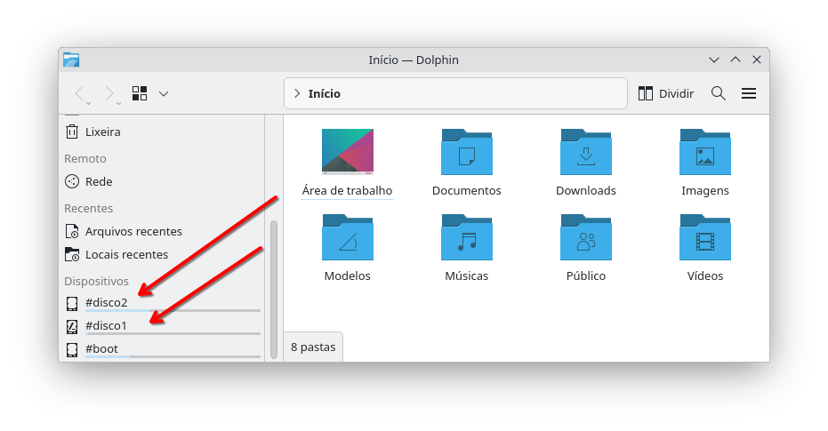

# ACESSAR PARTIÇÕES LINUX NO SISTEMA
Se você utiliza uma ou mais partições Linux que não são automaticamente montadas, pode usar o gerenciador de arquivos do KDE ou GNOME para acessá-las.  
No entanto, toda vez que fizer isso provavelmente será solicitada uma senha — e isso cansa até o desenvolvedor mais paciente.  

Minha recomendação é deixar essas partições já **montadas e disponíveis logo após o boot**.  
Vamos a um exemplo prático:

```bash
lsblk -f | grep -v "loop"
```

E então você verá algo parecido com:
```
NAME        FSTYPE   FSVER LABEL   UUID                                 FSAVAIL FSUSE% MOUNTPOINTS
sda                                                                                    
└─sda1      ext4     1.0   #dados2 b2154643-7b94-42a1-8146-267bb88ba833                
sdb                                                                                    
nvme0n1                                                                                
├─nvme0n1p1 vfat     FAT32         5085-7E3D                             944,1M     1% /boot/efi
├─nvme0n1p2 ext4     1.0           a6b817f4-8427-4d7d-8c12-4d6ec6e6c66d   98,9G     9% /
└─nvme0n1p3 ext4     1.0   #dados1 c8cb0172-7521-4ba6-83d4-95211530c8bc  774,7G     1% /home
```

Note que minhas partições têm **etiquetas (labels)** — isso facilita bastante na hora de identificá-las para montagem, muito mais do que nomes genéricos como *sda1*, *sda2* etc.  
Além da partição NVMe onde está o sistema principal, há um disco adicional em `/dev/sda1`, com o label `#dados2` e UUID `b2154643-7b94-42a1-8146-267bb88ba833`.

Primeiro, vamos relaxar as permissões das pastas **/mnt** e **/media**, para permitir que usuários comuns criem diretórios de montagem:

```bash
sudo chmod 2777 /mnt
sudo chmod 2777 /media
```

Depois, criamos uma pasta vazia para a montagem:
```bash
mkdir -p /mnt/dados2
chown -R $USER:$USER /mnt/dados2
chmod -R 2777 /mnt/dados2
```

Os comandos acima garantem **acesso total** ao conteúdo do disco montado.  
Agora edite o arquivo `/etc/fstab`:

```bash
sudo editor /etc/fstab
```

E acrescente uma linha usando o label do disco como exemplo:
```
# Meu disco #dados2
LABEL=#dados2  /mnt/dados2  ext4  defaults  0  0
```

Usar **LABEL** é conveniente, mas o nome da etiqueta pode ser alterado pelo usuário a qualquer momento e isso pode envolver riscos com o uso de scripts automatizados, por exemplo, se você apontar um label para um disco que será usado como **destino de backup** dentro de um script e agendasse em forma de tarefa(crontab), e mais tarde, alguém se esquecesse desta programação e alterasse o label deste disco então o script deixaria de funcionar, por isso,  recomenda-se o uso de **UUID** que são fixos e não pode ser alterados:
```
UUID=b2154643-7b94-42a1-8146-267bb88ba833  /mnt/dados2  ext4  defaults,auto,x-systemd.automount  0  0
```
Salve e feche o arquivo (`Ctrl+O`, `Enter`, `Ctrl+X`).     
Sempre que modificar o `fstab`, é preciso recarregar o daemon responsável pelas montagens:
```bash
sudo systemctl daemon-reload
```
Alguns sugerem trocar `defaults` por `rw,user,exec,auto,umask=000`, mas isso pode variar conforme o tipo de partição.  
Em geral, é mais seguro deixar `defaults` e ajustar permissões com **chown/chmod** ou **ACLs**.


E se o disco acima for daqueles que podemos ejetar, como aqueles que colocamos em gavetas, então muda um pouco:
```bash
mkdir /media/dados2
chown -R $USER:$USER /media/dados2
chmod -R 2777 /media/dados2
```
E o /etc/fstab ficaria assim:
```
UUID=b2154643-7b94-42a1-8146-267bb88ba833  /mnt/dados2  ext4  defaults,noauto,x-systemd.automount  0  0
```
As opções:  
* A opção **noauto** garantirá que no processo de **boot** o sistema não tente procurá-lo.  
* Usar a pasta **/media** garante para quem olha que se trata de um disco ejetável.  
* A opção **x-systemd.automount** fará com que ele seja montado sob demanda, ao invés de durante o boot, daí você pode ejetá-lo quando quizer e plugá-lo quando quizer. Embora eu esteja recomendando-o para discos ejetáveis, na prática você pode usá-lo para qualquer disco externo, desde que não seja os obrigatórios montados como /, /home, /var, etc...


| Parâmetro          | Explicação |  
|:-------------------|:--|  
|ext2, ext3, ext4... | Tipo de partição a montar. Aceita outros tipos como **vfat**, **ntfs**, etc. Dependendo do tipo, algumas opções de montagem variam. |  
|users               | Permite que usuários normais montem/desmontem, não apenas o root. |  
|rw                  | Monta o disco com leitura e escrita. |  
|user,exec,umask=000 | Permissões abertas: qualquer usuário pode ler/gravar/executar. |  
|nosuid              |Impede execução de arquivos com bit suid (segurança extra). |  
|nodev               |Impede criação de arquivos de dispositivo. |
|file_mode=0777      |Permissões padrão de arquivos dentro do volume (total acesso). |  
|dir_mode=0777       |Permissões padrão de diretórios (total acesso). |  
|auto                |Monta automaticamente durante o boot. |  
|noauto              |Não monta automaticamente no boot. |  
|x-systemd.automount |Será automaticamente montado sob demanda|  
|Os dois “0” finais  |Desativam dump e fsck automáticos. |  

Reinicie o sistema.  
Após o login, abra o gerenciador de arquivos e veja suas partições montadas automaticamente:  


### Diferença entre /mnt e /media
Será que há diferença entre usar **/mnt** ou **/media** para montar discos?  
A diferença é apenas protocolar, veja:  

| Diretório | Uso recomendado |
|:--|:--|
| **`/mnt`** | Montagens **manuais ou permanentes** administradas pelo usuário ou pelo sistema. Ideal para discos fixos e partições internas sempre disponíveis. |
| **`/media`** | Montagens **automáticas e removíveis**, geralmente gerenciadas pelo ambiente gráfico (*udisks/udev*). Ideal para pendrives, HDs externos e unidades de rede. Eu costumo usar `/media` para tudo que pode ser ejetado. |

### Sem acesso aos discos montados?
Se você não tiver permissão para modificar o conteúdo do disco montado, provavelmente as permissões originais pertencem a outro usuário.  
Corrija com:
```bash
sudo chown -R $USER:$USER /mnt/dados2
sudo chmod -R 2777 /mnt/dados2
```

Existem outras formas de gerenciar permissões — como **ACLs**, também usadas no Windows —, mas isso é assunto para outro tópico.

### Usar LABELs ou UUID?
Embora o uso de **LABELs** pareça mais legível e intuitivo que o uso de **UUIDs**, isso pode gerar sérios inconvenientes quando você renomeia as labels que estão descritas no /etc/fstab com **montagem automática**.  
E quando isso acontece, o sistema Linux pode **demorar muito durante o boot** tentando montar a partição configurada no `/etc/fstab` que a label não existe mais ou foi renomeada, especialmente em distribuições que exibem tela de inicialização (*splash screen*) porque dar-se-á a impressão que o sistema travou quando na realidade está aguardando um tempo de plug'n play para o disco indicado por label aparecer no sistema.  
Por esse motivo, dependendo do contexto, **use sempre UUIDs** em vez de LABELs ao montar partições no arquivo `/etc/fstab` cujos labels podem sofrer alterações.  
Os UUIDs são únicos e não se alteram, garantindo que o sistema encontre a partição correta de forma imediata e confiável.

### Alternativa moderna: AutoFS e systemd.automount
O **AutoFS** continua disponível e funcional nas principais distribuições Linux.  
Ele é um serviço que monta automaticamente pastas, partições ou compartilhamentos de rede **apenas quando são acessados**, o que pode ser útil para dispositivos externos ou unidades de rede.

Apesar de ainda ser amplamente usado, o **systemd** oferece uma alternativa mais moderna e integrada: o **systemd.automount**, que desempenha o mesmo papel de forma nativa, com menos dependências e melhor integração com o processo de inicialização.

Em geral, o uso de `fstab` é mais simples para montagens locais permanentes, enquanto **AutoFS** e **systemd.automount** são indicados para:
- Montagens sob demanda (discos externos, pendrives, unidades de rede);
- Ambientes corporativos com múltiplos compartilhamentos;
- Situações em que economizar tempo de boot é importante.

Se quiser estudar mais sobre o AutoFS:
[https://wiki.archlinux.org/title/Autofs](https://wiki.archlinux.org/title/Autofs)

E sobre systemd.automount:
[https://www.freedesktop.org/software/systemd/man/latest/systemd.mount.html](https://www.freedesktop.org/software/systemd/man/latest/systemd.mount.html)


