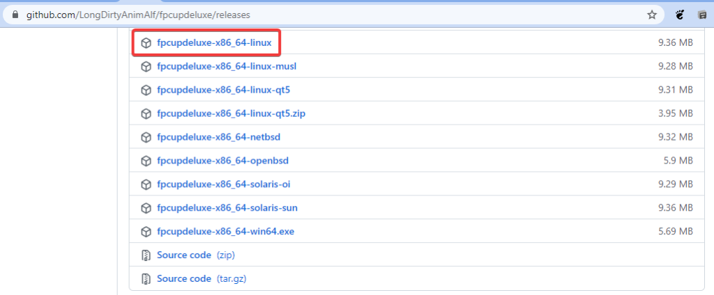

# INSTALANDO IDE DE PROGRAMAÇÃO PASCAL LAZARUS
Se esta desejoso de instalar o Lazarus em seu sistema, ...

Primeiro, atualize o repositorio
```bash
sudo apt update -y
```

As ferramentas básicas de build precisam ser instaladas:
```bash
sudo apt install -y build-essential pkg-config
```

Se você usa KDE ou ambientes baseados em QT, também precisará:
```bash
sudo apt install -y libqt5pas-dev libqt5pas1 qtbase5-dev qtbase5-dev-tools libqt5x11extras5-dev
```

Se você usa GNOME ou ambientes baseados em GTK, também precisará:
```bash
# GTK2 (legado, mas amplamente usado pelo Lazarus)
sudo apt install -y libgtk2.0-dev libcanberra-gtk-module 
# ou GTK3
sudo apt install -y libgtk-3-dev libcanberra-gtk3-module
```

Embora a maioria das distros estejam migrando para Wayland, alguns programas ou bibliotecas que iremos usar ainda estão usando libs do Xorg então vamos precisar:  
```bash
sudo apt install -y libx11-dev libxext-dev libxtst-dev libxi-dev libxrandr-dev libxinerama-dev libxrender-dev libxt-dev
```
Agora, estamos prontos para iniciar a instalação do Lazarus e para isso vamos usar `fpcupdeluxe`, um excelente instalador do Lazarus porque ele baixa-o diretamente doo codigo fonte original **gitlab.net** e traz opções de personalização que incluem o cross-compile.  
Antes de prosseguir, é sempre bom revisar os passos anteriores, as dicas acima foram retiradas da página oficial:
[Wiki da página do fpcupdeluxe](https://wiki.lazarus.freepascal.org/fpcupdeluxe)  
Porque pode acontecer deste tutorial ficar, por isso, sempre confirme as dependencias novamente.

Agora vamos começar com o download do fpcupdeluxe, visite a página e baixe a versão mais recente para a sua plataforma:  
[Download da versão recente do fpcupdeluxe](https://github.com/newpascal/fpcupdeluxe/releases/latest)  

Veja o exemplo que serve para GNOME, mas tem para KDE/QT também:  


Digamos que tenha baixado a versão para GNOME, agora vamos executá-lo:  
```bash
chmod +x fpcupdeluxe-x86_64-linux
./fpcupdeluxe-x86_64-linux
```
Não é necessário usar “sudo” porque essa será uma instalação homeuser, isto é, não vai requerer permissões administrativas.  
Na tela seguinte selecione como FPC Version a opção fixes e para Lazarus version também fixes, depois clique em Setup+:  
[Clique em Setup++ para ajustar alguns parametros](../img/instalacao_linux_fpcupdeluge2.png)  

Depois faça o seguinte ajuste selecionando a plataforma que deseja compilar seus programas:  
[Marque as opções que achar apropriado](../img/instalacao_linux_instalador1.png)    
Marque as opções que achar apropriado, porém só marque a opção **Use System FPC for Lazarus** se tiver instalado o fpc(FreePascal Compiler) dos repositórios, isto te poupa download e tempo.  

Você pode fazer algumas outras marcações como definir a plataforma em que pretende compilar:  
[Algumas outras opções também podem ser interessantes](../img/instalacao_linux_fpcupdeluge3.png)    
Algumas outras opções também podem ser interessantes, explore as opções do ambiente.  

Depois confirme com o Botão OK e então em Install/Update FPC+Laz e prossiga com a instalação:  
[Prossiga com a instalação](instalacao_linux_fpcupdeluge4.png)  

Então prepare-se, ela é bastante demorada. Após a conclusão com sucesso será gerado uma entrada no menu do sistema. Agora o Lazarus aparecerá na área de trabalho do seu computador.  
Também foi gerado o arquivo Lazarus_fpcupdeluxe no pasta HOME do usuário. O Lazarus só funcionará se executar por este script na $HOME ou pelos atalhos recém-criados na área de trabalho, não adianta executá-lo de outra forma.  


