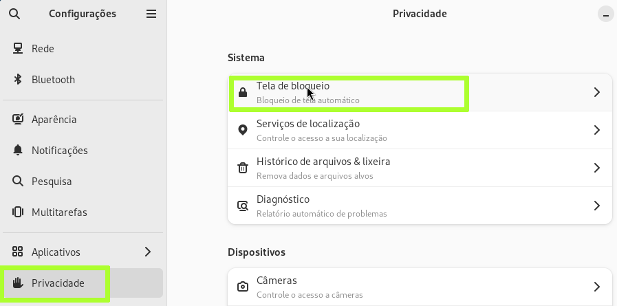
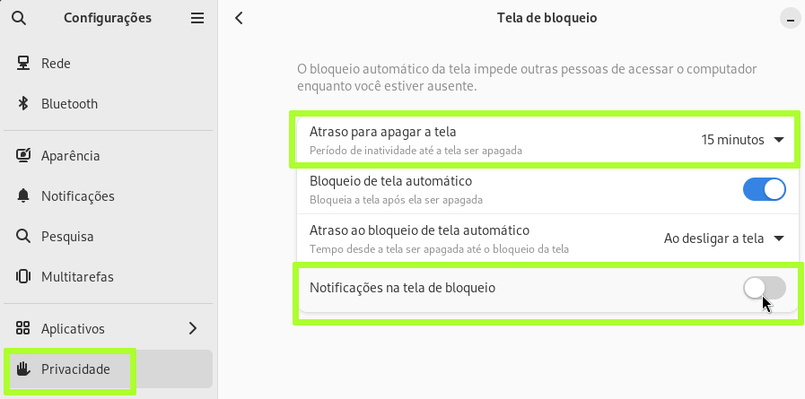
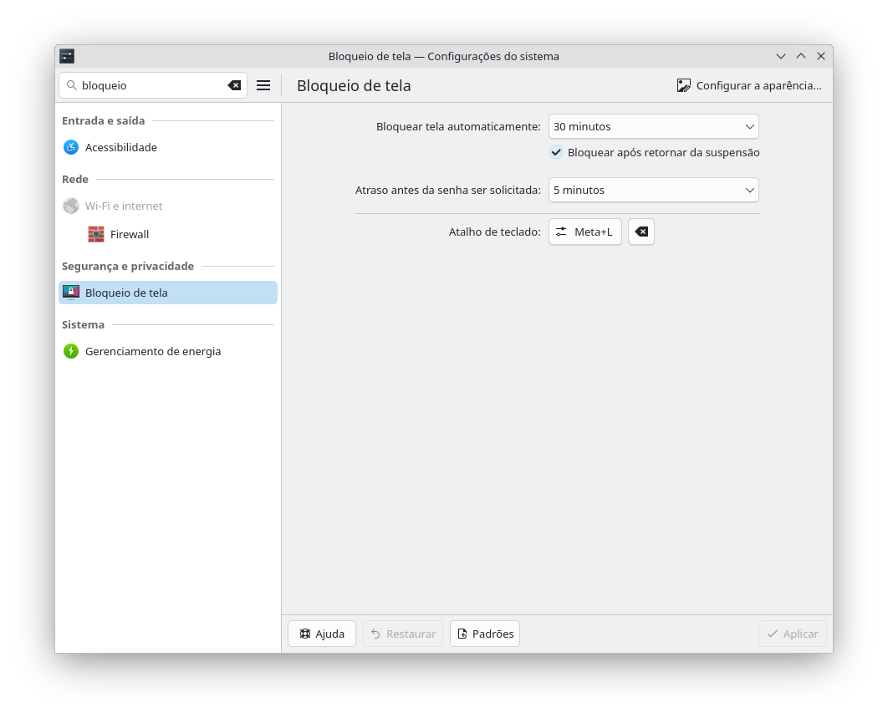

## BLOQUEIO DE TELA AUTOMÁTICO
O sistema normalmente é ajustado automaticamente para bloquear após 5 minutos de atividade, mas ‘falta de atividade’ é um termo incorreto, o correto seria ‘tempo sem interatividade’, isto é, o tempo que você fica sem ter que interagir com o computador. Às vezes estamos processando algo demorado e temos de esperar ou acompanhar a movimentação de log de status e o computador durante este tempo estará tendo muito trabalho, porém com pouca interatividade, a tela será bloqueada. Então precisamos saber quanto tempo precisamos nas tarefas do dia a dia ou então desligá-la.  

Neste guia passo a passo, em algumas opotunidades ficará sem interatividade esperando downloads e aguardando procedimentos serem finalizados, então é uma boa ideia fazer esse ajuste agora.  

### GNOME
Vá em configurações->Privacidade->Tela de bloqueio:

E então ajuste o tempo:

### KDE

