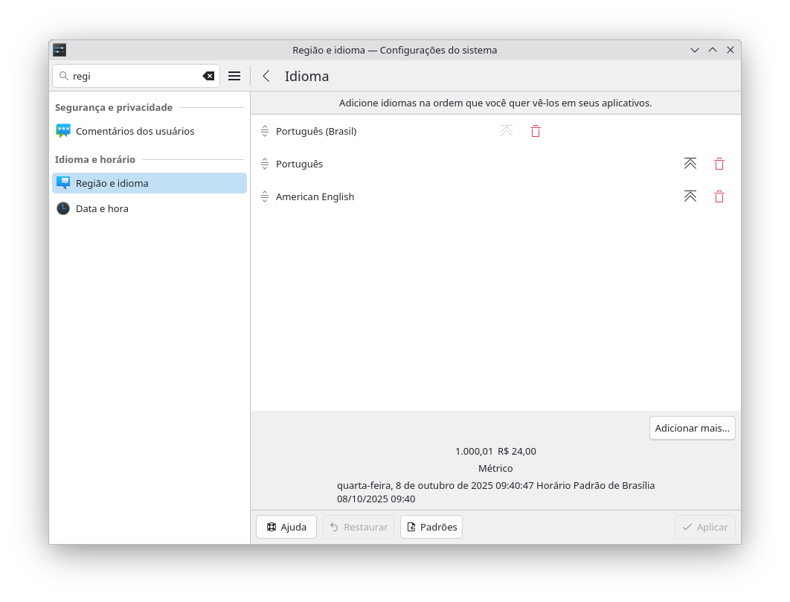
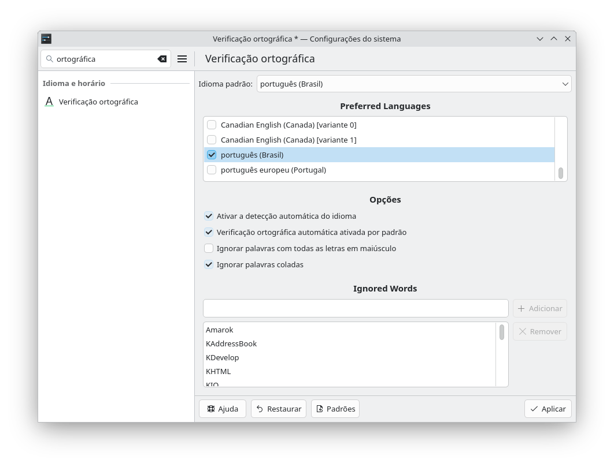

## COMPLETANDO O IDIOMA PORTUGUÊS
O idioma português-brasil não está completamente instalado, e nem o corretor ortográfico, portanto, execute:
```
sudo apt install -y locales task-laptop
sudo apt install -y task-portuguese task-portuguese-desktop
sudo apt install -y hunspell-pt-br 
```
O pacote locales fornece os idiomas do sistema; os pacotes task-* completam tradução de menus, ajuda e aplicativos do ambiente gráfico.  
Feche a sessão do GNOME ou KDE, caso esteja usando-o e refaça o login.  

Se usa KDE, GNOME, XFCE etc., vá em Configurações do sistema>Região e Idioma>Idioma>Português (Brasil):  
  
Você pode aproveitar o momento e remover os idiomas desnecessários, mas não remova o inglês, poderemos requerer ele em algum momento, por exemplo, verificação ortográfica de um texto escrito em inglês.  

## COMPLETANDO O IDIOMA PORTUGUÊS - Verificação ortográfica
Depois disso, vá em Configurações do sistema e procure por "Verificação ortográfica" e faça os seguintes ajustes: 
* Idioma padrão: Português(Brasil)  
* Ativar detecção automática de idioma: Ligado  
* Verificação ortográfica automática ativada por padrão: Ligado  
* Ignorar palavras com toda as letras em maiúsculo: Desligado  
* Ignorar palavras coladas: Ligado  
Como visto nesta imagem:

  

Depois, encerre e entre novamente na sessão.  

