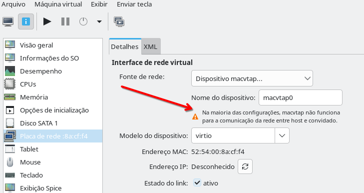
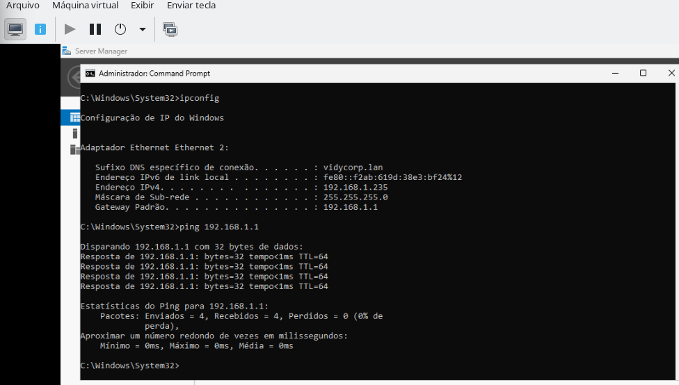

# CRIAR E REMOVER UMA BRIDGE DE REDE COM BRIDGE-UTILS (UBUNTU 25.10 / DEBIAN 13)

## INTRODUÇÃO

Este guia explica como **criar e remover uma interface de rede do tipo *macvtap*** no **Ubuntu 25.10** ou **Debian 13 (Trixie)**, permitindo que **máquinas virtuais (QEMU/KVM)** obtenham IPs diretamente da **rede física**, sem interromper a conexão do computador anfitrião (host).  

Ao contrário da *bridge* tradicional (`br0`), o **macvtap (modo bridge)** não transfere o IP do host para uma interface virtual.  
Ele cria uma **interface virtual ligada à NIC física (`enp8s0`)**, compartilhando o tráfego de rede de forma eficiente, ideal quando você quer:  

- Manter o host navegando normalmente;  
- Permitir que as VMs obtenham IPs da rede local (via DHCP ou IP fixo);  
- Evitar a queda temporária de conexão causada pela criação de bridges tradicionais.  

> 💡 Este procedimento é compatível tanto com ambientes **gráficos (virt-manager)** quanto **servidores headless (libvirt/QEMU puro)**.

Durante o processo:
- A interface física (`enp8s0`) será **transferida para a bridge**;
- O **IP passará a ser atribuído à `br0`** (e não mais à `enp8s0`);
- Você poderá **usar DHCP ou IP fixo** (exemplo incluso);
- Um **método de reversão** completo é apresentado ao final, com opção de restauração total do backup.

⚠️ **Importante:**  
Execute este guia **diretamente no terminal local** (não via SSH), pois a conexão pode cair temporariamente enquanto a nova bridge é criada.

## VOCÊ PRECISA DE BRIDGE?
Na introdução foi explicado o que é o modo bridge, será que entendeu bem?  
O padrão do virt-manager é usar NAT, uma forma de comunicação que funciona o acesso a Internet e tudo o que o hospedeiro conseguir acessar, mas tem a limitação que é computadores de fora não acessam essa VM, por isso, a solução para este problema é criar uma conexão bridge. Mas vocÊ precisa realmente disso?  

Caso seja desenvolvedor, provavelmente não precisa tanto do modo bridge porque sua estação de trabalho pode ser um notebook ou desktop onde a comunicação se dá principalmente da VM para fora e quase nunca na direção contrária. Mas para administradores de sistemas provavelmente vão querer que pessoas de fora acessem esta VM então para eles, o modo bridge é imprescindivel.  

Uma vez detectado que realmente vocÊ precisa de bridge então siga o restante do tutorial, mas entenda que ativando o modo bridge pode ser que alguns recursos de comunicação entre host e convidado podem não funcionar como diz essa advertência:  

  


## ENTENDENDO O AMBIENTE DO EXEMPLO
O ambiente usado neste guia é típico de um sistema limpo com suporte a virtualização (QEMU/KVM, VirtualBox, etc.).


- **Distribuição:** `Debian 13`
- **Gerenciador de rede:** NetworkManager (`nmcli`)
- **Interface física:** `enp8s0`
- **Nome da conexão principal:** `Wired connection 1`
- **Diretório de backups:** `~/net-backups`
- **IP local do host:** obtido normalmente via DHCP
- **Interface virtual a ser criada:** `macvtap0`
- **Modo de operação:** `bridge`  
  (há também `private`, `vepa` e `passthru`, mas `bridge` permite comunicação direta entre VMs e LAN)

- Diretório de backups: `~/net-backups`
- O passo a passo descreve uma bridge que usa IP via DHCP, mas caso opte por IP Fixo, então o exemplo alternativo usa o IP `192.168.1.50/24`, o gateway será `192.168.1.1` e o DNS da rede será local com o IP `192.168.1.5`.
- Estado do arquivo `/etc/network/interfaces`:
  - Conteúdo atual:
    ```text
    source /etc/network/interfaces.d/*

    # The loopback network interface
    auto lo
    iface lo inet loopback
    ```
  - Interpretação: Apenas o loopback está definido. **Não há blocos para `enp8s0`**, portanto não existe conflito com o NetworkManager. **Nenhuma alteração é necessária nesse arquivo.**

## BACKUP DA CONFIGURAÇÃO ORIGINAL
Vamos ser cautelosos e fazer um backup de nossa configuração de rede atual, assim se algo der errado, restauramos.  

Escolha uma pasta para guardar o backup dessa configuração de rede, minha sugestão é **~/net-backups**, mas você pode escolher outra:  
```bash
export BKP=~/net-backups
```

Depois criamos a pasta:
```bash
mkdir -p $BKP
```

Depois, vamos definir o nome do arquivo de backup com o seu nome:
```bash
export BKPFILE=$BKP/netcfg-bridge-$(date +%F_%H%M%S).tgz 
```

Depois, geramos um relatorio em formato .txt e usamos o tar para compactar os arquivos de configurações atuais no local de destino:  
```bash
nmcli general status >$BKPFILE.txt
nmcli con show  >>$BKPFILE.txt
sudo tar -C / -czf $BKPFILE   etc/network etc/NetworkManager etc/systemd/network
sudo chown -R $USER:$USER $BKP
```
E então verifique os arquivos que foram gerado:  
```bash
ls -lh $BKP/
```
E verá algo similar a isso:
```
-rw-r--r-- 1 gsantana gsantana 2,3K out 23 16:57 netcfg-bridge-2025-10-23_165719.tgz
-rw-rw-r-- 1 gsantana gsantana  399 out 23 17:10 netcfg-bridge-2025-10-23_165719.tgz.txt
```
Como pôde ver, a composição dos arquivos que foram compactados são apenas alguns arquivos textos pequenos, quase nada em termos de espaço. Também criamos uma arquivo `.txt` que armazena os resultados dos comandos que você viu no inicio desse tutorial, ou seja, algo similar:
```
$ cat $BKP/netcfg-bridge-2025-10-23_165719.tgz.txt 
STATE      CONNECTIVITY  WIFI-HW  WIFI        WWAN-HW  WWAN        METERED          
conectado  completa      missing  habilitado  missing  habilitado  não (adivinhado) 
NAME                UUID                                  TYPE      DEVICE 
Wired connection 1  aaaaaaaa-bbbb-cccc-dddd-eeeeeeeeeeee  ethernet  enp8s0 
lo                  bbbbbbbb-cccc-dddd-eeee-ffffffffffff  loopback  lo  
```
Com isso, mais tarde será possível comparar o antes e o depois. Se você não vê nenhum dos dois arquivos, o `.tgz` e o `.txt` ou estão vazios, então algo deu errado nos passos anteriores e é melhor revisá-los e não prosseguir.

## VERIFICAÇÃO DO AMBIENTE
Comandos úteis de verificação, primeira observamos se `enp8s0` esta presente:
```bash
$ ip -br link | grep -E 'enp|eth'
enp8s0           UP             74:56:3c:f0:18:b4 <BROADCAST,MULTICAST,UP,LOWER_UP> 
```
Depois, execute:
```bash
$ nmcli device status | grep enp8s0
enp8s0  ethernet  conectado               Wired connection 1 
```
Note que acima está descrito tanto a interface fisica `enp8s0` como também o nome da conexão `Wired connection 1`, fique atento porque você precisará adaptar esses nomes ao seu ambiente que pode ser diferente do meu.  

Após a instalação e a verificação, certifique-se de que o NetworkManager está ativo:
```bash
sudo systemctl enable --now NetworkManager
```
Depois observe o status, execute:
```bash
$ sudo nmcli general status
STATE      CONNECTIVITY  WIFI-HW  WIFI        WWAN-HW  WWAN        METERED          
conectado  completa      missing  habilitado  missing  habilitado  não (adivinhado) 
```
Observe suas conexões atuais:
```bash
$ nmcli con show 
NAME                UUID                                  TYPE      DEVICE 
Wired connection 1  aaaaaaaa-bbbb-cccc-dddd-eeeeeeeeeeee  ethernet  enp8s0 
lo                  bbbbbbbb-cccc-dddd-eeee-ffffffffffff  loopback  lo  
```
Se você teve problemas e agora aparecem mais conexões do que deveria, por exemplo, vamos supor que o comando `nmcli con show ` mostre isso:  
```
NAME                UUID                                  TYPE      DEVICE 
Wired connection 1  aaaaaaaa-bbbb-cccc-dddd-eeeeeeeeeeee  ethernet  enp8s0 
lo                  bbbbbbbb-cccc-dddd-eeee-ffffffffffff  loopback  lo     
Wired connection 1  277b4807-23a8-4018-b679-69cc3dcbc1e6  ethernet  --  
```  
No exemplo acima, você nota que a conexão chamada `Wired connection1` que está com nome duplicado e tem UUID `277b4807-23a8-4018-b679-69cc3dcbc1e6` não está relacionado a nenhum DEVICE, então ela não fará nenhuma falta se for removida, então para remover, executamos o comando:
```bash
$ sudo nmcli con delete 277b4807-23a8-4018-b679-69cc3dcbc1e6
A conexão “Wired connection 1” (277b4807-23a8-4018-b679-69cc3dcbc1e6) foi excluída com sucesso.
```
E assim vamos removendo todas as conexões desnecessárias.  


## CRIANDO UMA INTERFACE MACVTAP(bridge)
Procedimento recomendado para criar a bridge `br0` e anexar `enp8s0` como escrava, usando DHCP na bridge.  
A criação pode ser feita com nmcli ou com ip link.  
O método ip link é mais direto e recomendado para testes manuais.  

### Criar a interface macvtap
```bash
sudo ip link add link enp8s0 name macvtap0 type macvtap mode bridge
```
Ativar a interface:
```bash
sudo ip link set macvtap0 up
```
Confirmar a criação:
```bash
ip -d link show macvtap0
```
Saída esperada:
```
3: macvtap0@enp8s0: <BROADCAST,MULTICAST,UP,LOWER_UP> mtu 1500 qdisc fq_codel state UP mode DEFAULT group default qlen 500
    link/ether 2a:19:36:99:83:d8 brd ff:ff:ff:ff:ff:ff promiscuity 0 allmulti 0 minmtu 68 maxmtu 9194 
    macvtap mode bridge bcqueuelen 1000 usedbcqueuelen 1000 addrgenmode eui64 numtxqueues 1 numrxqueues 1 gso_max_size 64000 gso_max_segs 64 tso_max_size 64000 tso_max_segs 64 gro_max_size 65536 gso_ipv4_max_size 64000 gro_ipv4_max_size 65536 
```
Verifique a interface:
```bash
ip -br a show macvtap0
```
> macvtap0@enp8s0  UP             fe80::4027:80ff:fe96:4798/64  

Essa interface aparece também em /dev/tap* e pode ser usada diretamente por QEMU/libvirt. Para todos os fins, você acabou de criar uma interface bridge chamada **macvtap0** e será esta que usará quando configurar suas VMs.   
Mas ela é volátil, isto significa que quando reiniciar o computador terá de repetir este tópico de criação de uma **bridge macvtap0** todas as vezes. É possível, deixá-la permanente? Claro que sim, assim que eu descobrir um outro método considerado seguro, eu postarei aqui. Por ora, o que pode ser feito é colocar os comandos acimas num script `/usr/local/sbin/create_bridge_macvtap0`, mas faremos isso apenas depois dos testes de conectividade.  


### INTEGRANDO "MACVTAP0" COM O LIBVIRT / VIRT-MANAGER
No virt-manager, ao criar ou editar uma VM:
1. Vá em Interface de rede → Fonte de rede.
2. Escolha Interface Host.
3. Selecione **macvtap0** (modo bridge).
4. Clique em Aplicar e salve.


A VM agora receberá IP direto do servidor DHCP da rede local, sem NAT, podendo se comunicar com outras VMs e dispositivos da LAN.

### TESTANDO A CONECTIVIDADE

Verifique a interface:
```bash
ip -br a show macvtap0
```
> macvtap0@enp8s0  UP             fe80::4027:80ff:fe96:4798/64    
Ao mostrar `macvtap0@enp8s0` voce pode achar que a interface mostrou de nome, mas não, ela continua sendo `macvtap0`. Esse sufixo **@enp8s0** não faz parte do nome da interface — ele apenas indica o vínculo físico (“macvtap0 está ligado à enp8s0”).


Execute dentro da VM Windows, abre o `cmd` e execute:
```bash
ipconfig
```
O resultado esperado é a exibição dos dados de sua interface de rede. Agora vamos testar a conextividade com a rede internet:
```bash
ping 192.168.1.1 # supondo ser este o seu gateway
```
O resultado esperado é:  
```
PING 192.168.1.1 (192.168.1.1) 56(84) bytes of data.
64 bytes from 192.168.1.1: icmp_seq=1 ttl=64 time=0.331 ms
64 bytes from 192.168.1.1: icmp_seq=2 ttl=64 time=0.521 ms
64 bytes from 192.168.1.1: icmp_seq=3 ttl=64 time=0.528 ms

--- 192.168.1.1 ping statistics ---
3 packets transmitted, 3 received, 0% packet loss, time 2026ms
rtt min/avg/max/mdev = 0.331/0.460/0.528/0.091 ms
```

Se quiser testar pingando endereços de internet, também vale, mas antes, verifique se o IP acima está liberado em sua rede de firewall/gateway para acesso À internet:
```bash
ping 1.1.1.1 # IP do DNS da Cloudfare
```

  

Se sua VM conseguiu um IP de sua rede e consegue dar ping em qualquer outra estação, então parabens! Você conseguiu criar uma conexão bridge satisfatória e pode prosseguir. Criar uma bridge não é uma etapa fácil, eu patinei muitas vezes. Para desenvolvedores, usar uma conexão NAT é bem vantajosa e mais simples, mas administradores de sistemas quase sempre precisam simular que estão dentro da rede corporativa.  


### TORNANDO A INTERFACE MACVTAP PERMANENTE
Se os testes de conectividade deram certo, inclusive testados de uma VM(Windows, Linux,...) então vamos a má noticia: ela é temporária, criado reiniciar o sistema terá de repetir a seção de criação da conexão bride(macvtap0).  
Então vamos torná-la permanente por executar durante o boot do sistema a sequencia de comandos que utilizamos, chamamos isso de script, então vamos criar um script, crie ou edite o arquivo a seguir:  
```bash
sudo editor /usr/local/sbin/macvtap0.sh
```
E cole o conteúdo a seguir, não se preocupe, são os mesmos comandos que antes, mas com um tratamento especial de script:
```
#!/bin/bash
set -euo pipefail
PARENT_IF="${PARENT_IF:-enp8s0}"
IFACE="${IFACE:-macvtap0}"
MODE="${MODE:-bridge}"

# aguarda a interface física aparecer (até 10s)
for i in {1..10}; do
  [[ -e "/sys/class/net/$PARENT_IF" ]] && break
  sleep 1
done
if [[ ! -e "/sys/class/net/$PARENT_IF" ]]; then
  echo "Parent '$PARENT_IF' não encontrado." >&2
  exit 1
fi

case "${1:-up}" in
  up)
    /sbin/modprobe macvtap || true
    if ! /usr/sbin/ip link show "$IFACE" &>/dev/null; then
      /usr/sbin/ip link add link "$PARENT_IF" name "$IFACE" type macvtap mode "$MODE"
    fi
    /usr/sbin/ip link set "$IFACE" up
    /usr/sbin/ip -d link show "$IFACE" || true
    /usr/sbin/ip -br a show "$IFACE" || true
    ;;
  down)
    if /usr/sbin/ip link show "$IFACE" &>/dev/null; then
      /usr/sbin/ip link set "$IFACE" down || true
      /usr/sbin/ip link del "$IFACE" || true
    fi
    ;;
  status)
    /usr/sbin/ip -d link show "$IFACE" || true
    /usr/sbin/ip -br a show "$IFACE" || true
    ;;
  *)
    echo "Uso: $0 {up|down|status}"
    exit 1
    ;;
esac
```
Vamos dar permissão de execução ao script:
```bash
sudo chmod 755 /usr/local/sbin/macvtap0.sh
```

Vamos transformar o script em algo reconhecido pelo serviço systemd, crie ou edite o arquivo `/etc/systemd/system/macvtap0.service`:
```bash
sudo editor /etc/systemd/system/macvtap0.service
```
E cole o seguinte conteúdo:
```
[Unit]
Description=macvtap0 em modo bridge
Wants=network-online.target
After=network-online.target
# Se usa NetworkManager, estas linhas ajudam ainda mais:
Wants=NetworkManager-wait-online.service
After=NetworkManager-wait-online.service

[Service]
Type=oneshot
RemainAfterExit=yes
Environment=PATH=/usr/sbin:/usr/bin:/sbin:/bin
# Ajuste aqui se o parent não for enp8s0
Environment=PARENT_IF=enp8s0
Environment=IFACE=macvtap0
Environment=MODE=bridge
ExecStartPre=/sbin/modprobe macvtap
ExecStart=/usr/bin/env bash -c '/usr/local/sbin/macvtap0.sh up'
ExecStop=/usr/bin/env bash -c '/usr/local/sbin/macvtap0.sh down'

[Install]
WantedBy=multi-user.target
```
Mas, nosso intuíto é deixar esta interface subir sozinha durante o boot, certo? Então execute os comandos:
```bash
sudo systemctl daemon-reload
sudo systemctl enable --now macvtap0.service
sudo systemctl status macvtap0.service --no-pager
```

A partir desse momento, você já pode subir a interface usando o systemd com os comandos:
```bash
sudo systemctl [status|start|stop] macvtap0
```

O 'kvm' e 'libvirt' são usuários utilizados pelo virtualizado, e quando se faz uso de bridge, eles também precisam de acesso a alguns devices-blocks como **/dev/tapNN** e **/dev/macvtapNN**, então precisamos criar regras udev,  crie o arquivo `/etc/udev/rules.d/99-macvtap-perms.rules`:
```bash
sudo editor /etc/udev/rules.d/99-macvtap-perms.rules
```
E cole o seguinte conteúdo:
```
# macvtap: /dev/tapN (usado por macvtap)
SUBSYSTEM=="macvtap", KERNEL=="tap*", MODE="0660", GROUP="kvm"

# vhost-net (opcional, bom para desempenho com virtio-net)
KERNEL=="vhost-net", MODE="0660", GROUP="kvm"

# TUN/TAP genérico: /dev/net/tun (útil para outras topologias)
SUBSYSTEM=="misc", KERNEL=="tun", MODE="0660", GROUP="kvm"
```
Um device só pode ter um grupo, estamos escolhemos o grupo do 'kvm'. Agora, precisamos garantir que seu login, libvirt e libvirt-qemu estão no grupo kvm, creio que isso já tenha sido feito em passos anteriores, mas não custa nada repetir oa mesmos comandos, execute:
```bash
sudo usermod -aG kvm "$USER"
sudo usermod -aG kvm libvirt-qemu
sudo usermod -aG libvirt "$USER"
```
Agora, vamos pliquar as regras do udev, execute:
```bash
sudo udevadm control --reload
sudo udevadm trigger
```
Execute um teste rápido:  
```bash
ls -l /dev/net/tun            # ... root kvm
ls -l /dev/tap* 2>/dev/null   # quando existir, deve vir ... root kvm
```
Recomendo que *faça o reboot*, para que as regras estabelecidas possam ser vistas, após o boot.  
Depois repita nosso teste rápido acima e veja se tudo está correto, se estiver, então terminamos.  


Observações úteis:
* O serviço é autoverificado: se macvtap0 já existir, só dá up.
* Para remover limpo: sudo systemctl stop macvtap0 && sudo systemctl disable macvtap0.
* Se for usar em VMs (QEMU/libvirt), o nome da interface é macvtap0 (o sufixo @enp8s0 é apenas representação do link-pai).

### REMOVENDO A INTERFACE MACVTAP
Para remover a interface e restaurar o estado original:
```bash
sudo ip link delete macvtap0
```
Verifique:
```bash
ip link show | grep macvtap
```
E se não aparecer nada, a interface foi removida.  

#### Desativar o serviço systemd (para não recriar no boot)
Execute os comandos:
```bash
sudo systemctl stop macvtap0.service
sudo systemctl disable macvtap0.service
sudo rm -f /etc/systemd/system/macvtap0.service
sudo systemctl daemon-reload
```
#### Remover o script auxiliar (opcional)
```bash
sudo rm -f /usr/local/sbin/macvtap0.sh
```
#### Remover as regras udev (se não for mais usar TAP/macvtap)
Execute:
```bash
sudo rm -f /etc/udev/rules.d/99-macvtap-perms.rules
sudo udevadm control --reload
sudo udevadm trigger
```
#### Remover o módulo do kernel do carregamento automático (opcional)
Se você adicionou este arquivo `/etc/modules-load.d/macvtap.conf` então execute:
```bash
sudo rm -f /etc/modules-load.d/macvtap.conf
```
Depois **reinicie o computador**.  


## RESTAURAÇÃO BACKUP DA CONFIGURAÇÃO DE REDE
Se está lendo isso é porque algo deu muito errado e reversão usando o NETWORK-MANAGER não funcionou e agora precisa voltar a configuração de rede original, não é mesmo?
Sem problemas, foi por isso que fizemos o backup antes de dar inicio aos procedimentos.  

Primeiro vamos apontar a variavel para a localização de seus backups:  
```bash
export BKP=~/net-backups
```

Depois liste todos os seus backups e escoha o que for mais apropriado:  
```bash
$ ls -1 $BKP/
netcfg-2025-10-22_165719.tgz
netcfg-bridge-2025-10-23_165719.tgz
```

Determinado qual o arquivo de backup desejado, execute:
```bash
sudo tar -C / -xzf $BKP/netcfg-bridge-2025-10-23_165719.tgz
```

Os arquivos de configuração serão substituidos pelo backup, porém o gerenciador que os controla precisa ser reiniciado:    
```bash
sudo systemctl restart NetworkManager 
```

Para confirmar que a rede foi restaurada ao original, execute:
```bash
nmcli general status
nmcli con show 
ip -br a 
```
E compare seus resultados com o que havia no backup lendo o arquivo `netcfg-bridge-2025-10-23_165719.tgz.txt`.  
Se os resultados dos comandos acima deram baterem com os resultados do arquivo `netcfg-bridge-2025-10-23_165719.tgz.txt`, então você restaurou sua rede com sucesso.  
Em algumas oportunidades, você pode encontrar conexões que não existiam antes, veja este exemplo que aparece ao executar o comando `nmcli con show`:  
```
NAME                UUID                                  TYPE      DEVICE 
Wired connection 1  aaaaaaaa-bbbb-cccc-dddd-eeeeeeeeeeee  ethernet  enp8s0 
lo                  bbbbbbbb-cccc-dddd-eeee-ffffffffffff  loopback  lo     
Wired connection 1  277b4807-23a8-4018-b679-69cc3dcbc1e6  ethernet  --  
```  
No exemplo acima, você nota que a conexão chamada `Wired connection1` que está com nome duplicado e tem UUID `277b4807-23a8-4018-b679-69cc3dcbc1e6` não está relacionado a nenhum DEVICE, então ela não fará nenhuma falta se for removida, então para remover, executamos o comando:
```bash
$ sudo nmcli con delete 277b4807-23a8-4018-b679-69cc3dcbc1e6
A conexão “Wired connection 1” (277b4807-23a8-4018-b679-69cc3dcbc1e6) foi excluída com sucesso.
```
E assim vamos removendo todas as conexões desnecessárias até que a comparação com o antes e depois sejam exatamente iguais.   


## CONCLUSÃO

Com o macvtap (modo bridge) você:

Mantém a interface do host (enp8s0) intacta;
* Dá IPs reais de LAN às suas VMs;  
* Evita desconexões do host durante a configuração;
* Dispensa br0 e bridge-utils.  

Esse método é ideal quando o host tem apenas uma placa de rede física e você precisa que as VMs se vejam entre si e com a rede local, com desempenho quase nativo.

> **Dica**: Se precisar de múltiplas VMs com IPs fixos, crie novas interfaces  (macvtap1, macvtap2, …) e vincule cada uma a enp8s0.  


