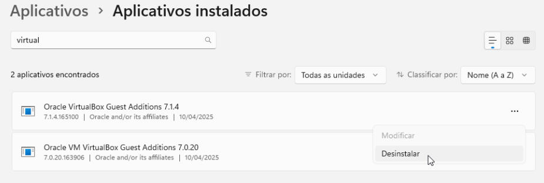

# 🧭 Introdução

O **VirtualBox** é um hipervisor do tipo 2 amplamente utilizado para virtualização em desktops.  
Ele armazena os discos virtuais no formato **VDI (Virtual Disk Image)**, um contêiner eficiente e fácil de expandir, projetado pela Oracle.  
Embora o VDI funcione muito bem dentro do ecossistema do VirtualBox, ele **não é nativamente compatível** com hipervisores baseados em KVM, como o **QEMU**, **virt-manager**, **GNOME Boxes** ou **Cockpit Machines**.

O **QEMU/KVM**, por sua vez, utiliza preferencialmente o formato **QCOW2 (QEMU Copy On Write)**.  
Esse formato é mais avançado, permitindo recursos como:
- snapshots incrementais,
- compactação eficiente,
- encriptação e
- melhor desempenho com drivers VirtIO.

Assim, para migrar uma VM do VirtualBox para o QEMU/KVM, basta converter o disco de **VDI → QCOW2**, e depois criar uma nova VM apontando para o arquivo convertido.

---

## Identificar o Disco VirtualBox

No VirtualBox, os discos das VMs geralmente ficam armazenados em:
```
~/VirtualBox VMs/<nome-da-vm>/<nome>.vdi
```

Exemplo:
```
~/VirtualBox VMs/win11-dx11/win11-dx11.vdi
````

Confirme o nome do arquivo `.vdi` e **encerre a VM** antes de prosseguir.

---

## Converter o Arquivo VDI para QCOW2

No Linux, o pacote `qemu-utils` traz a ferramenta **`qemu-img`**, usada para conversão de discos entre diversos formatos.

Instale (se ainda não tiver):
```bash
sudo apt install qemu-utils -y
````

Agora, execute a conversão:

```bash
qemu-img convert -p -O qcow2 -o compat=1.1,cluster_size=1M,lazy_refcounts=on \
  ~/VirtualBox\ VMs/win11-dx11/win11-dx11.vdi ~/libvirt/images/win11-dx11.qcow2
```
Essa conversão gerará um arquivo de mesmo tamanho que o original, porém no formato qcow2.  

### Explicando os parâmetros:

| Parâmetro                   | Função                                 |
| :-------------------------- | :------------------------------------- |
| `-p`                        | Exibe o progresso da conversão         |
| `-O qcow2`                  | Define o formato de saída como QCOW2   |
| `compat=1.1`                | Usa versão moderna e rápida do formato |
| `cluster_size=1M`           | Melhora desempenho de I/O              |
| `lazy_refcounts=on`         | Evita travamentos durante gravação     |
| `~/VirtualBox VMs/...vdi`   | Caminho do disco de origem             |
| `~/libvirt/images/...qcow2` | Caminho de destino do novo disco       |

Após o processo, você terá um arquivo QCOW2 pronto para uso no KVM.

---

## Validar a Conversão

Para verificar integridade, execute:

```bash
sudo qemu-img check -r all ~/libvirt/images/win11-dx11.qcow2
```
Saída esperada:
```
No errors were found on the image.
82174/122880 = 66.87% allocated, 0.00% fragmented, 0.00% compressed clusters
Image end offset: 86170927104
```


Uma vez validado, ou seja **No errors were found on the image.** então podemos obter as informações do disco:  
```bash
qemu-img info ~/libvirt/images/win11-dx11.qcow2
```
Saída esperada:
```
image: win11-dx11.qcow2
file format: qcow2
virtual size: 120 GiB (128849018880 bytes)
disk size: 80.3 GiB
cluster_size: 1048576
Format specific information:
    compat: 1.1
    compression type: zlib
    lazy refcounts: true
    refcount bits: 16
    corrupt: false
    extended l2: false
Child node '/file':
    filename: win11-dx11.qcow2
    protocol type: file
    file length: 80.3 GiB (86170927104 bytes)
    disk size: 80.3 GiB
```
Isso indica que podemos prosseguir.  

---

## Criar a VM no QEMU/KVM

### Método 1: via Virt-Manager (interface gráfica)

1. Abra o **Virt-Manager**.
2. Clique em **Criar nova máquina virtual**.
3. Escolha **“Importar imagem de disco existente”**.
4. Selecione o arquivo:

   ```
   ~/libvirt/images/win11-dx11.qcow2
   ```
5. Defina o sistema operacional convidado (ex: *Windows 11*).
6. Acrescente um CDROM SATA com a imagem  do CDROM DO WINDOWS 11(ou outro).
7. E prossiga a configuração da VM normalmente como faria numa instalação do [Windows](debian_qemu_kvm_windows.md), no entanto, mantenha **Dispositivo de disco** e **Interface de rede** com seus valores padrão. Não é o momento para especificar drivers do **VirtIO** ainda.
8. O boot deverá ser modificado para iniciar pelo CDROM.
10.Prossiga normalmente, até o reiniciio do computador

---

## Reparando o Boot do Windows   
Quando iniciar a VM, é bem provável que não funcione de primeira, o SecurityBoot é o culpado disso, mas vamos recuperá-lo.
Dê boot pelo CDROM do Windows e então siga **Solução de problemas>Prompt de comando**, execute:
```
diskpart
list vol
``` 
E serão listados todos os volumes, um deles é uma partição FAT32 e provavelmente marcada como oculta: 
```cmd
DISKPART> list vol
Volume ###  Ltr Rótulo          Fs     Tipo      Tamanho   Status   Informações
----------- --- --------------- ------ --------- --------- -------- ----------
Volume 0    D   CCCOMA_X64F     UDF    CD-ROM    7089 MB   Íntegro
Volume 1    C   Windows_OS      NTFS   Partição  119 GB    Íntegro
Volume 2        [Sem rótulo]    FAT32  Partição  100 MB    Íntegro Oculto
Volume 3        [Sem rótulo]    NTFS   Partição  841 MB    Íntegro Oculto
DISKPART>
   ``` 
Em nosso exemplo, Partição EFI (~100 MB, FAT32) é o volume 2, então vamos definir a letra S: para ele. Também foi detectado que o volume 1 é o Windows e para ele vamos estabelecer a letra C:. Dentro do diskpart, execute:  
```cmd
sel vol 2
assign letter=S
select vol 1
assign letter=C
exit
```
Agora temos a letra C: representando a instalação do Windows e a letra S: representando a partição UEFI.   

Vamos agora limpar a partição EFI e recrie o bootloader para evitar permissões erradas(Access Denied):  
```cmd
S:
cd \
del /F /S /Q *.*
rmdir /q /s EFI
```
Com isso esvaziamos o drive S:, vamos conferir:
```cmd
dir
```
Provavelmente resultará em:  
> Arquivo não encontrado

Então prosseguimos:
```cmd
mkdir EFI
cd EFI
mkdir Microsoft
mkdir Boot
```


Anote também que letra onde o Windows está instalado é **C:**, agora vamos recriar os arquivos de boot EFI, levando execute agora:  
```cmd
bcdboot C:\Windows /s S: /f UEFI
```
Haverá como resposta:
> Arquivos de inicialização criados com êxito.

Vamos dar uma olhada na partição UEFI:
```cmd
dir S:\EFI\Microsoft\Boot\*.efi
```
Na listagem de arquivos você deve encontrar o arquivo **bootmgfw.efi** indicando que tudo foi executado com êxito.  
Remova o CD de instalação e reinicie a VM.

Reinicie a VM.
Vá nas **Configurações da VM>Opções de inicialização** e desligue o boot pelo CDROM (e ejete o iso do Windows) e habilite a opçãos **Habilitar menu de inicialização** proque você agora precisará selecionar o arquivo `.efi` para dar boot no Windows.

Entre no firmware da VM Windows, vá em **Boot Maintenance Manager** e selecione a opção **Boot Next Value** e escolha **Windows Boot Manager**, depois pressione **F10** para salvar.

Depois disso, caso ainda falhar, repita o processo de boot boot de recuperação do Windows, mas execute agora:
```cmd
attrib -h -r -s S:\EFI\Microsoft\Boot\BCD
del S:\EFI\Microsoft\Boot\BCD
bcdboot C:\Windows /s S: /f UEFI
```

---

## Primeiro boot com o Windows bem sucedido
Ao iniciar o Windows, voce precisa remover os drivers e programas relacionados ao VirtualBox:  
  

A cada programa removido, provavelmente precisará reiniciar.  

Desligue a VM.
Com o nosso boot de Windows bem sucedido, vá nas **Configurações da VM>Opções de inicialização** e volte a desabilitar a opção **Habilitar menu de inicialização** porque não precisamos mais dela.  Também desmarque a opção de boot pelo CROM, não precisaremos mais disso. Essas opções quando ligadas tornam o nosso processo de boot mais lento do que deveria. 

---

## Instalando as ferramentas para convidado
Desligue a VM.  
Depois vá nas configurações de nossa VM e verifique se uma unidade de **CD ROM SATA** está presente, precisaremos dela para instalar as ferramentas de convidado. Se não existir, então o que precisaremos adicioná-la. Vá em **Adicionar hardware**, e mude o **Tipo de dispositivo** para **Dispositivo CDROM**: 

   

Uma vez selecionado o dispositivo **CDROM SATA**, então clique em **Gerenciar...** e escolha **virtio-win.iso** que baixamos em etapas anteriores. Depois clique em **Concluir** como mostra a imagem.

Inicie a VM e após o boot do Windows ter concluído, e após o primeiro login, você precisará instalar as ferramentas de convidado.  
Dentro do Windows vá até a unidade de CDROM onde estãos os drivers para convidado VirtIO, você verá nele o aplicativo:  
```
E:\virtio-win-guest-tools.exe
```
Execute-o e siga as instruções na tela:
   

A tela piscará algumas vezes, não se assuste. Não é necessário reiniciar a VM depois dessas ferramentas serem instaldas.   
Para verificar se os drivers já estão funcionando, vá no topo da janela do virt-manager em **Exibir|Escalonar a exibição|** e marque a opção **Redimensionar automaticamente a VM com janela***:  
   

Depois disso, notará que pode sair da janela sem precisar teclar Ctrl+Alt esquerdos e o Windows muda sua resolução a medida que redimencionamos a janela do virt-manager.   
Se você for no topo ao centro e ficar com o ponteiro do mouse ali parado por 1s, aparecerá dois botões que estavam camuflados, um deles é para sair de tela cheia e o outro para enviar combinações de tecla como Ctrl+Alt+Del.  

Ainda nos resta instalar um driver muito importante, o `WinFsp`, sem ele, não poderemos compartilhar arquivos entre hospedeiro e convidado.  
Visite à página:  
[https://github.com/winfsp/winfsp/releases](https://github.com/winfsp/winfsp/releases)   

E então baixe a versão mais recente.  
   

Depois de instalado, execute `services.msc` como administrador e procure pelo serviço **VirtIO-FS Service**, e habilite-o para iniciar junto com o Windows:  

   

Se você tentar iniciar o serviço **VirtIO-FS Service** é provavel que ainda não consiga, isso pode acontecer porque você ainda não usou o recurso de compartilhamento de pastas, então por não haver pastas para compartilhar, o serviço não inicie. Mas deixe-o habilitado porque nas próximas etapas faremos isso.  

Depois desligue essa VM para os próximos passos.

---

## Aprimoramentos
Agora que você tem todos os drivers qemu/kvm necessários, desligue a VM novamente.
Depois vá nas configurações de nossa VM e depois...

### Visão Geral
Na guia **Visão Geral**, selecione a guia **XML**, procure uma seção <hiperv> assim:
```
    <hyperv>
    (...)
    </hyperv>
```
e troque este bloco acima por:
```
<hyperv mode="custom">
  <relaxed state="on"/>
  <vapic state="on"/>
  <spinlocks state="on" retries="8191"/>
  <vpindex state="on"/>
  <runtime state="on"/>
  <synic state="on"/>
  <stimer state="on">
    <direct state="on"/>
  </stimer>
  <reset state="on"/>
  <vendor_id state="on" value="KVM Hv"/>
  <frequencies state="on"/>
  <reenlightenment state="on"/>
  <tlbflush state="on"/>
  <ipi state="on"/>
</hyperv>
```
Se tiver uma CPU Intel, dentro do bloco `hyperv` acrescente também:
```
  <evmcs state="on"/>
```
Ficando mais ou menos assim:  

    

Confirme também se a bloco **clock** está assim:  
```
  <clock offset="localtime">
(...)
    <timer name="hypervclock" present="yes"/>
  </clock>
```  
### CPU
Vá na guia **CPUs** e ligue a opção **Copiar configurações de CPU do hospedeiro(host-passthrough)**:


### MEMÓRIA
Vá em Memória, em nosso exemplo, a memória minima e máxima é 8192MB. Sei que está tentando em colocar a memória mínima abaixo da máxima, mas não faça isso porque VMs Windows ficam malucas. Precisamos apenas marcar a opção **Habilitar memória compartilhada**, apenas isso. Essa opção é um recurso para que quando várias máquinas virtuais com o mesmo sistema operacional o hypervisor possa manter um nucleo compartilhado, por exemplo, se tiver 4 VMs Windows rodando é como se apenas 1 delas realmente ocupasse memória, as demais estão simplesmente reutilizando os programas da primeira, essa é apenas forma simples de explicar porque debaixo dos panos não é exatamente assim. Mas o motivo de habilitarmos este recurso é porque ele é um pré-requisito para que possamos mais tarde compartilhar arquivos entre o ambiente hospedeiro e convidado:  
   
    

### DISCO SATA 1
Vá para a opção **Disco SATA 1**, e provavelmente o barramento estará configurado como **SATA**, para obter maior desempenho, vamos trocar para **VirtIO**, depois disso, expanda **Opçoes Avançadas** e troque:
  
**Modo de cache** troque para **none**(nenhum);  
**Modo de descarte** troque para **unmap**(desmapear);
   
   

Clique em **Aplicar**.  

Tem uma opção muito performática para o mundo Windows que é acrescentar:
* **io** com o valor **native**  
* **Detect zeroes** com o valor **unmap**  

Porém o virt-manager visualmente não traz essa opção, por isso, precisaremos adicioná-las manualmente, vá na aba **XML**, e localize o bloco `<disk …>` e provavelmente estará assim:
```xml
<disk type="file" device="disk">
  <driver name="qemu" type="qcow2" cache="none" discard="unmap"/>
  (...)
</disk>
```
a opção em destaque acima você precisará acrescentar as opções faltantes:  
> <driver name='qemu' type='qcow2' cache='none' discard="unmap"  **io="native" detect_zeroes="unmap"**/>

Tome muito cuidado a sintaxe, aspas simples no lugar de aspas duplas ou a falta delas ou qualquer outro erro de sintaxe fará com que a VM não inicie.  

Clique em **Aplicar** para salvar as alterações. É possivel que ao salvar, o editor visual mude a ordem dos parametros, ele realmente faz isso e não precisa se preocupar.

Depois inicie a VM.  
Se não funcionar, reverta as alterações, a causa mais provavel foram os ajustes em **DISCO SATA 1**.

---

## Compartilhamento de arquivos entre hospedeiro e anfitrião  
Você precisa do suporte ao VirtioFS, siga as instruções [aqui](debian_qemu_kvm_windows_virtiofs.md).  

---

## Programas Básicos
Instale os [programas básicos](debian_qemu_kvm_windows_apps.md).  

---

## Compactar o Arquivo QCOW2
Desligue a VM.  
Para reduzir o tamanho do disco, eliminando blocos vazios, use:

```bash
$ sudo virt-sparsify --in-place ~/libvirt/images/win2k25.qcow2
[   2.6] Trimming /dev/sda1
[   2.7] Trimming /dev/sda2
[   4.0] Trimming /dev/sda3
[   4.1] Sparsify in-place operation completed with no errors
```
O comando realiza uma desfragmentação lógica da imagem QCOW2, consolidando os espaços vazios para o final do arquivo enquanto mantém seu tamanho original. Durante este processo, operações de trimming sinalizam ao formato QCOW2 quais blocos estão realmente vazios, permitindo que o Windows reconheça este espaço como efetivamente disponível para novas alocações de arquivo. Isso otimiza significativamente a performance da VM porque, com os espaços vazios consolidados e sinalizados, o SO convidado pode alocar novos arquivos sem que o QEMU precise realizar custosas operações de growing — o processo onde a imagem QCOW2 precisa ser expandida para armazenar mais dados, consumindo recursos e aumentando latência. Embora o arquivo permaneça no mesmo tamanho, essa otimização de trimming é suficiente para melhorar a performance do Windows, eliminando o overhead desnecessário de expansão de imagem e tornando as operações de I/O mais previsíveis e eficientes.  


---

## 🧩 Conclusão

A conversão de discos **VDI>QCOW2** é o caminho mais prático para migrar VMs do VirtualBox para o QEMU/KVM.
Com essa abordagem:

* você mantém todos os dados intactos,
* aproveita o desempenho nativo do KVM,
* e ainda ganha recursos avançados como snapshots e backup incremental.

Essa técnica é ideal tanto para **migrações definitivas** quanto para **testes de performance** em ambientes Linux modernos.


---

[Retornar à página de Virtualização nativa com QEMU+KVM](debian_qemu_kvm.md)   

