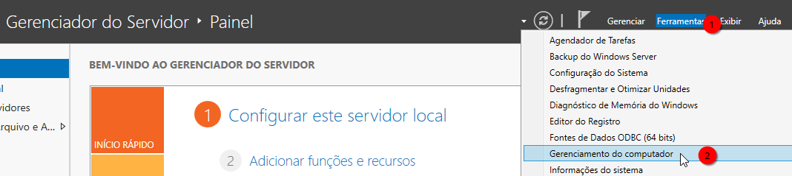
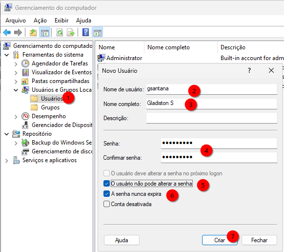
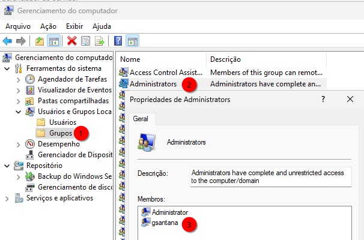
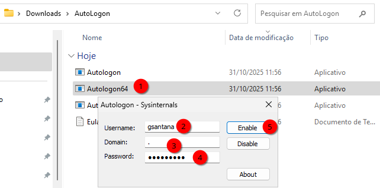
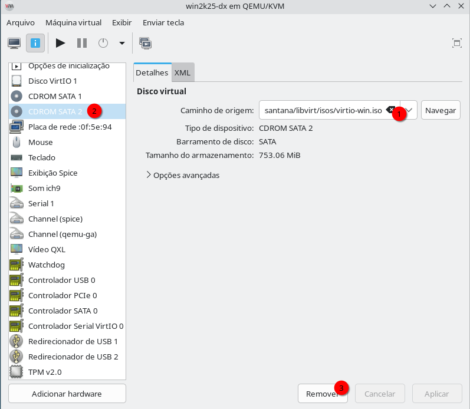

# VIRTUALIZAÇÃO NATIVA QEMU+KVM - USANDO VM WINDOWS
A virtualização com QEMU+KVM oferece desempenho quase nativo, aproveitando recursos do processador e integração direta com o kernel Linux. É uma opção poderosa e leve para executar Windows dentro do Linux, especialmente quando usada com o Virt-Manager, que simplifica a criação e o gerenciamento de VMs.

Neste guia, você verá como criar uma máquina virtual Windows otimizada, usando o pacote de drivers virtio-win para melhor desempenho de disco, rede e vídeo, além de boas práticas sobre discos dinâmicos, rede bridge e configurações essenciais.

Agora que você entende o contexto, vamos começar preparando o ambiente com o pacote de drivers VirtIO.

O `virtio-win.iso` é um pacote de drivers e utilitários da Red Hat criado para melhorar o desempenho e a compatibilidade de máquinas virtuais Windows executadas em hipervisores baseados em KVM/QEMU (como Virt-Manager, Proxmox, Xen, etc.).
Se pretende virtualizar máquinas windows precisará dessa .iso em seu sistema. Em nosso exemplo anterior, o pool de arquivos `.iso` é a pasta de **~/libvirt/isos**, então vamos baixá-lo lá, execute:  
```
cd ~/libvirt/isos
wget -vc https://fedorapeople.org/groups/virt/virtio-win/direct-downloads/stable-virtio/virtio-win.iso
```

Se estiver pensando em ambiente de desenvolvimento, a ISO do Windows Server é melhor, tem menor footprint de consumo de memória e CPU, e também, geralmente as atualizações dele não quebram o sistema como as atualizações da versão Workstation. Embora não exista uma `.iso` em português para o Windows Server, fique tranquilo, desde a edição do Windows Server 2012 é possivel modificar o idioma após a instalação. O link para download é:  
[Site oficial da Microsoft para baixar o Windows Server](https://www.microsoft.com/pt-br/evalcenter/download-windows-server-2025)  

## SERVIÇOS ESSENCIAIS
O sistema hospedeiro precisa ter os serviços abaixo rodando, eles são importantes para que possamos tem alguma integração entre o hospedeiro e máquinas windows, são eles:

### Serviço `spice-vdagentd`
Este é um serviço que lhe permitirá compartilhar a área de clipboard entre hospedeiro e convidado, veja se o serviço está habilitado e rodando, execute:  
```bash
$ sudo systemctl status spice-vdagentd
○ spice-vdagentd.service - Agent daemon for Spice guests
     Loaded: loaded (/usr/lib/systemd/system/spice-vdagentd.service; indirect; preset: enabled)
     Active: inactive (dead)
TriggeredBy: ○ spice-vdagentd.socket
```


### Serviço `spice-webdavd`
Este é um serviço que lhe permitirá compartilhar arquivos entre hospedeiro e convidado, veja se o serviço está habilitado e rodando, execute:  
```bash
$ sudo systemctl status spice-webdavd
○ spice-vdagentd.service - Agent daemon for Spice guests
     Loaded: loaded (/usr/lib/systemd/system/spice-vdagentd.service; indirect; preset: enabled)
     Active: inactive (dead)
TriggeredBy: ○ spice-vdagentd.socket
```
Se estes serviços não estiverem rodando, avalie os passos anteriores porque prosseguir sem eles torna a sua VM Windows muito limitada, mas na maioria das vezes, apenas o comando a seguir resolve:  
```bash
sudo systemctl start spice-vdagentd
sudo systemctl start spice-webdavd
```
Se não resolver, ou após o boot, estiverem novamente desligados, provavelmente faltou habilitar o "start"  junto com o boot `sudo systemctl enable [serviço]`.  

## Instalando o Windows dentro de uma VM
Siga as instruções abaixo:  
[Instalando o Windows dentro de uma VM](debian_qemu_kvm_windows_inst.md)   

## Mudando o idioma do Windows
Siga as instruções abaixo:  
[Mudando o idioma do Windows](debian_qemu_kvm_windows_lang.md)  


## VIRT-MANAGER - WINDOWS - RENOMEANDO O COMPUTADOR
Vamos renomear o computador para um nome mais apropriado, ex: **ti-01a**.  Aqui não vou colocar instruções porque acredito que você saiba como fazer isso.  

### VIRT-MANAGER - WINDOWS - CRIANDO A PRIMEIRA CONTA DE LOGIN
Não podemos usar a conta **Admnistrador** o tempo todo, então precisamos criar uma conta, ex: **gsantana**. Eu imagino que não tenha dificuldade com isso, mas se estiver usando o Windows Server, é um pouco diferente, neste sistema vá até o **Gerenciador do servidor|Ferramentas|Gerenciamento do computador**:  

  

E então usar o gerenciador de computador para criar a conta:  
  

Lembre-se de colocar o novo usuário no grupo de **Administradores**, assim não precisará ficar trocando de conta quando precisar ajustar algo administrativamente no sistema:  
    


### VIRT-MANAGER - WINDOWS - ATIVANDO O AUTOLOGON
É muito chato o logon do Windows, especialmente no servidor porque é preciso enviar CTRL+ALT+DEL para então digitar a senha. Uma vez que as VMs só rodam depois que vocÊ faz o login no sistema hospedeiro, é bem provável que você não queira ficar burocratizando digitar a senha na VM Windows também, então para isso temos uma solução, instale o programa de [autologon](https://learn.microsoft.com/pt-br/sysinternals/downloads/autologon).  
Ele é simples e ao executá-lo pela primeira vez você fornecerá sua autenticação e após o boot, ele entrará sozinho com a conta que foi informada.    
    

### CONFIGURAÇÃO DA BARRA DE TAREFAS
Faça o seguintes ajustes no painel do menu iniciar do Windows, clique com o botão direito do mouse e escolha **Configurações da barra de tarefas**:
1. Em **Pesquisa** troque **Caixa de pesquisa** por **Ocultar**;
2. Em **Visão de Tarefas**, desative-o;
3. Em comportamento da barra de tarefas, ajuste o **Alinhamento da barra de tarefas** do **Centro** para **Esquerda**, isso é importante porque uns glices às vezes acontece ao desligar e quando o botão fica no meio, às vezes ele aparece cortado, mas este tipo de cliches não acontece quando a barra de tarefas está alinhada à esquerda.
4. Em comportamento da barra de tarefas, ajuste o **Combine botões da barra de tarefas e oculte rótulos** de **Sempre** para **Quando a barra de tarefas estiver cheia**, este é mais um ajuste para evitar gliches.

### MODO DESENVOLVEDOR
Novamente vá em **Configurações** e procure por **Desenvolvedor** e então encontrará **Configurações do desenvolvedor**, clique nele e faça os seguintes ajustes:  
1. **Modo desenvovedor** mude para **Ativado**;  
2. **Finalizar Tarefa** mude para **Ativado**;  
3. Em **Explorador de Arquivos**, ative as opções:  
   Exibir extensões de arquivos.  
   Mostrar caminho completo na barra de título.  
   Mostrar opções para executar como usuário diferente em Iniciar.  

Na seção **Área de Trabalho Remota**, ative a **Área de Trabalho Remota**.  
Ainda na seção **Área de Trabalho Remota**, vá em **Usuários da Área de Trabalho Remota** e acrescente os usuários/grupos que poderão acessar remotamente esta máquina virtual pela rede. Salvo engano da minha parte, membros do grupo **Administradores** já tem acesso, então se for acrescentar novos, não precisa repetir membros desse grupo.  

### PROGRAMAS ESSENCIAIS DENTRO DO WINDOWS
A seguir apenas uma pequena lista de programas que não devem ser esquecidos para sua instalação, é uma lista pequena que considero essencial a qualquer um Windows de um administrador de sistemas ou desenvolvedor:  
[Programas de windows básicos e essenciais](debian_qemu_kvm_windows_apps.md)    

### VIRT-MANAGER - REMOVENDO O CDROM SECUNDÁRIO
O CDROM secundário foi usado para a instalação dos drivers de convidado durante a instalação do Windows, então ele não é mais necessário, vamos removê-lo.  
Primeiro, desligue a máquina virtual Windows.  
Depois vá na configuração de hardware da VM, selecione o **CDROM SATA 2**, ejete o `.iso` e enfim, escolha **Remover**.
Aproveite o momento e ejete o `.iso` de instalação do Windows do **CDROM SATA 1**, cuidado, neste você apenas irá ejetar, não remova  dispositivo de hardware dele.   
    

## OTIMIZAÇÃO DA VM WINDOWS
O Windows depois de instalado está carregado de coisas que roubam performance, vamos tentar melhorar. Siga as instruções abaixo para otimizá-lo:  
[Otimizando o Windows](debian_qemu_kvm_windows_otimizar.md)

### VIRT-MANAGER - COMPARTILHANDO CLIPBOARD
Basta testar o copiar/colar, uma vez que tenha instalado o programa cliente dentro da VM Windows, o recurso de copiar/colar da área de clipboard funcionará perfeitamente.  

Se não estiver funcionando, talvez seja necessário seguir os passos anteriores.  
O teste é simplesmente, abra a VM no virt-manager (janela SPICE) e:
* Copie um texto no host Linux>Ctrl + V dentro da VM Windows.     
* Copie algo no Windows>Ctrl + Shift + V (ou normal, dependendo do app) no host.   

Se não estiver funcionando, confirme se o host está com o serviço spice-vdagentd e spice-webdavd funcionando, falamos sobre ele logo no inicio artigo. Se eles não estiverem funcionando, esta parte do guia também não funcionará.  

### VIRT-MANAGER - COMPARTILHANDO ARQUIVOS VIA SHARED FOLDERS+WinSFP
Para compartilhar arquivos entre o sistema hospedeiro e convidado, voce pode usar o virtiofs+WinSFP. Esse é o método mais performático que existe.  
Siga as instruções abaixo:  
[COMPARTILHANDO ARQUIVOS VIA SHARED FOLDERS+WinSFP](debian_qemu_kvm_windows_virtiofs.md)  


### VIRT-MANAGER - COMPARTILHANDO ARQUIVOS VIA SPICE-WEBDAV
Para compartilhar arquivos entre o sistema hospedeiro e convidado, voce pode usar o SPICE-WEBDAV. Esse é o método conhecido por muitos devs no mundo windows.  
Siga as instruções abaixo:  
[COMPARTILHANDO ARQUIVOS VIA SHARED FOLDERS+WinSFP](debian_qemu_kvm_windows_spice-webdav.md)  


## MAXIMIZANDO PERFORMANCE NAS VMs
O sistema está ajustado para performar no modo 'desktop' ou 'generico', alguns passos atrás neste guia vocÊ conheceu o programa chamado **tuned**, então provavelemnte você está usando seu computador no perfil 'balanceado', execute:
```bash
sudo tuned-adm active
```
Receberá como resposta algo como:  
> Current active profile: balanced   

Embora possa rodar VMs com este perfil, ele não está otimizado para rodar VMs.  
Quando você for passar parte do seu tempo usando uma VM e não importa se é Windows ou não, faça o seguinte ajuste depois de iniciar a VM:  
```bash
sudo tuned-adm profile virtual-guest  
```
Depois que desligar a VM, volte a maximizar a performance para seu desktop, execute:  
```bash
sudo tuned-adm profile desktop # ou balanced(anterior)  
```
Se estiver usando 'kde' ou 'gnome' existe applets gráficos para você fazer essa troca de perfil de um jeito mais rápido sem ter que abrir o terminal.  


## DICAS DO YOUTUBE
Sem falsa modéstia, mas este guia passo a passo é mais completo que a maioria dos vídeos no YouTube que mostram como criar VMs Windows.
Mas 'ler como fazer' e 'assistir como fazer' são coisas diferentes, e pessoas diferentes podem preferir cada qual, o seu método.
Por isso, depois deste guia pronto, fui fuçar alguns videos e vou recomendar alguns, são eles:  

* (How To PROPERLY Install Windows 11 on KVM)[https://youtu.be/7tqKBy9r9b4?si=xmM6vPTbu68kVxPr]  
* [Migrando pro Linux - migre Windows 11 do VirtualBox pro Virt-Manager e Ative ACELERAÇÃO GRÁFICA](https://youtu.be/WZ16GsFHSjM?si=LJoLVhI3c9iBqPWI)
* [Qemu: Data Exchange Between Windows and Linux - Share Folders](https://youtu.be/0hZU3vltZVM?si=wHv3id8czwD4u957)
* [This is a basic tutorial on how to virtualize Any Operating System using QEMU in PlayList](https://www.youtube.com/watch?v=cE6X2IrTzgU&list=PLmsony4NVQpxYb6B51t-uWWuGkph5rmf1)
* [Produtividade com máquinas virtuais](https://youtu.be/8swg8mDQ9SA?si=HZC7vKnrx7ZxmCfE)  

Esses vídeos incluiem coisas que mencionei e alguns deles vão além disso, por exemplo, há algumas coisas que são possiveis fazer, mas é dificil explicar com palavras "como fazer", mas vão estender ainda mais as funcionalidades de computadores virtualizados com o Windows, um dos exemplos é usufruir de uma GPU dedicada por meio de passtrough.


## VIRTUALIZAÇÃO NATIVA QEMU+KVM - Criando conexões bridge
O padrão de rede da VM é usar **NAT**, se você deseja colocar essa VM como cliente de sua rede, troque de **NAT** por **bridge** e forneça a conexão bridge para suas VMs. Algumas formas de compartilhamento de arquivos entre anfitrião e convidado só funcionará se a VM estiver usando a rede em modo bridge.  

Para trabalhos extensos e mais profissionais com VMs é impossivel viver apenas com NAT, então siga o tutorial a seguir para criar uma conexão do tipo bridge em seu sistema:  

[Criando conexões bridge pelo terminal](debian_qemu_kvm_bridge.md)  

### OTIMIZANDO O DISCO QCOW2
O QCOW2 é um formato copy-on-write com recursos como snapshots, compressão e alocação sob demanda. Esses recursos trazem overhead e, com o tempo, geram fragmentação interna. Mas máquinas Windows são muito mais afetadas do que as demais porque o Windows gera memória virtual, arquivos temporários a todo instante. Então o link a seguir descreve como podemos otimizar e compactar o disco virtual para que o desempenho - especialmente para VMs Windows - fique sempre máximizado.  

[Instruções para melhorar o desempenho](debian_qemu_kvm_otimizar_disco.md)  


## CONCLUSÃO
Não se trata mais de criar VMs, as informações que obteve até aqui cobriram essa etapa e algumas foram além disso. Então os links a seguir são para "tunar" suas estações Windows.

**Resumo rápido**

| Função | Onde configurar |
|:---|:---|
| Copiar/colar texto | spice-vdagent (host + guest) |
| Ajuste de resolução | QXL + spice-vdagent |
| Copiar/colar arquivos | spice-webdavd |
| Canal de comunicação | virt-manager → Canal SPICE agent |
