# VIRTUALIZAÇÃO NATIVA QEMU+KVM - USANDO VM WINDOWS
A virtualização com QEMU+KVM oferece desempenho quase nativo, aproveitando recursos do processador e integração direta com o kernel Linux. É uma opção poderosa e leve para executar Windows dentro do Linux, especialmente quando usada com o Virt-Manager, que simplifica a criação e o gerenciamento de VMs.

Neste guia, você verá como criar uma máquina virtual Windows otimizada, usando o pacote de drivers virtio-win para melhor desempenho de disco, rede e vídeo, além de boas práticas sobre discos dinâmicos, rede bridge e configurações essenciais.

Agora que você entende o contexto, vamos começar preparando o ambiente com o pacote de drivers VirtIO.

O `virtio-win.iso` é um pacote de drivers e utilitários da Red Hat criado para melhorar o desempenho e a compatibilidade de máquinas virtuais Windows executadas em hipervisores baseados em KVM/QEMU (como Virt-Manager, Proxmox, Xen, etc.).
Se pretende virtualizar máquinas windows precisará dessa .iso em seu sistema. Em nosso exemplo anterior, o pool de arquivos `.iso` é a pasta de **~/libvirt/isos**, então vamos baixá-lo lá, execute:  
```
cd ~/libvirt/isos
wget -vc https://fedorapeople.org/groups/virt/virtio-win/direct-downloads/stable-virtio/virtio-win.iso
```

Se estiver pensando em ambiente de desenvolvimento, a ISO do Windows Server é melhor, tem menor footprint de consumo de memória e CPU, e também, geralmente as atualizações dele não quebram o sistema como as atualizações da versão Workstation. Embora não exista uma `.iso` em português para o Windows Server, fique tranquilo, desde a edição do Windows Server 2012 é possivel modificar o idioma após a instalação. O link para download é:  
[Site oficial da Microsoft para baixar o Windows Server](https://www.microsoft.com/pt-br/evalcenter/download-windows-server-2025)  

## SERVIÇOS ESSENCIAIS
O sistema hospedeiro precisa ter os serviços abaixo rodando, eles são importantes para que possamos tem alguma integração entre o hospedeiro e máquinas windows, são eles:

### Serviço `spice-vdagentd`
Este é um serviço que lhe permitirá compartilhar a área de clipboard entre hospedeiro e convidado, veja se o serviço está habilitado e rodando, execute:  
```bash
$ sudo systemctl status spice-vdagentd
○ spice-vdagentd.service - Agent daemon for Spice guests
     Loaded: loaded (/usr/lib/systemd/system/spice-vdagentd.service; indirect; preset: enabled)
     Active: inactive (dead)
TriggeredBy: ○ spice-vdagentd.socket
```


### Serviço `spice-webdavd`
Este é um serviço que lhe permitirá compartilhar arquivos entre hospedeiro e convidado, veja se o serviço está habilitado e rodando, execute:  
```bash
$ sudo systemctl status spice-webdavd
○ spice-vdagentd.service - Agent daemon for Spice guests
     Loaded: loaded (/usr/lib/systemd/system/spice-vdagentd.service; indirect; preset: enabled)
     Active: inactive (dead)
TriggeredBy: ○ spice-vdagentd.socket
```
Se estes serviços não estiverem rodando, avalie os passos anteriores porque prosseguir sem eles torna a sua VM Windows muito limitada.   

## INSTALANDO O WINDOWS NUMA VM
Em nosso exemplo, vamos instalar o Windows 2025 Server.  Deixe um `.iso` de instalação deste sistema operacional em **~/libvirt/isos**.  

### VIRT-MANAGER - AJUSTES DE PREFERENCIA
Carregue o virt-manager, vá em **Editar|Preferencias** na guia **Geral** e ligue as opções:  
1. Habiiutar ícone na bandeja do sistema
2. Habilitar edição de XML   

  

Depois, na mesma janela, na guia **E/S programada**, faça o seguinte ajuste:  
1. Atualizar o satus a cada 3 segundos
2. Obter o uso da CPU: Ligado
3. Obter E/S de disco: Ligado
4. Obter estatistica de memória: Ligado  

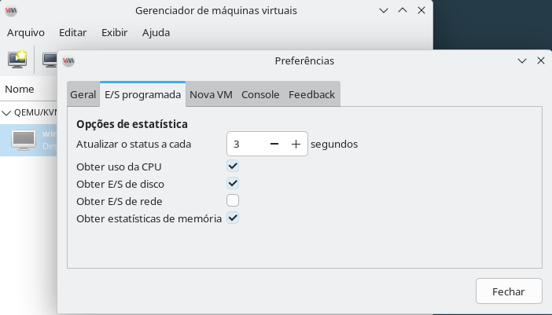  

Depois, na mesma janela, na guia **Nova VM**, faça o seguinte ajuste:  
1. Tipo de gráfico: PAdrão do sistema(spice)
2. Formnato de armazenamento: QCOW2
3. CPU Padrão: Padrão do Aplicativo
4. Formware x86: Padrão do sistema  
   
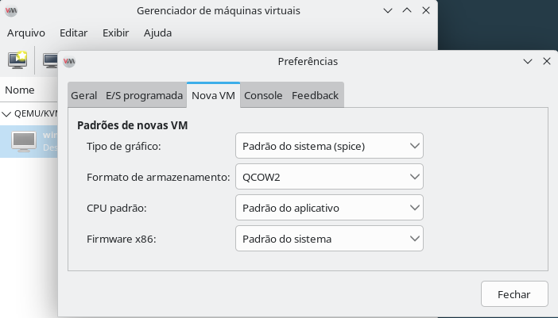  


Depois, na mesma janela, na guia **Console**, garanta que o ajuste seja:  
1. Escalonamento de console gráfico: Sempre
2. Redimencionar convidado com janela: Padrão do sistema(desligado)
3. Capturar teclas: Ctrl_L(esquerdo)+ALT_L(esquerdo)
4. Redirecionamento SPICE de USB: Redirecionamento manual apenas
5. Conectar automaticamente ao console: Ligado  

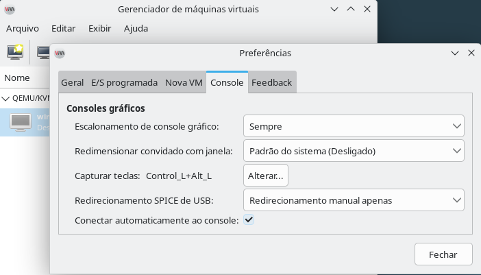   

### CRIANDO DISCO VIRTUAL PARA HOSPEDAR A VM
Voce pode usar o virt-manager para criar suas VMs e na tela que você define o tamanho do disco haverá um problema que detectei nas distros Debian e derivados, em todas as vezes que crio o disco por esse wizard embutido, os discos virtuais criados serão de tamanho fixo, ou seja, se definir alí que sua VM terá um disco de 200GB, ela terá exatamente 200GB ocupados no sistema operacional do hospedeiro. O formato qcow2 aceita usar discos dinamicos, isto é, você cria um disco virtual de 200GB, mas no sistema operacional ele ocupará um tamanho mínimo e crescerá conforme o uso, então como usar discos dinâmicos? Até que corrijam este problema, crie o disco no gerenciador de pools e ele perguntará se deseja um disco de tamanho fixo ou dinâmico e então escolha essa ultima opção e pronto, o arquivo .qcow2 deverá ser criado no pool `default` com tamanho dinâmico. Pessoalmente, acho o Wizard do virt-manager burocrático, então se quiser ser mais rapido, apenas execute no terminal:  
```
sudo virsh vol-create-as default win2k25.qcow2 200G --format qcow2
```

Agora vamos conferir o tamanho:  
```
$ ls -lh ~/libvirt/images
total 196K
-rw------- 1 root kvm 196K Oct 17 14:31 win2k25.qcow2
```
Como pôde ver, um disco de 200GB que ocupa apenas 196K no sistema. É claro que a medida que formos instalar o sistema e todas as demais coisas, este arquivo subirá de tamanho. Na minha modesta opinião, eu criaria discos apenas pelo terminal porque podemos criar vários em sequencia, evitando o wizard burocrático e repetitivo para cada um deles.  

### VIRT-MANAGER - CRIANDO A VM
Vá em **Arquivo|Nova Maquina Virtual**, depois selecione **Midia de Instalaçao** e prossiga.

#### Tela 1 de 5
Na tela **Escolha a mídia de instalação ISO ou CDROM** e então prossiga.  

#### Tela 2 de 5
Nesta tela, escolha a `.iso` de instalação do Windows e então prossiga:   
     

E ao escolher a iso, defina corretamente o sistema convidado e não confie na opção auto-detecção porque as vezes ela falha, especialmente ao detectar edições do Windows Server:  
   

Atenção, no caso do Windows, só escolha as edições suportadas pelo virtualizador. Caso surja uma nova versão do Windows, mas ela não apareça na lista de sistemas suportados, não tente prosseguir.  

#### Tela 3 de 5
Quando prosseguir, precisará decidir quanto de memória precisará usar e quantas CPUs. A quantidade de memória que escolher é definido pelos requisitos de programas que irá usar, no meu caso será 8GB de RAM usando 8 CPUs, que é metade do que tenho. Eu não costumo usar mais do que 1 VM por vez, geralmente concentro VMs por tarefas que desempenho, então quando vou programar usando o Windows tenho uma VM só para ela, para testes de automação tenho outra e assim por diante. Essa é uma dica importante, prefira ter VMs por atividade, não crie uma VM para todas as coisas porque elas podem ser voláteis, uma ora ou outra precisam ser recriadas:   
     

#### Tela 4 de 5
Nesta janela, ligue a opção **Habilitar armazenamento para esta máquina virtual** e vá em **Selecionar ou criar um armazenamento personalizado**, ao clicar em **Gerenciar...** selecione o disco virtual que criamos anteriormente, ou vá para o terminal e crie uma com o comando:   
```
sudo virsh vol-create-as default win2k25-dx.qcow2 200G --format qcow2
```
No exemplo acima, estou criando um disco virtual com o nome `win2k25-dx` onde `win2k25` é um prefixo que me lembra `Windows 2025` e o sufixo `dx` me lembra o ambiente que vou instalar depois. Preparar nomes assim não é uma regra, mas ajuda bastante. E então escolha no pool `default` o seu disco virtual:

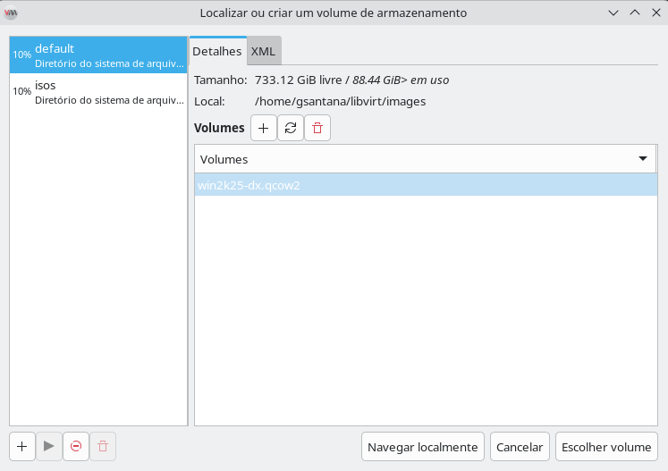  
E então, estará assim:
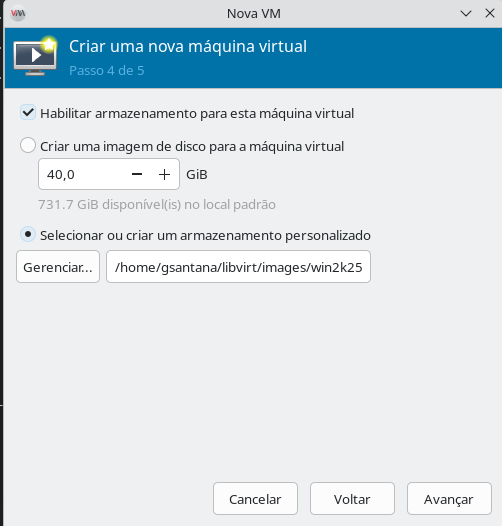   
E então prossiga.

#### Tela 5 de 5
Agora vamos dar um nome, pode ser qualquer nome, mas geralmente eu uso o mesmo nome do disco virtual para facilitar o reconhecimento depois. Precisará marcar a opção **Personalizar a configuração antes de instalar** porque precisaremos fazer o acrescimo de mais uma unidade de CDROM:
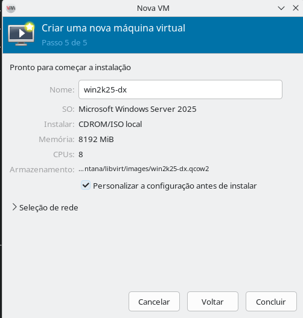   

Depois clique em **Concluir** e é possivel que apareça uma janela como a seguir pergutando se deseja qye a rede virtual `default` pode ser ligada, responda **Sim**:   
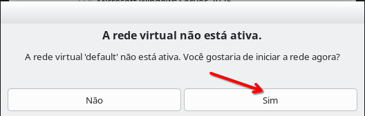    

Será apresentada a configuração de nossa VM, vamos a alguns ajustes:
1. Vá na guia **Visão Geral** e confirme que o chipset escolhido é **Q35** e o formato de Fimware é **UEFI** senão o Windows não funcionará:
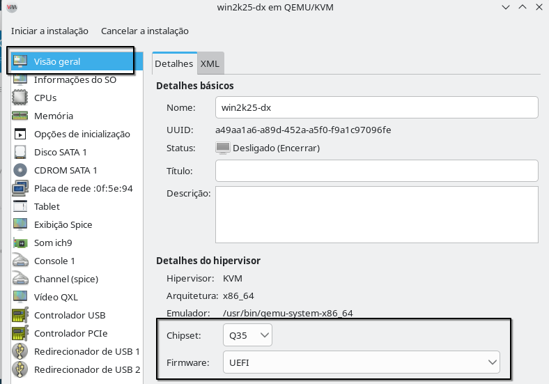    

2. Ainda na guia **Visão Geral**, selecione a guia **XML**, procure uma seção <hiperv> assim:
```
    <hyperv>
    (...)
    </hyperv>
```
e troque este bloco acima por:
```
<hyperv mode="custom">
  <relaxed state="on"/>
  <vapic state="on"/>
  <spinlocks state="on" retries="8191"/>
  <vpindex state="on"/>
  <runtime state="on"/>
  <synic state="on"/>
  <stimer state="on">
    <direct state="on"/>
  </stimer>
  <reset state="on"/>
  <vendor_id state="on" value="KVM Hv"/>
  <frequencies state="on"/>
  <reenlightenment state="on"/>
  <tlbflush state="on"/>
  <ipi state="on"/>
</hyperv>
```
Se tiver uma CPU Intel, dentro do bloco `hyperv` acrescente também:
```
  <evmcs state="on"/>
```
Ficando mais ou menos assim:  

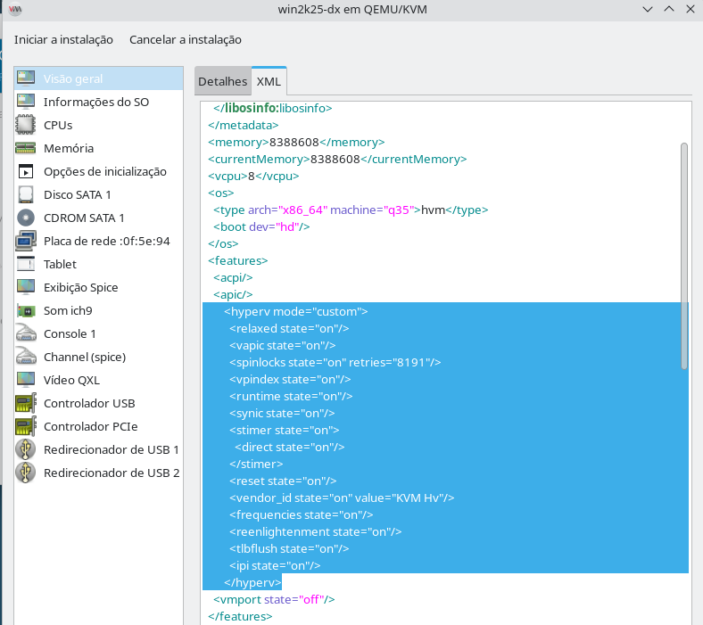    

Confirme também se a bloco **clock** está assim:  
```
  <clock offset="localtime">
(...)
    <timer name="hypervclock" present="yes"/>
  </clock>
```  

3. Vá na guia **CPUs** e ligue a opção **Copiar configurações de CPU do hospedeiro(host-passthrough)**:
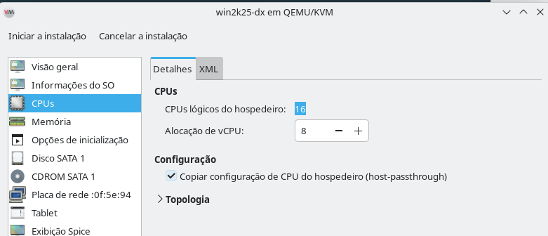

4. Vá para a opção **Disco SATA 1**, e provavelmente o barramento estará configurado como **SATA**, para obter maior desempenho, vamos trocar para **VirtIO**, depois disso, expanda **Opçoes Avançadas** e troque:
   a) **Modo de cache** troque para **none**(nenhum);  
   b) **Modo de descarte** troque para **unmap**(desmapear);
   
   

5. Mudar o barramento para **VirtIO** fará com que o instalador do Windows não reconheça nosso disco, por isso, durante o processo de instalação onde temos o .iso do Windows no CDROM precisaremos adicionar drivers adicionais, mas isso não será possivel porque precisariamos ejetar o cdrom com o Windows e incluir o .iso dos drivers de convidado e isso quebraria o processo de instalação, então o que precisamos fazer agora é adicionar mais um CDROM a nossa maquina virtual, onde o primeiro CDROM estará com o iso do Windows e a segunda unidade com o .iso dos drivers de convidado. Vá em **Adicionar hardware**, e mude o **Tipo de dispositivo** para **Dispositivo CDROM** e então clique em **Gerenciar...** e escolha **virtio-win.iso** que baixamos em etapas anteriores. Depois clique em **Concluir**:   

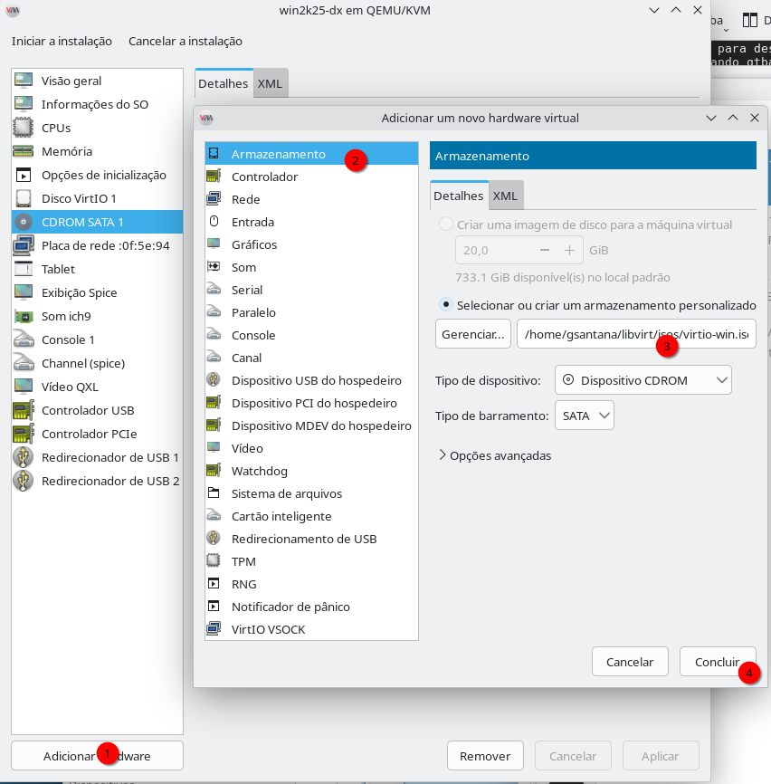   

E agora teremos duas unidades de CDROM:  
   

Na primeira unidade de CDROM temos o .iso de instalação do Windows e na segunda unidade, o cdrom contendo o VirtIO drivers para convidado.  

6. Agora vamos em nossa placa de rede e vamos fazer um pequeno ajuste:
   * Fonte de rede: NAT;    
   * Modelo de dispositivo, troque para **virtio**.  
   

7. Há um item em nossa lista de hardware intitulado como **Tablet**, ele é desnecessário, remova-o:  
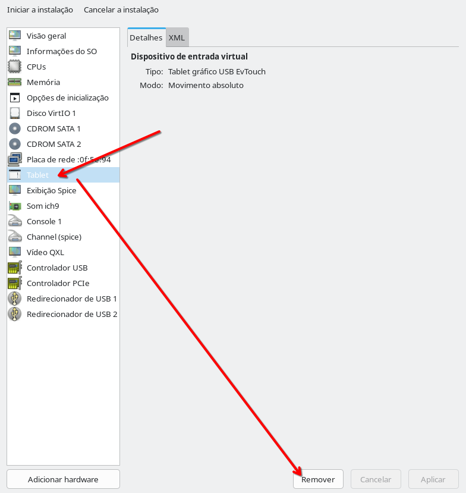  

8. Nosso virtualizado usa um de hardware chamado de **canal(Channel spice)** que é usado para a interação entre hospedeiro e convidado, por exemplo, troca de arquivos e funcionamento de copiar/colar da área de clipboard entre eles. Vamos adicionar um **canal**, vá em **Adicionar hardware** e escolha **Channel** e ajuste os detalhes para:
**Nome:** para **org.qemu.guest_agent.0**    
**Tipo de dispositivo** para **Soquete UNIX(unix)**    
**Soquete automático** para **ligado**  

Depois clique em **Concluir**:
  

9. Na lista de hardware, escolha o **Vídeo**, confirme que o modelo escolhido é o **QXL**:
   

10. Olhe na relação de hardware, veja se há o item **TPM**, se não existir clique novamente em **Adicionar hardware** e escolha **TPM**. Certifique-se de que as seguintes propriedades estejam assim:
* Tipo: **emulado**
* Modelo: **CRB**
* Versão: **2.0**
Sem isso, algumas edições do Windows - como o Windows 11 - não funcionarão:
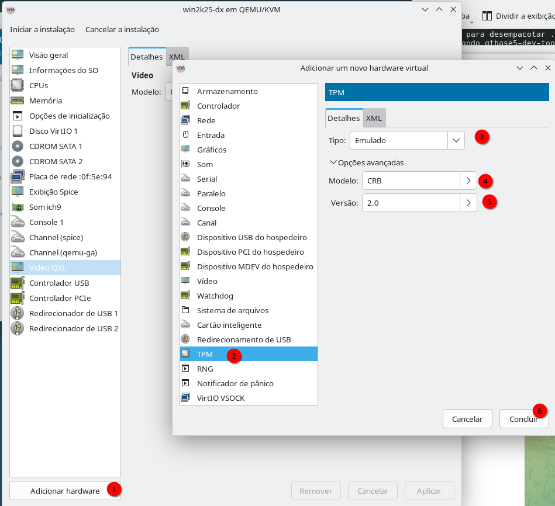   


11. Finalmente podemos começar a instalação, clique em **Iniciar a instalação** que existe lá no topo de nosso assistente:  
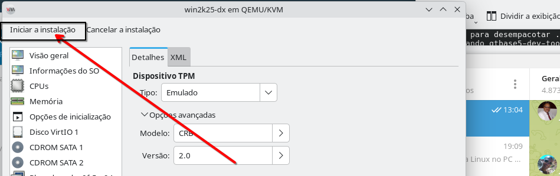
A instalação começará, e trata-se de uma instalação comum, no entanto, seu ponteiro de mouse estará preso à essa janela, para sair dela use as teclas **Ctrl** e **Alt** do lado esquerdo do teclado.


13. Após concordar com os termos de instalação, notará que não existe nenhum disco para que o Windows possa ser instalado, isto acontece porque nosso disco virtual não usa uma interface SATA que seria prontamente reconhecido pelo Windows, mas uma interface **VirtIO** que é mais rápida, mas que não é autoreconhecida pelo Windows, então clique em **Carregar Driver**(Load Driver):  

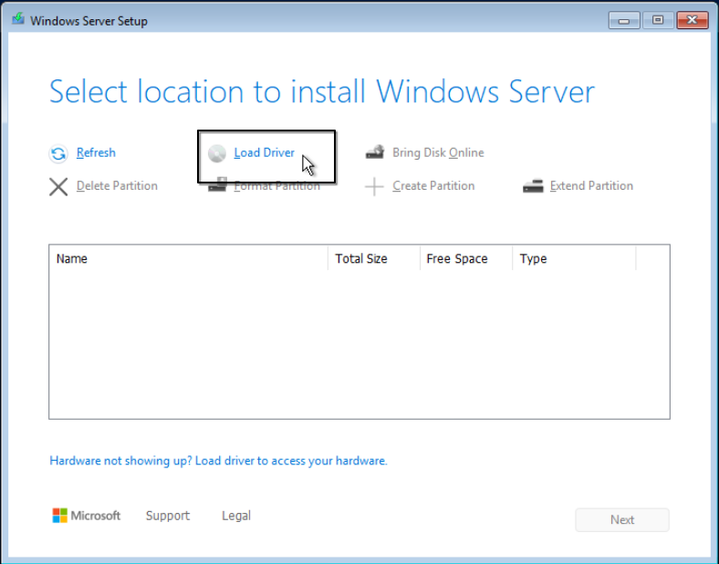   

Então, aponte para a pasta (Browse) na segunda unidade de CDROM onde temos o iso do VirtIO drivers para convidado, geralmente a unidade E: na pasta:  
```
E:\VioStor\2k25\amd64
```
Onde `2k25` é os drivers para Windows 2025, para o Windows 11 seria `w11` e assim por diante.
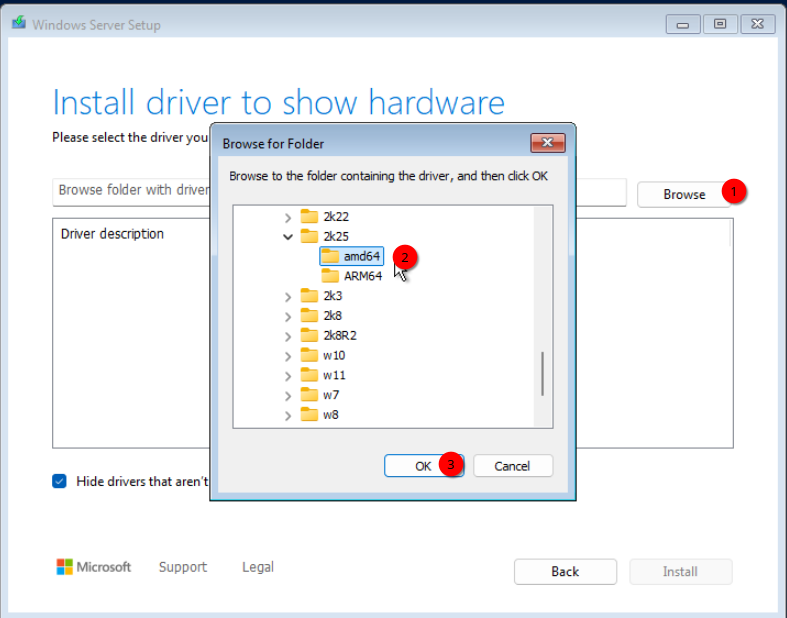   

Agora confirme a instalação deste driver:  
   

Notará que agora, o disco irá aparecerá:
   

No entanto, ainda nos resta incluir o driver de rede, então novamente vá em **Load Driver** e aponte para a pasta (Browse) na segunda unidade de CDROM onde temos o iso do VirtIO drivers para convidado, geralmente a unidade E: na pasta:   
```
E:\NetKVM\2k25\amd64
```
Onde `2k25` é os drivers para Windows 2025, para o Windows 11 seria `w11` e assim por diante:
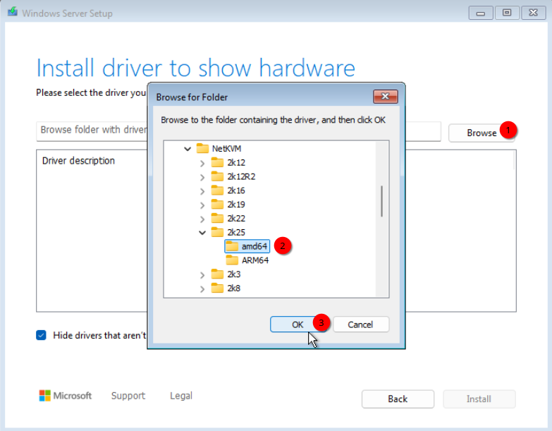   

E em seguida, confirme a instação do driver de rede:  
   

Agora, podemos prosseguir normalmente com a instalação do Windows, já temos o driver do disco e rede instalados:  
   

A instalação é bem rápida, após o **reboot**, você estará na tela de **Boas vindas** e provavelmente, no caso do Windows 2025 notará que o teclado não funciona, isso porque a edição Servidor requer que vocÊ pressione **Ctrl+Alt+Delete** e aqui temos um problema, o Linux usa essas teclas também, por essa rzão você irá no topo da janela do virt-manager onde está **Enviar tecla** e escolha a opção **Cltr+Alt+Delete**:  
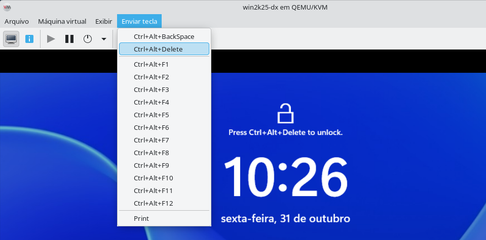   

Após o primeiro login, você precisará instalar as ferramentas de convidado, dentro do Windows vá até a segunda unidade de CDROM onde estãos os drivers para convidado VirtIO, você verá nele o aplicativo:  
```
E:\virtio-win-guest-tools.exe
```
Execute-o e siga as instruções na tela:
   

A tela piscará algumas vezes, não se assuste. Não é necessário reiniciar a VM depois dessas ferramentas serem instaldas.   
Para verificar se os drivers já estão funcionando, vá no topo da janela do virt-manager em **Exibir|Escalonar a exibição|** e marque a opção **Redimensionar automaticamente a VM com janela***:  
   

Depois disso, notará que pode sair da janela sem precisar teclar Ctrl+Alt esquerdos e o Windows muda sua resolução a medida que mudamos a janela do virt-manager.   


### VIRT-MANAGER - WINDOWS - MUDANDO O IDIOMA
1. Se estiver com o Windows em inglês, no menu iniciar do Windows, vá em **Settings** e procure por **language Settings**, depois em **Add a language**:
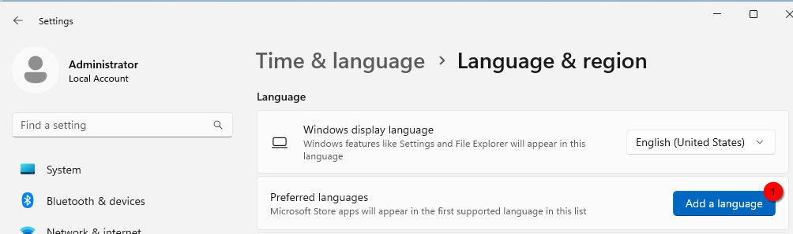   
A instalação de um novo idioma é um pouco demorado, mas assim que estiver completa, aparecerá logo abaixo:
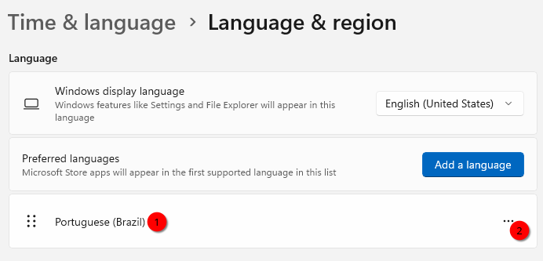   
Clique então em `...`, depois **Language Options** e faça o download de todas as opções **Language Pack**, **Basic typing**, **Text-to-speech** e até mesmo as improvaveis de usarmos: **Spaech Recognition**:


Sim, o download de cada um deles é demorado e não adianta tentar fazer o download de todos simultaneamente porque o Windows só baixa o seguinte quando o anterior tiver terminado. Inclusive as etiquetas dos botões indicam downloads de 1MB e 77MB o que tornaria esses downloads rápidos, mas não são.  

2. Após ter terminado completamente os downloads do idioma Português, role a tela um pouco mais e confirme que o teclado foi configurado para o padrão que está usando no momento:   
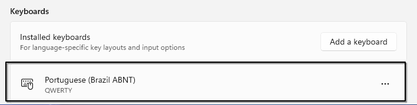   
Se não está configurado, configure-o. Não tente prosseguir sem o layout do teclado estar completo.

3. Com o download completo do idioma, vá novamente em **Settings** e procure por **language Settings** e notará que agora podemos trocar o idiona:
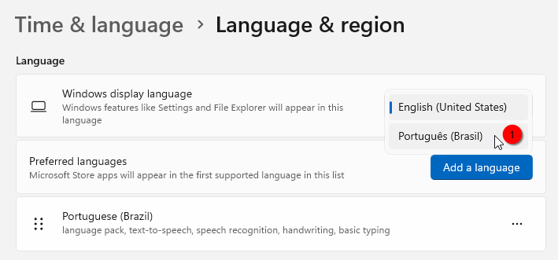
Quando fizer essa troca, haverá uma advertência, solicitando que vocÊ refaça o login:
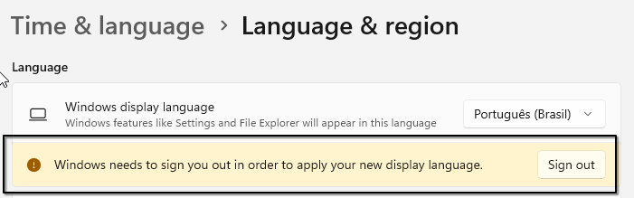
Mas, não faça isso ainda.

4. Uma vez que o idioma e teclado estejam baixados corretamente, confira se o **Regional Settings** está corretamente configurado para o **Brasil**, normalmente isso se ajusta automaticamente quando configuramos o idioma, vá agora em **Settings** procure por **Regional Settings**:
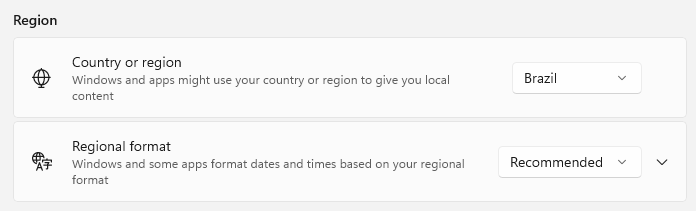


6. Uma vez que o idioma, layout de teclado e região estejam corretamente baixados e configurados, precisamos propagar esse ajuste para todo o sistema e para novos usuários, então vá agora em **Settings** procure por **language Settings** e depois clique no botão **Administrative language Settings**:
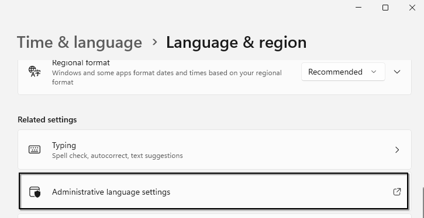


Ao clicar você será redirecionado para outra tela onde enfim poderemos fazer nossos ajustes finais, na guia **Administrative**, vá em **Change system locale**:  
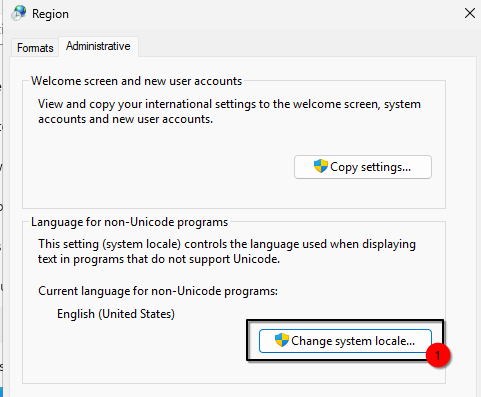  

E então troque o idioma **English** por **Português(Brasil)** e muito cuidado para não selecionar **Portugal**, por alguma razão, estou sempre selecionando erroneamente:  
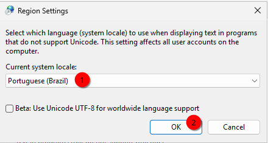   

Após confirmar, não tem jeito, terá de **reiniciar**.   

7. Após reboot, o Windows estará parcialmente em português, ainda falta o ultimo ajuste, terá de voltar a última tela, mas agora nossa tela já estará em português, então vá agora em **Configurações** procure por **Idioma** e depois role a tela até encontrar o botão **Configurações administrativas de idioma** e ao clicar você será redirecionado para outra tela onde enfim poderemos fazer nossos ajustes finais, na guia **Administrativo**, clique em **Copiar Configurações**:
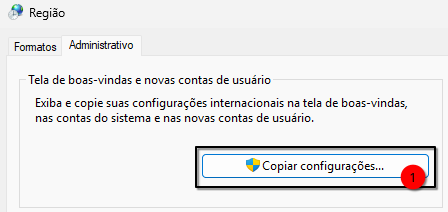


E então marque as opções **Tela de boas-vindas e contas do sistema** e também **Novas contas de usuário**:  
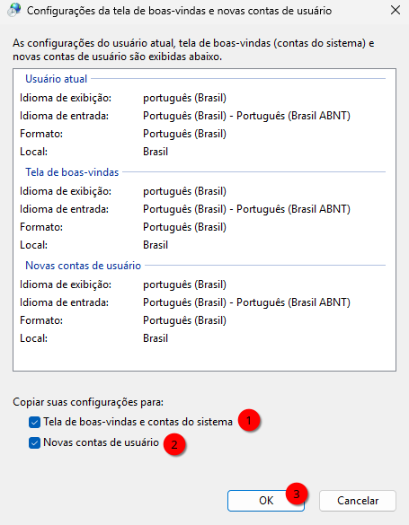  

Ao clicar em **OK**, o idioma português do Brasil estará em todo o sistema, incluindo novos usuários.  
Depois, você é obrigado a **reiniciar o sistema**.

### VIRT-MANAGER - WINDOWS - NOMEANDO O COMPUTADOR
Vamos renomear o computador para um nome mais apropriado, ex: **ti-01a**.  Aqui não vou colocar instruções porque acredito que você saiba como fazer isso.  

### VIRT-MANAGER - WINDOWS - CRIANDO A PRIMEIRA CONTA DE LOGIN
Não podemos usar a conta **Admnistrador** o tempo todo, então precisamos criar uma conta, ex: **gsantana**. Eu imagino que não tenha dificuldade com isso, mas se estiver usando o Windows Server, é um pouco diferente, neste sistema vá até o **Gerenciador do servidor|Ferramentas|Gerenciamento do computador**:  

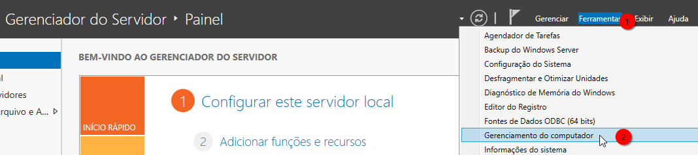  

E então usar o gerenciador de computador para criar a conta:  
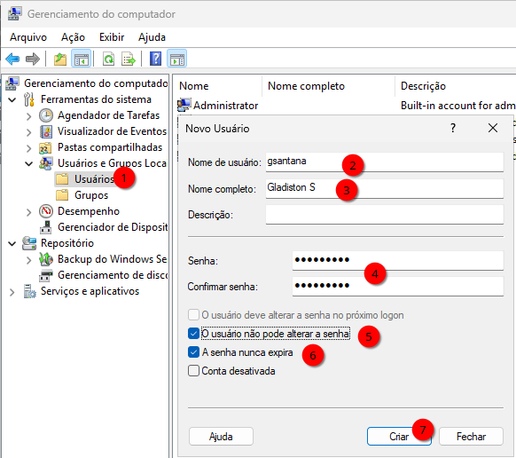  

Lembre-se de colocar o novo usuário no grupo de **Administradores**, assim não precisará ficar trocando de conta quando precisar ajustar algo administrativamente no sistema:  
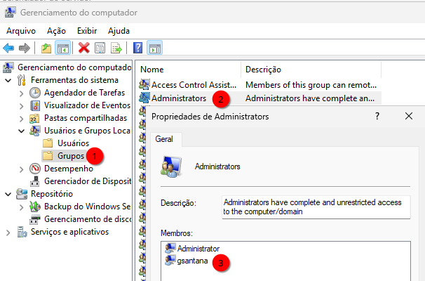    


### VIRT-MANAGER - WINDOWS - ATIVANDO O AUTOLOGON
É muito chato o logon do Windows, especialmente no servidor porque é preciso enviar CTRL+ALT+DEL para então digitar a senha. Uma vez que as VMs só rodam depois que vocÊ faz o login no sistema hospedeiro, é bem provável que você não queira ficar burocratizando digitar a senha na VM Windows também, então para isso temos uma solução, instale o programa de [autologon](https://learn.microsoft.com/pt-br/sysinternals/downloads/autologon).  
Ele é simples e ao executá-lo pela primeira vez você fornecerá sua autenticação e após o boot, ele entrará sozinho com a conta que foi informada.    
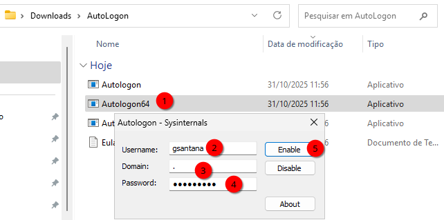    

### VIRT-MANAGER - REMOVENDO O CDROM SECUNDÁRIO
O CDROM secundário foi usado para a instalação dos drivers de convidado durante a instalação do Windows, então ele não é mais necessário, vamos removê-lo.  
Primeiro, desligue a máquina virtual Windows.  
Depois vá na configuração de hardware da VM, selecione o **CDROM SATA 2**, ejete o `.iso` e enfim, escolha **Remover**.
Aproveite o momento e ejete o `.iso` de instalação do Windows do **CDROM SATA 1**, cuidado, neste você apenas irá ejetar, não remova  dispositivo de hardware dele.   
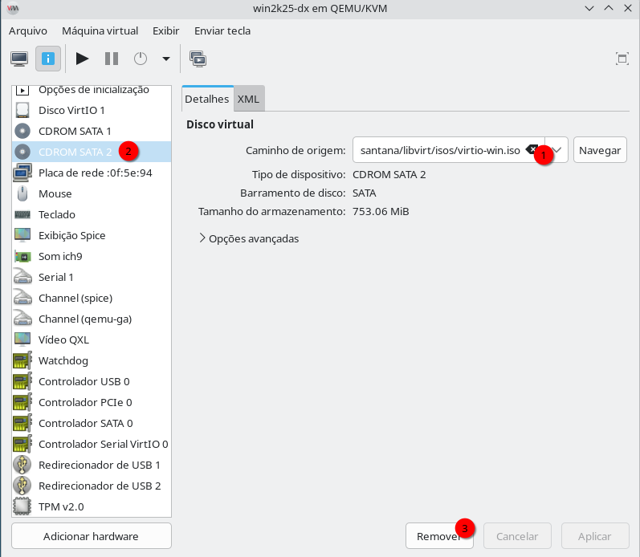    

## OTIMIZAÇÃO DA VM WINDOWS
O Windows depois de instalado está carregado de coisas que roubam performance, vamos tentar melhorar.  

### Otimizando o Windows - Removendo o Gerenciador do Servidor do Startp do Windows:
Se estiver usando uma edição Servidor do Windows, provavelmente você se aborrecerá do Gerenciador do Servidor que é carregado todas as vezes que faz o logon. Para desabilitá-lo vá em **Gerenciar|Propriedades do Gerenciador do Servidor** e então marque a opção **Não iniciar o Gerenciador do Servidor automaticamente no logon**:  

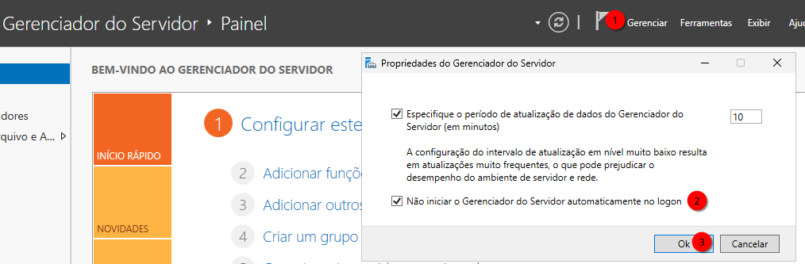    

### Otimizando o Windows - Menu do Windows
No painel de menu, remova os recursos que não precisa como caixa de pesquisa e visão de tarefas:   
    

Lembre-se de que qualquer coisa que consuma ciclos de CPU e não são úteis, devem ser desativados.  

### Otimizando o Windows - Papel de parede
Remova o papel de parede e use uma cor solida como preto. Antes que pergunte, sim, isso faz muito a diferença.  
    
Lembre-se de que qualquer coisa que consuma ciclos de CPU e não são úteis, devem ser desativados.  

### Otimizando o Windows - Energia
Você esta usando uma VM e por isso, você não tem compromisso de economia de energia.  
No Windows vá em **Configurações**, procure por **Energia**, e desative qualquer medida ou tentativa para economizar energia:  
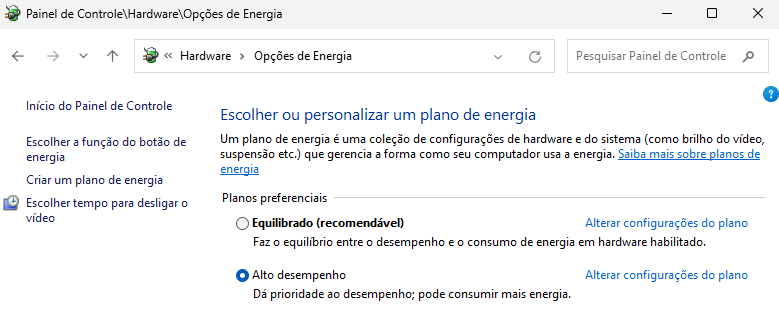    


### Otimizando o Windows - Programas dispensáveis
Se você não usa os serviços Microsoft 365 nesta VM, não instale o onedrive e afins, só vão lhe roubar recursos.  

### Otimizando o Windows - Serviçõs dispensáveis
Alguns serviços o Windows sao dispensáveis, execute `services.msc` e desative alguns desses(ou todos eles):  

| Nome exibido no `services.msc` | Nome interno (`sc config ...`) | Função | Pode desativar? |
|--------------------------------|-------------------------------|---------|------------------|
| **Windows Search** | `WSearch` | Indexação de arquivos e e-mails | ✅ |
| **SysMain** *(antigo Superfetch)* | `SysMain` | Otimiza inicialização e cache de aplicativos | ✅ |
| **Optimize Drives (Desfragmentador)** | `defragsvc` | Desfragmenta discos mecânicos | ✅ |
| **Windows Error Reporting Service** | `WerSvc` | Envia relatórios de erro para a Microsoft | ✅ |
| **Diagnostic Policy Service** | `DPS` | Detecta e tenta corrigir problemas de rede e hardware | ✅ |
| **Connected User Experiences and Telemetry** | `DiagTrack` | Coleta telemetria e estatísticas de uso | ✅ |
| **Windows Update Medic Service** | `WaaSMedicSvc` | Reativa o Windows Update automaticamente | ✅ |
| **Remote Registry** | `RemoteRegistry` | Permite editar o registro remotamente | ✅ |
| **Fax** | `Fax` | Suporte a envio de fax | ✅ |
| **Print Spooler** | `Spooler` | Gera fila de impressão | ✅ *(a não ser que use impressoras)* |
| **Bluetooth Support Service** | `bthserv` | Gerencia dispositivos Bluetooth | ✅ |
| **Smart Card** | `SCardSvr` | Gerencia cartões inteligentes | ✅ |
| **Secondary Logon** | `seclogon` | Permite “Executar como outro usuário” | ⚠️ *Opcional* |
| **Windows Defender Antivirus Service** | `WinDefend` | Proteção antivírus | ⚠️ *Somente se VM isolada* |
| **Offline Files** | `CscService` | Sincroniza arquivos offline | ✅ |
| **Program Compatibility Assistant Service** | `PcaSvc` | Detecta compatibilidade de programas antigos | ✅ |
| **Security Center** | `wscsvc` | Central de segurança (alertas) | ✅ |

A lista acima, foi tirada do Windows Server, o Windows 11 tem muito mais serviços que estes e levará algum tempo para você complementar a lista.  
Desativar um serviço de cada vez levará muito tempo, então para agilizar, criei um script `agilizar_vm.bat` que ao rodar uma única vez como administrador, ele desativará vários de uma única vez. Se estiver interessado crie um script `agilizar_vm.bat` com o seguinte cnteúdo:  

```cmd
@echo off
echo === Otimizando VM Windows para melhor desempenho ===
echo.

for %%S in (
  WSearch
  SysMain
  defragsvc
  WerSvc
  DPS
  DiagTrack
  WaaSMedicSvc
  RemoteRegistry
  Fax
  bthserv
  SCardSvr
  WinDefend
  CscService
  PcaSvc
  wscsvc
) do (
  echo Desativando %%S ...
  sc stop "%%S" >nul 2>&1
  sc config "%%S" start= disabled >nul 2>&1
)

echo.
echo === Concluido! Reinicie o Windows para aplicar todas as alteracoes. ===
pause
```
Aproveite para remover remova os nomes de serviços que na sua definição lhe são útes, afinal, a lista acima desativa todos os serviços que detalhei na tabela. Eu por exemplo, removo da lista os serviços a serem desativados: **Print Spooler** e **Secondary Logon** porque eles me são uteis, por isso eles estão fora da lista do arquivo .cmd acima.    
Salve o conteúdo acima como `otimizar-vm.cmd`, então clique com o botão direito sobre ele e **“Executar como Administrador”**.    

Caso se arrependa de ter desativado algum serviço em particular, execute `servces.msc` e ative-o.

### Otimizando o Windows - Recursos Visuais
A configuração de vídeo é um aspecto muito importante porque não importa o quanto a VM seja rápida para processar, o aspecto mais valorizado é a responsividade. As vezes você pode achar a VM lenta, mas quando roda um processo, o processo roda rápido, mas a impressão que se tem é de lerdeza ao operar a VM, isto é a responsividade.  
Se você tiver um notebook que tem uma placa de vídeo Intel e outra NVIDIA, parabens você pode configurar sua máquina virtual para passthrough, isto é, deixar o sistema hospedeiro ficar 100% com uma placa de vídeo(Intel) enquanto a VM fica 100% com a outra placa de vídeo(NVIDIA) por meio de passthrough e poderá inclusive jogar nessa VM com desempenho similar sem virtualização.  
Mas voltando ao assunto, este guia passo a passo foi feito para mortais que usufruem apenas de uma placa de vídeo e como ela fica com o hospedeiro, as VMs "emulam" uma placa de vídeo que usa um driver QXL que é apenas um quebra-galho aceitando apenas a parte 2D, por isso dentro do Windows vocÊ precisa urgentemente desligar todos os efeitos visuais que puder, vá em **Configurações>ConfiguraçõesaAvançadas do sistema>Desempenho** e clique em **Configurações** e deixe selecionado apenas a opção **Usar fontes de tela com cantos arredondados** porque nossos olhos não precisam sangrar também:
!(Desempenho)[../img/debian_qemu_kvm_windows-otimiza1.png]  

### Otimizando o Windows - Agendador de tarefas
Depois de instalar dentro da VM todos os programas de que precisa, vá no agendador de tarefas e desative os agendamentos de atualizações que estes programas gostam de deixar lá, por exemplo, o Oracle Java e Adobe Reader deixam no Agendador de tarefas programas para atualização de seus produtos. Normalmente ficam programados para conferir se há atualizações de seu produtos quando o computador esta ocioso e diariamente, e isso é horrivel para a nossa VM.  

### Otimizando o Windows - Relogio
Vamos desativar o uso do relógio de hardware HPET (High Precision Event Timer) como fonte principal de tempo do sistema, afinal, isso será fornecido pelo nosso hypervisor. Abra o terminal PS(PowerShell) como administrador e execute:  
```cmd
bcdedit /set useplatformclock No
```
Não confunda PowerShell com o `cmd` do Windows.  

### Otimizando o Windows - Apps no iniciar do Windows
Vá em **Configurações** e procure por **Aplicativos** e então aparecerá um **Aplicativos na inicialização**, execute ele.  
A seguir serão listados programas que são carregados juntos com o Windows:  
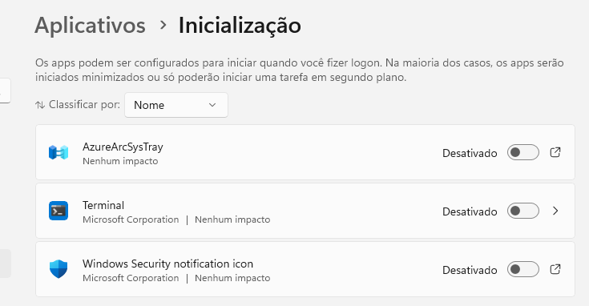    

Desabiltie o máximo de programas que puder.

### Otimizando o Windows - Tarefas agendadas desnecessárias
Vamos remover todas as tarefas agendadas desnecessárias, abra o terminal PS(PowerShell) como administrador e execute:  
Primeiro vamos listá-las, execute:
```cmd
Get-ScheduledTask -TaskName '*schedule*'
```
Isso listará algo como:
```
TaskPath                                       TaskName                          State
--------                                       --------                          -----
\Microsoft\Windows\Defrag\                     ScheduledDefrag                   Ready
\Microsoft\Windows\Diagnosis\                  Scheduled                         Ready
\Microsoft\Windows\UpdateOrchestrator\         Schedule Maintenance Work         Disabled
\Microsoft\Windows\UpdateOrchestrator\         Schedule Scan                     Ready
\Microsoft\Windows\UpdateOrchestrator\         Schedule Scan Static Task         Ready
\Microsoft\Windows\UpdateOrchestrator\         Schedule Wake To Work             Disabled
\Microsoft\Windows\UpdateOrchestrator\         Schedule Work                     Disabled
\Microsoft\Windows\Windows Defender\           Windows Defender Scheduled Scan   Ready
\Microsoft\Windows\WindowsUpdate\              Scheduled Start                   Ready
```
E então terá uma ideia do que está no estado de `Ready`, ou seja, pronto para ser executado em momentos especificados pela própria Microsoft. Se desejar, poderá desativá-los, mas terá de fazer um por um, dessa forma:
```cmd
Disable-ScheduledTask -TaskPath '\Microsoft\Windows\Defrag\' -TaskName 'ScheduledDefrag'
```
E então, lhe será infromado algo como:
```
TaskPath                                       TaskName                          State
--------                                       --------                          -----
\Microsoft\Windows\Defrag\                     ScheduledDefrag                   Disabled
```
Confirmando a mudança do estado para **desabilitado**(Disabled).

Abaixo temos a sintaxe para desabilitar os que eu recomendo por considerar inapropriado para uma VM:  
```cmd
Disable-ScheduledTask -TaskPath '\Microsoft\Windows\Defrag\' -TaskName 'ScheduledDefrag'
Disable-ScheduledTask -TaskPath '\Microsoft\Windows\Diagnosis\' -TaskName 'Scheduled'
Disable-ScheduledTask -TaskPath '\Microsoft\Windows\Windows Defender\' -TaskName 'Windows Defender Scheduled Scan'
Disable-ScheduledTask -TaskPath '\Microsoft\Windows\WindowsUpdate\' -TaskName 'Scheduled Start'
```
Não sei se percebeu, mas até mesmo o 'Windows Update' esta na lista para ser desativado, então para atualizar seu Windows, só indo diretamente nas configurações e mandando atualizar manualmente.
  

### Teste o copiar/colar
Uma vez que tenha instalado o programa cliente dentro da VM Windows, o recurso de copiar/colar da área de clipboard funcionará perfeitamente.  

Se não estiver funcionando, talvez seja necessário seguir os passos anteriores.  
O teste é simplesmente, abra a VM no virt-manager (janela SPICE) e:
* Copie um texto no host Linux>Ctrl + V dentro da VM Windows.     
* Copie algo no Windows>Ctrl + Shift + V (ou normal, dependendo do app) no host.   

Se não estiver funcionando, confirme se o host está com o serviço spice-vdagentd e spice-webdavd funcionando, falamos sobre ele logo no inicio artigo. Se eles não estiverem funcionando, esta parte do guia também não funcionará.  

### Copiar arquivos entre sistema hospedeiro e convidado
O **SPICE WebDAV** permite compartilhar arquivos entre o **sistema hospedeiro (Linux)** e o **convidado (Windows)** sem precisar configurar Samba, FTP ou serviços de rede.  
Ele usa um **canal SPICE** interno e o protocolo **WebDAV**, exibindo a pasta compartilhada como uma unidade de rede no Windows.  

#### Preparar a VM (Canal SPICE WebDAV)
1. Desligue a máquina virtual.
2. Abra o **virt-manager**, selecione a VM, depois **Detalhes**, depois **Adicionar hardware** e então escolha **Canal**.
3. Configure:
   - **Tipo de dispositivo:** `spicevmc`
   - **Nome do dispositivo:** `org.spice-space.webdav.0`
4. Clique em **Concluir** e **salve as alterações**.

> Use **Vídeo Virtio-GPU** e **Display SPICE** para compatibilidade total com clipboard, redimensionamento e WebDAV.

Depos, ir em Console → Abrir em Remote Viewer → File → Preferences → Share folder e escolher a pasta.  

(todo)


## CRIANDO A VM VIA YOUTUBE
Sem falsa modéstia, mas este guia passo a passo é mais completo que a maioria dos vídeos no YouTube que mostram como criar VMs Windows.
Mas 'ler como fazer' e 'assistir como fazer' são coisas diferentes, e pessoas diferentes podem preferir cada qual, o seu método.
Por isso, depois deste guia pronto, fui fuçar alguns videos e vou recomendar alguns, são eles:  

* (How To PROPERLY Install Windows 11 on KVM)[https://youtu.be/7tqKBy9r9b4?si=xmM6vPTbu68kVxPr]  
* [Migrando pro Linux - migre Windows 11 do VirtualBox pro Virt-Manager e Ative ACELERAÇÃO GRÁFICA](https://youtu.be/WZ16GsFHSjM?si=LJoLVhI3c9iBqPWI)
* [Qemu: Data Exchange Between Windows and Linux - Share Folders](https://youtu.be/0hZU3vltZVM?si=wHv3id8czwD4u957)
* [This is a basic tutorial on how to virtualize Any Operating System using QEMU in PlayList](https://www.youtube.com/watch?v=cE6X2IrTzgU&list=PLmsony4NVQpxYb6B51t-uWWuGkph5rmf1)
* [Produtividade com máquinas virtuais](https://youtu.be/8swg8mDQ9SA?si=HZC7vKnrx7ZxmCfE)  

Esses vídeos incluiem coisas que mencionei e alguns deles vão além disso, por exemplo, há algumas coisas que são possiveis fazer, mas é dificil explicar com palavras "como fazer", mas vão estender ainda mais as funcionalidades de computadores virtualizados com o Windows, um dos exemplos é usufruir de uma GPU dedicada por meio de passtrough.


## VIRTUALIZAÇÃO NATIVA QEMU+KVM - Criando conexões bridge
O padrão de rede da VM é usar **NAT**, se você deseja colocar essa VM como cliente de sua rede, troque de **NAT** por **bridge** e forneça a conexão bridge para suas VMs. Algumas formas de compartilhamento de arquivos entre anfitrião e convidado só funcionará se a VM estiver usando a rede em modo bridge.  

Para trabalhos extensos e mais profissionais com VMs é impossivel viver apenas com NAT, então siga o tutorial a seguir para criar uma conexão do tipo bridge em seu sistema:  

[Criando conexões bridge pelo terminal](debian_qemu_kvm_bridge.md)  

## CONCLUSÃO
Não se trata mais de criar VMs, as informações que obteve até aqui cobriram essa etapa e algumas foram além disso. Então os links a seguir são para "tunar" suas estações Windows.

Resumo rápido:   
|:---|:---|
|Função	|Onde configurar|
|Copiar/colar texto|spice-vdagent (host + guest)|
|Ajuste de resolução|QXL + spice-vdagent|
|Copiar/colar arquivos|spice-webdavd|
|Canal de comunicação|virt-manager>Canal SPICE agent|

