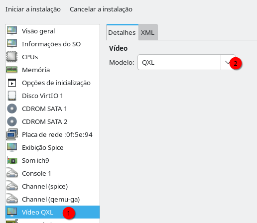

# INSTALANDO O WINDOWS DENTRO DE UMA VM
Vamos ao passo a passo, mas antes de iniciarmos, atente-se:  
Em algumas oportunidades, o ponteiro do mouse ficará travado dentro da VM e nesse interim, se desejar ir para o host, precisará dessa combinação no teclado:   
**CTRL + ALT** (lado esquerdo)   
Faça o teste logo no inicio, se não gostar dessa combinação poderá trocar nas preferencias do **virt-manager**, mas de maneira geral, essa combinação é bastante interessante para a maioria de nós.  


## INSTALANDO O WINDOWS NUMA VM
Em nosso exemplo, vamos instalar o Windows 2025 Server.  Deixe um `.iso` de instalação deste sistema operacional em **~/libvirt/isos**.  

### VIRT-MANAGER - AJUSTES DE PREFERENCIA
Carregue o virt-manager, vá em **Editar|Preferencias** na guia **Geral** e ligue as opções:  
1. Habiiutar ícone na bandeja do sistema
2. Habilitar edição de XML   

  

Depois, na mesma janela, na guia **E/S programada**, faça o seguinte ajuste:  
1. Atualizar o satus a cada 3 segundos
2. Obter o uso da CPU: Ligado
3. Obter E/S de disco: Ligado
4. Obter estatistica de memória: Ligado  

  

Depois, na mesma janela, na guia **Nova VM**, faça o seguinte ajuste:  
1. Tipo de gráfico: PAdrão do sistema(spice)
2. Formnato de armazenamento: QCOW2
3. CPU Padrão: Padrão do Aplicativo
4. Formware x86: Padrão do sistema  
   
  


Depois, na mesma janela, na guia **Console**, garanta que o ajuste seja:  
1. Escalonamento de console gráfico: Sempre
2. Redimencionar convidado com janela: Padrão do sistema(desligado)
3. Capturar teclas: Ctrl_L(esquerdo)+ALT_L(esquerdo)
4. Redirecionamento SPICE de USB: Redirecionamento manual apenas
5. Conectar automaticamente ao console: Ligado  

   

### CRIANDO DISCO VIRTUAL PARA HOSPEDAR A VM
Voce pode usar o virt-manager para criar suas VMs e na tela que você define o tamanho do disco haverá um problema que detectei nas distros Debian e derivados, em todas as vezes que crio o disco por esse wizard embutido, os discos virtuais criados serão de tamanho fixo, ou seja, se definir alí que sua VM terá um disco de 200GB, ela terá exatamente 200GB ocupados no sistema operacional do hospedeiro. O formato qcow2 aceita usar discos dinamicos, isto é, você cria um disco virtual de 200GB, mas no sistema operacional ele ocupará um tamanho mínimo e crescerá conforme o uso, então como usar discos dinâmicos? Até que corrijam este problema, crie o disco no gerenciador de pools e ele perguntará se deseja um disco de tamanho fixo ou dinâmico e então escolha essa ultima opção e pronto, o arquivo .qcow2 deverá ser criado no pool `default` com tamanho dinâmico. Pessoalmente, acho o Wizard do virt-manager burocrático, então se quiser ser mais rapido, apenas execute no terminal:  
```
sudo virsh vol-create-as default win2k25.qcow2 200G --format qcow2
```

Agora vamos conferir o tamanho:  
```
$ ls -lh ~/libvirt/images
total 196K
-rw------- 1 root kvm 196K Oct 17 14:31 win2k25.qcow2
```
Como pôde ver, um disco de 200GB que ocupa apenas 196K no sistema. É claro que a medida que formos instalar o sistema e todas as demais coisas, este arquivo subirá de tamanho. Na minha modesta opinião, eu criaria discos apenas pelo terminal porque podemos criar vários em sequencia, evitando o wizard burocrático e repetitivo para cada um deles.  

### VIRT-MANAGER - CRIANDO A VM
Vá em **Arquivo|Nova Maquina Virtual**, depois selecione **Midia de Instalaçao** e prossiga.

#### Tela 1 de 5
Na tela **Escolha a mídia de instalação ISO ou CDROM** e então prossiga.  

#### Tela 2 de 5
Nesta tela, escolha a `.iso` de instalação do Windows e então prossiga:   
     

E ao escolher a iso, defina corretamente o sistema convidado e não confie na opção auto-detecção porque as vezes ela falha, especialmente ao detectar edições do Windows Server:  
   

Atenção, no caso do Windows, só escolha as edições suportadas pelo virtualizador. Caso surja uma nova versão do Windows, mas ela não apareça na lista de sistemas suportados, não tente prosseguir.  

#### Tela 3 de 5
Quando prosseguir, precisará decidir quanto de memória precisará usar e quantas CPUs. A quantidade de memória que escolher é definido pelos requisitos de programas que irá usar, no meu caso será 8GB de RAM usando 8 CPUs, que é metade do que tenho. Eu não costumo usar mais do que 1 VM por vez, geralmente concentro VMs por tarefas que desempenho, então quando vou programar usando o Windows tenho uma VM só para ela, para testes de automação tenho outra e assim por diante. Essa é uma dica importante, prefira ter VMs por atividade, não crie uma VM para todas as coisas porque elas podem ser voláteis, uma ora ou outra precisam ser recriadas:   
     

#### Tela 4 de 5
Nesta janela, ligue a opção **Habilitar armazenamento para esta máquina virtual** e vá em **Selecionar ou criar um armazenamento personalizado**, ao clicar em **Gerenciar...** selecione o disco virtual que criamos anteriormente, ou vá para o terminal e crie uma com o comando:   
```
sudo virsh vol-create-as default win2k25-dx.qcow2 200G --format qcow2
```
No exemplo acima, estou criando um disco virtual com o nome `win2k25-dx` onde `win2k25` é um prefixo que me lembra `Windows 2025` e o sufixo `dx` me lembra o ambiente que vou instalar depois. Preparar nomes assim não é uma regra, mas ajuda bastante. E então escolha no pool `default` o seu disco virtual:  

   

E então, estará assim:  
    

E então prossiga.   


#### Tela 5 de 5
Agora vamos dar um nome, pode ser qualquer nome, mas geralmente eu uso o mesmo nome do disco virtual para facilitar o reconhecimento depois. Precisará marcar a opção **Personalizar a configuração antes de instalar** porque precisaremos fazer o acrescimo de mais uma unidade de CDROM:
   

Depois clique em **Concluir** e é possivel que apareça uma janela como a seguir pergutando se deseja qye a rede virtual `default` pode ser ligada, responda **Sim**:   
    

#### Tela 5 de 5 - Visão Geral
Será apresentada a configuração de nossa VM, vamos a alguns ajustes, vá na guia **Visão Geral** e confirme que o chipset escolhido é **Q35** e o formato de Fimware é **UEFI** senão o Windows 11 não funcionará:


Uma coisa interessante é que as edições do Windows Server até o 2025 não "forçam" o uso do **UEFI**, assim, se estiver lidando com o Windows Server, poderá usar **BIOS** que é mais simples e rápida.   

Ainda na guia **Visão Geral**, selecione a guia **XML**, procure uma seção <hiperv> assim:
```
    <hyperv>
    (...)
    </hyperv>
```
e troque este bloco acima por:
```
<hyperv mode="custom">
  <relaxed state="on"/>
  <vapic state="on"/>
  <spinlocks state="on" retries="8191"/>
  <vpindex state="on"/>
  <runtime state="on"/>
  <synic state="on"/>
  <stimer state="on">
    <direct state="on"/>
  </stimer>
  <reset state="on"/>
  <vendor_id state="on" value="KVM Hv"/>
  <frequencies state="on"/>
  <reenlightenment state="on"/>
  <tlbflush state="on"/>
  <ipi state="on"/>
</hyperv>
```
Se tiver uma CPU Intel, dentro do bloco `hyperv` acrescente também:
```
  <evmcs state="on"/>
```
Ficando mais ou menos assim:  

    

Confirme também se a bloco **clock** está assim:  
```
  <clock offset="localtime">
(...)
    <timer name="hypervclock" present="yes"/>
  </clock>
```  
#### Tela 5 de 5 - CPU
Vá na guia **CPUs** e ligue a opção **Copiar configurações de CPU do hospedeiro(host-passthrough)**:


#### Tela 5 de 5 - MEMÓRIA
Vá em Memória, em nosso exemplo, a memória minima e máxima é 8192MB. Sei que está tentando em colocar a memória mínima abaixo da máxima, mas não faça isso porque VMs Windows ficam malucas. Precisamos apenas marcar a opção **Habilitar memória compartilhada**, apenas isso. Essa opção é um recurso para que quando várias máquinas virtuais com o mesmo sistema operacional o hypervisor possa manter um nucleo compartilhado, por exemplo, se tiver 4 VMs Windows rodando é como se apenas 1 delas realmente ocupasse memória, as demais estão simplesmente reutilizando os programas da primeira, essa é apenas forma simples de explicar porque debaixo dos panos não é exatamente assim. Mas o motivo de habilitarmos este recurso é porque ele é um pré-requisito para que possamos mais tarde compartilhar arquivos entre o ambiente hospedeiro e convidado:  
   
    

#### Tela 5 de 5 - DISCO SATA 1
Vá para a opção **Disco SATA 1**, e provavelmente o barramento estará configurado como **SATA**, para obter maior desempenho, vamos trocar para **VirtIO**, depois disso, expanda **Opçoes Avançadas** e troque:
  
**Modo de cache** troque para **none**(nenhum);  
**Modo de descarte** troque para **unmap**(desmapear);
   
   

Clique em **Aplicar**.  

Tem uma opção muito performática para o mundo Windows que é acrescentar:
* **io** com o valor **native**  
* **Detect zeroes** com o valor **unmap**  

Porém o virt-manager visualmente não traz essa opção, por isso, precisaremos adicioná-las manualmente, vá na aba **XML**, e localize o bloco `<disk …>` e provavelmente estará assim:
```xml
<disk type="file" device="disk">
  <driver name="qemu" type="qcow2" cache="none" discard="unmap"/>
  (...)
</disk>
```
a opção em destaque acima você precisará acrescentar as opções faltantes:  
> <driver name='qemu' type='qcow2' cache='none' discard="unmap"  **io="native" detect_zeroes="unmap"**/>

Tome muito cuidado a sintaxe, aspas simples no lugar de aspas duplas ou a falta delas ou qualquer outro erro de sintaxe fará com que a VM não inicie.  

6. Clique em **Aplicar** para salvar as alterações. É possivel que ao salvar, o editor visual mude a ordem dos parametros, ele realmente faz isso e não precisa se preocupar.

#### Tela 5 de 5 - DISCO SATA 2 - CDROM ADICIONAL
Mudar o barramento para **VirtIO** fará com que o instalador do Windows não reconheça nosso disco, por isso, durante o processo de instalação onde temos o .iso do Windows no CDROM precisaremos adicionar drivers adicionais, mas isso não será possivel porque precisariamos ejetar o cdrom com o Windows e incluir o .iso dos drivers de convidado e isso quebraria o processo de instalação, então o que precisamos fazer agora é adicionar mais um CDROM a nossa maquina virtual, onde o primeiro CDROM estará com o iso do Windows e a segunda unidade com o .iso dos drivers de convidado. Vá em **Adicionar hardware**, e mude o **Tipo de dispositivo** para **Dispositivo CDROM** e então clique em **Gerenciar...** e escolha **virtio-win.iso** que baixamos em etapas anteriores. Depois clique em **Concluir**:   

   

E agora teremos duas unidades de CDROM:  
   

Na primeira unidade de CDROM temos o .iso de instalação do Windows e na segunda unidade, o cdrom contendo o VirtIO drivers para convidado.  

#### Tela 5 de 5 - REDE
Agora vamos em nossa placa de rede e vamos fazer um pequeno ajuste:  
**Fonte de rede**: NAT;    
**Modelo de dispositivo**: troque para **virtio**.  
   

#### Tela 5 de 5 - REMOVENDO TABLET
Há um item em nossa lista de hardware intitulado como **Tablet**, ele é desnecessário, remova-o:  
  

#### Tela 5 de 5 - ADICIONAL CANAL SPICE
Nosso virtualizador usa de um de hardware chamado de **canal(Channel spice)** que é usado para a interação entre hospedeiro e convidado, por exemplo, troca de arquivos e funcionamento de copiar/colar da área de clipboard entre eles. Vamos adicionar um **canal**, vá em **Adicionar hardware** e escolha **Channel** e ajuste os detalhes para:
  
Nome: **org.qemu.guest_agent.0**    
Tipo de dispositivo: **Soquete UNIX(unix)**    
Soquete automático: **ligado**  

Depois clique em **Concluir**: 
  

#### Tela 5 de 5 - VIDEO QXL
Na lista de hardware, escolha o **Vídeo**, confirme que o modelo escolhido é o **QXL**:
   

#### Tela 5 de 5 - TPM
Olhe na relação de hardware, veja se há o item **TPM**, se não existir clique novamente em **Adicionar hardware** e escolha **TPM**. Certifique-se de que as seguintes propriedades estejam assim:
  
Tipo: **emulado**  
Modelo: **CRB**  
Versão: **2.0**  

Sem isso, algumas edições do Windows - como o Windows 11 - não funcionarão:
  

**OBSERVAÇÃO**: Nas edições do Windows Server, o TPM ainda não é obrigatório, então não precisa incluí-lo caso esteja usando essa edição do Windows.  


#### Tela 5 de 5 - INICIAR INSTTALAÇAO
* Finalmente podemos começar a instalação, clique em **Iniciar a instalação** que existe lá no topo de nosso assistente:  

A instalação começará, e trata-se de uma instalação comum, no entanto, seu ponteiro de mouse estará preso à essa janela, para sair dela use as teclas **Ctrl** e **Alt** do lado esquerdo do teclado.


* Após concordar com os termos de instalação, notará que não existe nenhum disco para que o Windows possa ser instalado, isto acontece porque nosso disco virtual não usa uma interface SATA que seria prontamente reconhecido pelo Windows, mas uma interface **VirtIO** que é mais rápida, mas que não é autoreconhecida pelo Windows, então clique em **Carregar Driver**(Load Driver):  

   

Então, aponte para a pasta (Browse) na segunda unidade de CDROM onde temos o iso do VirtIO drivers para convidado, geralmente a unidade E: na pasta:  
```
E:\VioStor\2k25\amd64
```
Onde `2k25` é os drivers para Windows 2025, para o Windows 11 seria `w11` e assim por diante.
   

Agora confirme a instalação deste driver:  
   

Notará que agora, o disco irá aparecerá:
   

No entanto, ainda nos resta incluir o driver de rede, então novamente vá em **Load Driver** e aponte para a pasta (Browse) na segunda unidade de CDROM onde temos o iso do VirtIO drivers para convidado, geralmente a unidade E: na pasta:   
```
E:\NetKVM\2k25\amd64
```
Onde `2k25` é os drivers para Windows 2025, para o Windows 11 seria `w11` e assim por diante:
   

E em seguida, confirme a instação do driver de rede:  
   

Agora, podemos prosseguir normalmente com a instalação do Windows, já temos o driver do disco e rede instalados:  
   

A instalação é bem rápida, muito mais rápido do que seria num hardware convencional. 

Após o primeiro **reboot**, voce será convidado a definir uma senha para o Administrador, especifique uma e provavelmente você gostaria de definir uma senha em brano,mas isso não vai funcionar.  

Quando chegar à tela de **Boas vindas**, no meu caso a do Windows 2025 - a edição do Windows que escolhi - notará que o teclado não funciona, isso porque alguém achou que seria ótimo pressionar **Ctrl+Alt+Delete** para iniciar o logon e aqui temos um problema, o Linux usa essas teclas também, por essa rzão você irá no topo da janela do virt-manager onde está **Enviar tecla** e escolha a opção **Cltr+Alt+Delete**:  
   

Após o primeiro login, você precisará instalar as ferramentas de convidado, dentro do Windows vá até a segunda unidade de CDROM onde estãos os drivers para convidado VirtIO, você verá nele o aplicativo:  
```
E:\virtio-win-guest-tools.exe
```
Execute-o e siga as instruções na tela:
   

A tela piscará algumas vezes, não se assuste. Não é necessário reiniciar a VM depois dessas ferramentas serem instaldas.   
Para verificar se os drivers já estão funcionando, vá no topo da janela do virt-manager em **Exibir|Escalonar a exibição|** e marque a opção **Redimensionar automaticamente a VM com janela***:  
   

Depois disso, notará que pode sair da janela sem precisar teclar Ctrl+Alt esquerdos e o Windows muda sua resolução a medida que mudamos a janela do virt-manager.   
Se vocÊ for no topo ao centro e ficar com o ponteiro do mouse ali por 1s, aparecerá dois botões que estavam camuflados, um deles é para sair de tela cheia e o outro para enviar combinações de tecla como Ctrl+Alt+Del.  


Ainda nos resta instalar um driver muito importante, o `WinFsp`, sem ele, não poderemos compartilhar arquivos entre hospedeiro e convidado.  
Visite à página:  
[https://github.com/winfsp/winfsp/releases](https://github.com/winfsp/winfsp/releases)   

E então baixe a versão mais recente.  
   

Depois de instalado, execute `services.msc` e procure pelo serviço **VirtIO-FS Service**, e habilite-o para iniciar junto com o Windows:  

   

Se você tentar iniciar o serviço **VirtIO-FS Service** é provavel que ainda não consiga, isso pode acontecer porque você ainda não usou o recurso de compartilhamento de pastas, então por não haver pastas para compartilhar, o serviço não inicie. Mas deixe-o habilitado porque nas próximas etapas faremos isso.  


---

[Retornar à página de Virtualização nativa com QAEMU+KVM Usando VM/Windows](debian_qemu_kvm_windows.md)   

