# MUDANDO O IDIOMA DO WINDOWS
Edições promocionais da Microsoft, como aqueles cursos que você faz com eles e geram como brinde uma licença do Windows costumam estar no idioma em Inglês.  
Ou também as edições Server, como é o nosso exemplo inicial.  
E geralmente, ficamos mais confortáveis com o idioma em nossa lingua, então as instruções abaixo servem justamente para esse objetivo.  

## ADICIONANDO O IDIOMA
 Se estiver com o Windows em inglês, no menu iniciar do Windows, vá em **Settings** e procure por **language Settings**, depois em **Add a language**:
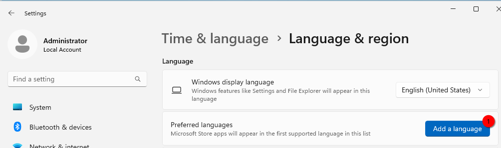   
A instalação de um novo idioma é um pouco demorado, mas assim que estiver completa, aparecerá logo abaixo:
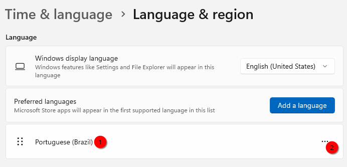   
Clique então em `...`, depois **Language Options** e faça o download de todas as opções **Language Pack**, **Basic typing**, **Text-to-speech** e até mesmo as improvaveis de usarmos: **Spaech Recognition**:
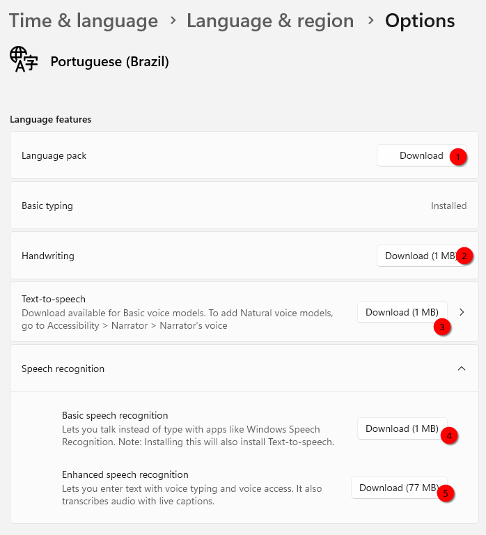

Marque para baixar todos simultaneamnte, embora aparentemente o Windows enfilera o download que parece ir apenas um download por vez. É um download tão demorado que coloca em questão a veracidade dos botões que indicam downloads de 1MB e 77MB.  

## AJUSTANDO O LAYOUT DE TECLADO
Após ter terminado completamente os downloads do idioma Português, role a tela um pouco mais e confirme que o teclado foi configurado para o padrão que está usando no momento:   
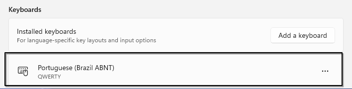   
Se não está configurado, configure-o. Não tente prosseguir sem o layout do teclado estar completo.  

## TORNANDO O IDIOMA EM PORTUGUÊS COMO PADRÃO  
Com o download completo do idioma, vá novamente em **Settings** e procure por **language Settings** e notará que agora podemos trocar o idiona:
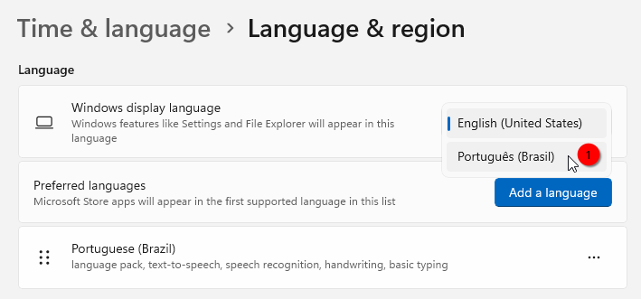
Quando fizer essa troca, haverá uma advertência, solicitando que vocÊ refaça o login:
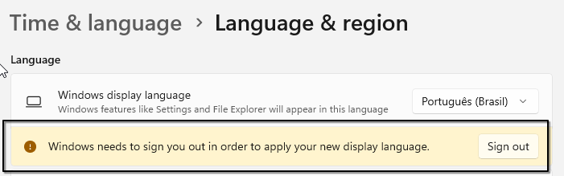
Mas, não faça isso ainda.  

## TORNANDO O IDIOMA EM PORTUGUÊS COMO PADRÃO  
Uma vez que o idioma e teclado estejam baixados corretamente, confira se o **Regional Settings** está corretamente configurado para o **Brasil**, normalmente isso se ajusta automaticamente quando configuramos o idioma, vá agora em **Settings** procure por **Regional Settings**:
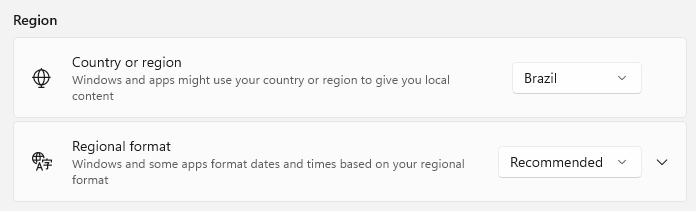

## PROPAGANDO O IDIOMA PADRÃO PARA TODOS
Uma vez que o idioma, layout de teclado e região estejam corretamente baixados e configurados, precisamos propagar esse ajuste para todo o sistema e para novos usuários, então vá agora em **Settings** procure por **language Settings** e depois clique no botão **Administrative language Settings**:
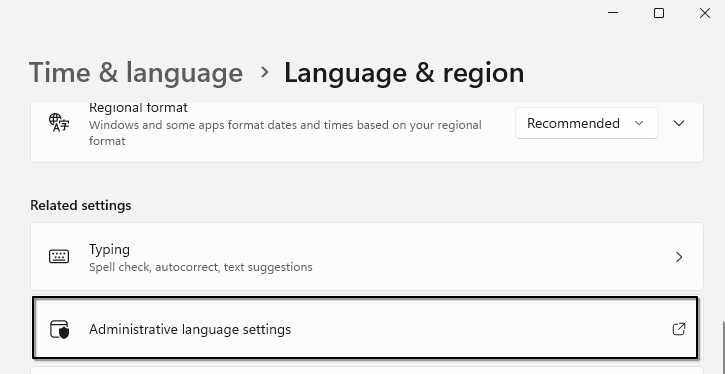

Ao clicar você será redirecionado para outra tela onde enfim poderemos fazer nossos ajustes finais, na guia **Administrative**, vá em **Change system locale**:  
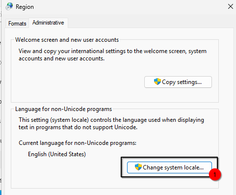  

E então troque o idioma **English** por **Português(Brasil)** e muito cuidado para não selecionar **Portugal**, por alguma razão, estou sempre selecionando erroneamente:  
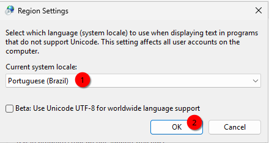   

Após confirmar, não tem jeito, terá de **reiniciar**.   

## IDIOMA PADRÃO NA TELA DE BOAS VINDAS E NOVOS USUÁRIOS
Após reboot, o Windows estará parcialmente em português, ainda falta o ultimo ajuste, terá de voltar a última tela, mas agora nossa tela já estará em português, então vá agora em **Configurações** procure por **Idioma** e depois role a tela até encontrar o botão **Configurações administrativas de idioma** e ao clicar você será redirecionado para outra tela onde enfim poderemos fazer nossos ajustes finais, na guia **Administrativo**, clique em **Copiar Configurações**:
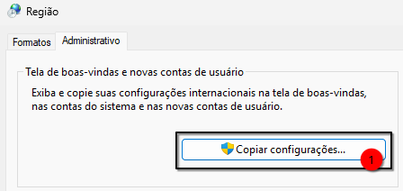

E então marque as opções **Tela de boas-vindas e contas do sistema** e também **Novas contas de usuário**:  
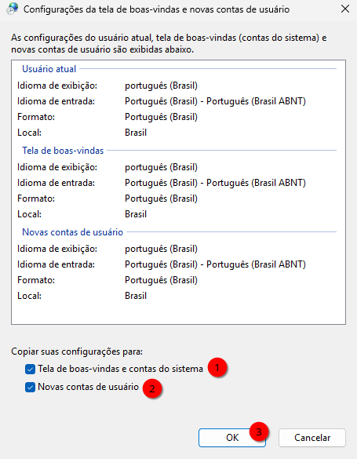  

Ao clicar em **OK**, o idioma português do Brasil estará em todo o sistema, incluindo novos usuários.  
Aproveite o momento - se desejar - para remover o idioma em Inglês, caso contrário, o Windows irá baixar atualizações também para esse idioma.  

Depois, você é obrigado a **reiniciar o sistema**.
