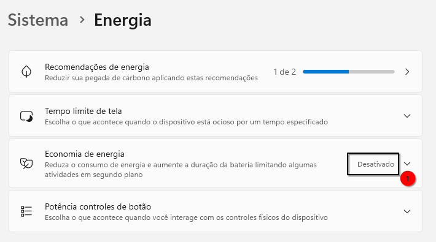

# OTIMIZAÇÃO DA VM WINDOWS
O Windows depois de instalado está carregado de coisas que roubam performance, vamos tentar melhorar. Siga as instruções abaixo para otimizá-lo:  

### Otimizando o Windows - Removendo o Gerenciador do Servidor do Startp do Windows:
Se estiver usando uma edição Servidor do Windows, provavelmente você se aborrecerá do Gerenciador do Servidor que é carregado todas as vezes que faz o logon. Para desabilitá-lo vá em **Gerenciar|Propriedades do Gerenciador do Servidor** e então marque a opção **Não iniciar o Gerenciador do Servidor automaticamente no logon**:  

    

## Otimizando o Windows - Menu do Windows
No painel de menu, remova os recursos que não precisa como caixa de pesquisa e visão de tarefas:   
    

Lembre-se de que qualquer coisa que consuma ciclos de CPU e não são úteis, devem ser desativados.  

## Otimizando o Windows - Papel de parede
Remova o papel de parede e use uma cor solida como preto. Antes que pergunte, sim, isso faz muito a diferença.  
    
Lembre-se de que qualquer coisa que consuma ciclos de CPU e não são úteis, devem ser desativados.  

## Otimizando o Windows - Energia
Você esta usando uma VM e por isso, você não tem compromisso de economia de energia.  
No Windows vá em **Configurações**, procure por **Energia**, e desative qualquer medida ou tentativa para economizar energia:  
    


## Otimizando o Windows - Programas dispensáveis
Se você não usa os serviços Microsoft 365 nesta VM, não instale o onedrive e afins, só vão lhe roubar recursos.  

## Otimizando o Windows - Serviçõs dispensáveis
Alguns serviços o Windows sao dispensáveis, execute `services.msc` e desative alguns desses(ou todos eles):  

| Nome exibido no `services.msc` | Nome interno (`sc config ...`) | Função | Pode desativar? |
|--------------------------------|-------------------------------|---------|------------------|
| **Windows Search** | `WSearch` | Indexação de arquivos e e-mails | ✅ |
| **SysMain** *(antigo Superfetch)* | `SysMain` | Otimiza inicialização e cache de aplicativos | ✅ |
| **Optimize Drives (Desfragmentador)** | `defragsvc` | Desfragmenta discos mecânicos | ✅ |
| **Windows Error Reporting Service** | `WerSvc` | Envia relatórios de erro para a Microsoft | ✅ |
| **Diagnostic Policy Service** | `DPS` | Detecta e tenta corrigir problemas de rede e hardware | ✅ |
| **Connected User Experiences and Telemetry** | `DiagTrack` | Coleta telemetria e estatísticas de uso | ✅ |
| **Windows Update Medic Service** | `WaaSMedicSvc` | Reativa o Windows Update automaticamente | ✅ |
| **Remote Registry** | `RemoteRegistry` | Permite editar o registro remotamente | ✅ |
| **Fax** | `Fax` | Suporte a envio de fax | ✅ |
| **Print Spooler** | `Spooler` | Gera fila de impressão | ✅ *(a não ser que use impressoras)* |
| **Bluetooth Support Service** | `bthserv` | Gerencia dispositivos Bluetooth | ✅ |
| **Smart Card** | `SCardSvr` | Gerencia cartões inteligentes | ✅ |
| **Secondary Logon** | `seclogon` | Permite “Executar como outro usuário” | ⚠️ *Opcional* |
| **Windows Defender Antivirus Service** | `WinDefend` | Proteção antivírus | ⚠️ *Somente se VM isolada* |
| **Offline Files** | `CscService` | Sincroniza arquivos offline | ✅ |
| **Program Compatibility Assistant Service** | `PcaSvc` | Detecta compatibilidade de programas antigos | ✅ |
| **Security Center** | `wscsvc` | Central de segurança (alertas) | ✅ |

A lista acima, foi tirada do Windows Server, o Windows 11 tem muito mais serviços que estes e levará algum tempo para você complementar a lista.  
Desativar um serviço de cada vez levará muito tempo, então para agilizar, criei um script `agilizar_vm.bat` que ao rodar uma única vez como administrador, ele desativará vários de uma única vez. Se estiver interessado crie um script `agilizar_vm.bat` com o seguinte cnteúdo:  

```cmd
@echo off
echo === Otimizando VM Windows para melhor desempenho ===
echo.

for %%S in (
  WSearch
  SysMain
  defragsvc
  WerSvc
  DPS
  DiagTrack
  WaaSMedicSvc
  RemoteRegistry
  Fax
  bthserv
  SCardSvr
  WinDefend
  CscService
  PcaSvc
  wscsvc
) do (
  echo Desativando %%S ...
  sc stop "%%S" >nul 2>&1
  sc config "%%S" start= disabled >nul 2>&1
)

echo.
echo === Concluido! Reinicie o Windows para aplicar todas as alteracoes. ===
pause
```
Aproveite para remover da lista acima os nomes de serviços que na sua definição lhe são útes, afinal, a lista acima desativa todos os serviços que detalhei na tabela. Eu por exemplo, removo da lista os serviços a serem desativados: **Print Spooler** e **Secondary Logon** porque eles me são uteis, por isso eles estão fora da lista do arquivo .cmd acima.    
Salve o conteúdo acima como `otimizar-vm.cmd`, então clique com o botão direito sobre ele e **“Executar como Administrador”**.    

Caso se arrependa de ter desativado algum serviço em particular, execute `servces.msc` e ative-o.  

**OBSERVAÇÃO**: Você está desativando o `defragsvc`, o que lhe impossibilitará a desfragmentação do disco e deve estar pensando se isso é uma boa idéia, sim, é uma boa idéia porque caso precisemos desfragmentar o disco, não usaremos o desfragmentador do Windows, mas a ferramenta de otimização para arquivos qcow2 que é muito mais eficiente e limpa espaços vazios do disco fazendo recuar o tamanho do arquivo da VM.  


## Otimizando o Windows - Recursos Visuais
A configuração de vídeo é um aspecto muito importante porque não importa o quanto a VM seja rápida para processar, o aspecto mais valorizado é a responsividade. As vezes você pode achar a VM lenta, mas quando roda um processo, o processo roda rápido, mas a impressão que se tem é de lerdeza ao operar a VM, isto é a responsividade.  
Se você tiver um notebook que tem uma placa de vídeo Intel e outra NVIDIA, parabens você pode configurar sua máquina virtual para passthrough, isto é, deixar o sistema hospedeiro ficar 100% com uma placa de vídeo(Intel) enquanto a VM fica 100% com a outra placa de vídeo(NVIDIA) por meio de passthrough e poderá inclusive jogar nessa VM com desempenho similar sem virtualização.  
Mas voltando ao assunto, este guia passo a passo foi feito para mortais que usufruem apenas de uma placa de vídeo e como ela fica com o hospedeiro, as VMs "emulam" uma placa de vídeo que usa um driver QXL que é apenas um quebra-galho aceitando apenas a parte 2D, por isso dentro do Windows vocÊ precisa urgentemente desligar todos os efeitos visuais que puder, vá em **Configurações>ConfiguraçõesaAvançadas do sistema>Desempenho** e clique em **Configurações** e deixe selecionado apenas a opção **Usar fontes de tela com cantos arredondados** porque nossos olhos não precisam sangrar também:
!(Desempenho)[../img/debian_qemu_kvm_windows-otimiza1.png]  

## Otimizando o Windows - Agendador de tarefas
Depois de instalar dentro da VM todos os programas de que precisa, vá no agendador de tarefas e desative os agendamentos de atualizações que estes programas gostam de deixar lá, por exemplo, o Oracle Java e Adobe Reader deixam no Agendador de tarefas programas para atualização de seus produtos. Normalmente ficam programados para conferir se há atualizações de seu produtos quando o computador esta ocioso e diariamente, e isso é horrivel para a nossa VM.  

## Otimizando o Windows - Relogio
Vamos desativar o uso do relógio de hardware HPET (High Precision Event Timer) como fonte principal de tempo do sistema, afinal, isso será fornecido pelo nosso hypervisor. Abra o terminal PS(PowerShell) como administrador e execute:  
```cmd
bcdedit /set useplatformclock No
```
Não confunda PowerShell com o `cmd` do Windows.  

## Otimizando o Windows - Apps no iniciar do Windows
Vá em **Configurações** e procure por **Aplicativos** e então aparecerá um **Aplicativos na inicialização**, execute ele.  
A seguir serão listados programas que são carregados juntos com o Windows:  
    

Desabiltie o máximo de programas que puder.

## Otimizando o Windows - Tarefas agendadas desnecessárias
Vamos remover todas as tarefas agendadas desnecessárias, abra o terminal PS(PowerShell) como administrador e execute:  
Primeiro vamos listá-las, execute:
```cmd
Get-ScheduledTask -TaskName '*schedule*'
```
Isso listará algo como:
```
TaskPath                                       TaskName                          State
--------                                       --------                          -----
\Microsoft\Windows\Defrag\                     ScheduledDefrag                   Ready
\Microsoft\Windows\Diagnosis\                  Scheduled                         Ready
\Microsoft\Windows\UpdateOrchestrator\         Schedule Maintenance Work         Disabled
\Microsoft\Windows\UpdateOrchestrator\         Schedule Scan                     Ready
\Microsoft\Windows\UpdateOrchestrator\         Schedule Scan Static Task         Ready
\Microsoft\Windows\UpdateOrchestrator\         Schedule Wake To Work             Disabled
\Microsoft\Windows\UpdateOrchestrator\         Schedule Work                     Disabled
\Microsoft\Windows\Windows Defender\           Windows Defender Scheduled Scan   Ready
\Microsoft\Windows\WindowsUpdate\              Scheduled Start                   Ready
```
E então terá uma ideia do que está no estado de `Ready`, ou seja, pronto para ser executado em momentos especificados pela própria Microsoft. Se desejar, poderá desativá-los, mas terá de fazer um por um, dessa forma:
```cmd
Disable-ScheduledTask -TaskPath '\Microsoft\Windows\Defrag\' -TaskName 'ScheduledDefrag'
```
E então, lhe será infromado algo como:
```
TaskPath                                       TaskName                          State
--------                                       --------                          -----
\Microsoft\Windows\Defrag\                     ScheduledDefrag                   Disabled
```
Confirmando a mudança do estado para **desabilitado**(Disabled).

Abaixo temos a sintaxe para desabilitar os que eu recomendo por considerar inapropriado para uma VM:  
```cmd
Disable-ScheduledTask -TaskPath '\Microsoft\Windows\Defrag\' -TaskName 'ScheduledDefrag'
Disable-ScheduledTask -TaskPath '\Microsoft\Windows\Diagnosis\' -TaskName 'Scheduled'
Disable-ScheduledTask -TaskPath '\Microsoft\Windows\Windows Defender\' -TaskName 'Windows Defender Scheduled Scan'
Disable-ScheduledTask -TaskPath '\Microsoft\Windows\WindowsUpdate\' -TaskName 'Scheduled Start'
```
Não sei se percebeu, mas até mesmo o 'Windows Update' esta na lista para ser desativado, então para atualizar seu Windows, só indo diretamente nas configurações e mandando atualizar manualmente.
  


