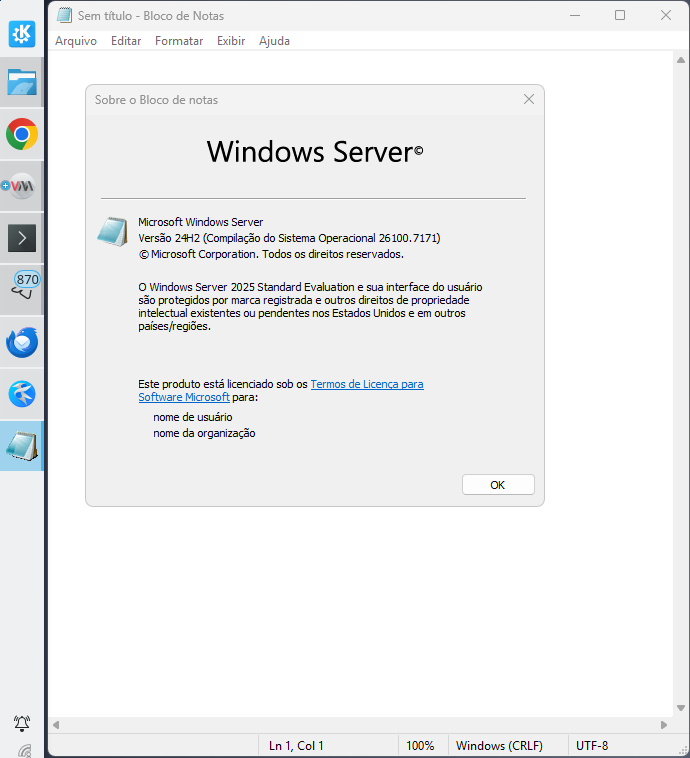

# MODO SEAMLESS: Integração de Aplicativos Windows no Linux

O recurso **Seamless** (sem emendas, ou **integração perfeita**) no contexto de máquinas virtuais (VMs) rodando no **Virt-Manager** (que utiliza o **QEMU/KVM**) permite que **aplicativos específicos** do sistema operacional convidado (Guest OS), como o Windows, apareçam e se comportem como se fossem aplicativos nativos no seu ambiente gráfico Linux (Host OS, como GNOME ou KDE).

-----

## O Que é o Modo Seamless?

Normalmente, quando você executa uma VM, você visualiza o ambiente completo do sistema operacional convidado (o desktop do Windows, por exemplo) em uma única janela ou em tela cheia. O modo **Seamless** muda isso:

  * Em vez de ver o **desktop completo** da VM, você vê **apenas a janela do aplicativo Windows** que você escolheu executar.
  * Esse aplicativo **interage diretamente** com o seu ambiente Linux: ele aparece no seu painel ou dock, pode ser alternado com o seu atalho de teclado normal (como Alt+Tab no Linux) junto com outros aplicativos Linux, e suas janelas de diálogo (como "Abrir Arquivo" ou "Salvar Como") exibem as unidades e pastas da VM, não do host Linux.

## Por Que Usar Seamless?

A principal vantagem é o **ganho de produtividade e a melhoria da experiência do usuário**, especialmente em cenários como:

1.  **Monitores Limitados:** Se você usa apenas um monitor, a alternância constante entre a VM em tela cheia e o desktop Linux quebra o fluxo de trabalho. O modo Seamless permite que você use o aplicativo Windows lado a lado com seus aplicativos Linux sem a complicação de gerenciar dois desktops completos.
2.  **Foco:** Reduz a distração do ambiente desktop completo do Windows. Se você precisa usar apenas um software específico, o Seamless oferece uma experiência mais focada, como se o aplicativo fosse um "canivete suíço" integrado.
3.  **Melhor Gerenciamento de Janelas:** Evita conflitos de atalhos de teclado (como o Alt+Tab) que poderiam ser capturados pela VM em tela cheia, garantindo que eles funcionem no seu sistema operacional host Linux.

-----

## Consideração Importante sobre Consumo de Recursos

**Não se engane:** O fato de ver apenas a janela do aplicativo, e não o desktop completo do Windows, **não significa que o consumo de recursos (CPU, Memória, Disco) será menor**.

  * A **VM completa** continua carregada e em execução na memória.
  * O consumo de recursos será o **mesmo** que se estivesse executando a VM normalmente com o desktop completo.
  * A vantagem é puramente na **interação e usabilidade** da interface gráfica.

-----

## Como Implementar o Modo Seamless

O modo Seamless pode ser configurado de duas formas principais, dependendo dos protocolos e serviços utilizados:

1.  **Protocolo RDP (Remote Desktop Protocol):**

      * Requer que o sistema operacional convidado (Windows) tenha suporte ao recurso **Área de Trabalho Remota**  ativado.
      * Este recurso é nativo em sistemas como **Windows Server** (Terminal Server/RDS), mas no Windows 11 ele não tem um frontend bonito preciusando executar comandos via powershell.
      * Esse método é um quebra-galho porque devido aos DPIs de Windows e Linux serem diferentes há muitos glitches e cortes e por isso, completamente desaconselhado.

2.  **Recurso Nativo do QEMU/KVM:**

      * Esta é a forma mais versátil, pois funciona **com qualquer versão do Windows** e é o recurso padrão que o Virt-Manager utiliza para a integração.
      * Geralmente envolve a instalação dos drivers ou agentes apropriados (como o **spice-guest-tools** e o agente QEMU) dentro da VM para habilitar a comunicação necessária entre o host e o convidado para o modo seamless.
      * No entanto, ela é ainda experimental e depois de alguns testes achei muito insipiente e parece não funcionar no Debian.
  


-----

## Rodando Aplicativos do Windows no Linux em Modo Seamless com QEMU/KVM 
No exemplo, eu usarei o programa **Calculadora do Windows** cuja localização no sistema operacional é:  
```
"C:\\Windows\\System32\\notepad.exe"
```
O nome da máquina virtual é **win2k25-dx**.

## Recurso Aplicativos do Windows no Linux em Modo Seamless Nativo do QEMU/KVM
Infelizmente é meio incipiente, parece que os drivers para Windows que deveriam fazer este método funcionar ainda estão em beta e em meus testes não funcionaram adequadamente no Debian 13. Há relatos desse método funcionando no Fedora, mas as pessoas que fizeram funcionar contornaram problemas e/ou estão usando uma versão mais recente do qemu/kvm. Não é seguro testá-lo no Debian ainda.


## Rodando Aplicativos do Windows no Linux em Modo Seamless com QEMU/KKVM + FreeRDP (xfreerdp3)

Executar programas do Windows diretamente no ambiente Linux — e não a área de trabalho inteira — é possível combinando QEMU/KVM, RDP e FreeRDP.
Esse modo é conhecido como **seamless** ou **RemoteApp**, e permite abrir apenas uma janela específica do Windows integrada ao KDE/GNOME.  

Mas antes de prosseguir por esse método, saiba as limitações:  
* A resoluçao que em DPI que o Windows usa, se diferir do ambiente Linux, os programas tem glitches.  
* Não rodará aplicativos obtidos da Microsoft Store ou qualquer outro que use o formato UWP.  
Então mesmo que você chegue ao final, o resultado pode não ser agradável aos olhos. Na minha opinião profissional, fazer isso será apenas para demonstrar que você é uma pessoa resiliente e que faz as coisas apenas porque pode e não porque será útil porque rodar apps no Linux usando RemoteApps funciona, não é nada bonito ou agradável aos olhos.  

Se desejar prosseguir assim mesmo, neste guia você aprenderá a:

* usar **VM Windows em NAT**, requeirerá criar redirecionamento de porta,
* usar o `xfreerdp3` para abrir apenas um aplicativo,
* e executar a Calculadora Win32 (`notepad.exe`) como exemplo.

---

# 1. Pré-requisitos

### Na VM Windows:
As coisas que são necessárias nós já fizemos em etapas anteriores, mesmo assim, revise:  

* Usuário com senha, [clique aqui](debian_qemu_kvm_windows.md#virt-manager---windows---criando-a-primeira-conta-de-login)  
* Autologon habilitado, [clique aqui](debian_qemu_kvm_windows.md#virt-manager---windows---ativando-o-autologon)  
* Protocolo RDP ativado, [clique aqui](debian_qemu_kvm_windows.md#modo-desenvolvedor)  

Execute o `powershell` como administrador e execute o comando abaixo para verificar que porta o protocolo RDP está funcionando, geralmente é sempre a mesma **3389**, mesmo assim vams verificar:  

```powershell
Get-ItemProperty -Path "HKLM:\System\CurrentControlSet\Control\Terminal Server\WinStations\RDP-Tcp" -Name PortNumber
```

Saída típica:

```
PortNumber : 3389
```

---

# 2. Como funciona o acesso com NAT
Se sua VM está usando NAT - o padrão do QEMU/KVM - então temos um problema, com NAT, a VM não é diretamente acessível na rede, por isso, precisamos **redirecionar uma porta qualquer do host** para a porta **3389** da VM.

Podemos usar qualquer porta para redirecionar, mas para melhor familiaridade vamos usar **33890**, com um zero na frente apenas para diferenciar da portal local da VM Windows:
```
HOST:33890  ->  VM:3389
```

A porta **33890** foi escolhida por ser próxima da padrão, fácil de lembrar e geralmente livre.

---

Aqui está **somente a seção pedida**, em **Markdown puro**, pronta para copiar/colar:

---

````md
# 3. Criando o port-forward corretamente no libvirt

O redirecionamento de portas **não deve** ser colocado no XML da VM (isso foi removido em versões modernas do libvirt).  
A forma correta é configurar o port-forward **na rede NAT**, normalmente chamada `default`.

## 3.1 Verifique o nome da rede NAT

```bash
sudo virsh net-list --all
````

A saída deve mostrar algo como:

```
 Nome      Estado   Auto-iniciar   Persistente
------------------------------------------------
 default   ativo    sim            sim

```

Se a rede estiver com Estado como ativo, continue.

---

## 3.2 Criar o port-forward Host:33890 → VM:3389
Vamos criar uma nova rede e para isso vamos gerar um `nat33890.xml` a partir da configuração atual
```bash
editor nat33890.xml
```
E cole o seguinte conteúdo:
```
<network>
  <name>nat33890</name>
  <forward mode='nat'>
    <nat>
      <port start='1024' end='65535'/>
    </nat>
    <port protocol='tcp' hostport='33890' guestport='3389'/>
  </forward>

  <bridge name='virbr10' stp='on' delay='0'/>

  <ip address='192.168.200.1' netmask='255.255.255.0'>
    <dhcp>
      <range start='192.168.200.2' end='192.168.200.254'/>
    </dhcp>
  </ip>
</network>
```
Se observar com cuidado notará que a linha:
```
<port protocol='tcp' hostport='33890' guestport='3389'/>
```
A linha acima foi acrescentada numa nova rede virtual fazendo redirecionamento de porta que precisamos.

Agora, precisamos definir a nova rede virtual com o arquivo que criamos, execute:
```bash
$ sudo virsh net-define nat33890.xml
Rede nat33890 definida a partir de nat33890.xml
```
Então, iniciamos a nova rede nat33890:  
```bash
$ sudo virsh net-start nat33890
Rede nat33890 iniciada
```
Por padrão, elas redes são criadas, mas não são ativadas durante o boot, então precisamos ativá-las:  
```bash
$ sudo virsh net-autostart nat33890
A rede nat33890 foi marcada como auto-iniciada
```
E agora ajustamos nossa VM Windows para usar a nova rede virtual, execute:
```bash
sudo virsh edit win2k25-dx
```
E localize:
```
<interface type='network'>
  <source network='default'/>
```
E onde está **default**, troque por **nat33890**:
```
<interface type='network'>
  <source network='nat33890'/>
```
Agora, já que a VM estava desligada, vamos iniciá-la:
```bash
sudo virsh start win2k25-dx
```
> Domain 'win2k25-dx' started

Para prosseguir, precisamos saber qual é o IP dessa nova VM, execute:
```bash
sudo virsh domifaddr win2k25-dx
```
Algo assim aparecerá:
```
 Nome       Endereço MAC        Protocol     Address
-------------------------------------------------------------------------------
 vnet0      52:54:00:cc:eb:7e    ipv4         192.168.200.38/24
```
Daí descobrimos que o IP é `192.168.200.38`, agora estamos prontos para testar o protocolo RDP acessando o desktop inteiro da VM porque se funcionar, testaremos com os programas individualmente no modo **seamless**, execute:
```bash
xfreerdp3 /u:gsantana /p:'Senha#123' /v:192.168.200.38 /cert:tofu
```
Como essa `NAT` está usando NAT, ela só está acessivel para você, mas caso algum dia queira criar um servidor de virtualização, troque `NAT` por `Bridge` e não precisará de redirecionar portas e todas as VMs estarão acessíveis pela rede.  

## Finalmenmte vamos aos RemoteApps
Uma características de RemoteApps no Windows é que o Windows bloqueia qualquer tentativa, de tentar rodar programas dessa forma `C:\\Windows\\System32\\Win32Calc.exe`, isso funcionava no passado, porém muitos hackers fizeram a festa com esse jeito e a microsoft corrigiu fazendo com que você publique o programa que voce pretende executar e depois o caminho dele, ex:  

|Nome      |Caminho                             |  
|:---------|:-----------------------------------|
|Win32Calc |C:\\Windows\\System32\\Win32Calc.exe|  
|(........)|(...)                               |  

E então para executar, você chama apenas "Win32Calc" e o Windows saberá que tem que executar "C:\\Windows\\System32\\Win32Calc.exe", isso é uma lista branca de aplicativos que podem ser executados.  
Mas diferente do Windows Server, o Windows 11+ não tem um froendend bonitinho para criar esse catalogo de programas, então teremos de apelar para o prompt do powershell no modo de administrador para criar nossa lista de aplicativos:  
```powershell
New-Item -Path "HKLM:\SOFTWARE\Microsoft\Windows NT\CurrentVersion\Terminal Server\TSAppAllowList" -Force | Out-Null

New-ItemProperty `
  -Path "HKLM:\SOFTWARE\Microsoft\Windows NT\CurrentVersion\Terminal Server\TSAppAllowList" `
  -Name "fDisabledAllowList" `
  -PropertyType DWord `
  -Value 1 `
  -Force | Out-Null

Restart-Service TermService -Force
```
O que o comando acima fez foi criar uma lista de aplicativos, só que ao inves de ser uma lista branca, é uma lista negra, ou seja, ele permite todos os programas menos o que eu publicar na lista. Isso torna mais flexivel nosso trabalho de desenvolvedor. Será que funciona? Vamos tentar:
```bash
xfreerdp3 \
  /u:gsantana /p:'Senha#123' /v:192.168.200.38 /cert:ignore \
  /app:program:"C:\\Windows\\System32\\notepad.exe" \
  +clipboard /dynamic-resolution
```
Vejamos:  
  

```

[Retornando a página anterior](debian_qemu_kvm_windows.md#virt-manager---seamless)
