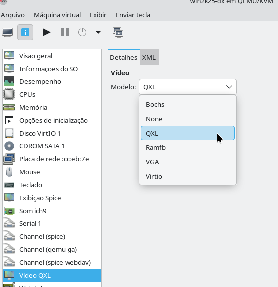
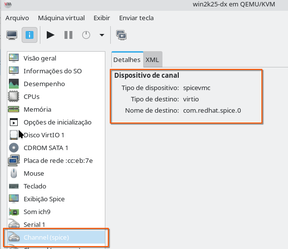
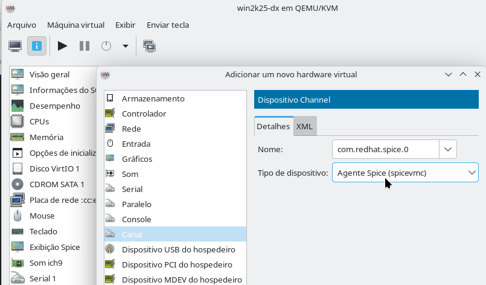

# MODO SEAMLESS: Integração de Aplicativos Windows no Linux

O recurso **Seamless** (sem emendas, ou **integração perfeita**) no contexto de máquinas virtuais (VMs) rodando no **Virt-Manager** (que utiliza o **QEMU/KVM**) permite que **aplicativos específicos** do sistema operacional convidado (Guest OS), como o Windows, apareçam e se comportem como se fossem aplicativos nativos no seu ambiente gráfico Linux (Host OS, como GNOME ou KDE).

-----

## O Que é o Modo Seamless?

Normalmente, quando você executa uma VM, você visualiza o ambiente completo do sistema operacional convidado (o desktop do Windows, por exemplo) em uma única janela ou em tela cheia. O modo **Seamless** muda isso:

  * Em vez de ver o **desktop completo** da VM, você vê **apenas a janela do aplicativo Windows** que você escolheu executar.
  * Esse aplicativo **interage diretamente** com o seu ambiente Linux: ele aparece no seu painel ou dock, pode ser alternado com o seu atalho de teclado normal (como Alt+Tab no Linux) junto com outros aplicativos Linux, e suas janelas de diálogo (como "Abrir Arquivo" ou "Salvar Como") exibem as unidades e pastas da VM, não do host Linux.

## Por Que Usar Seamless?

A principal vantagem é o **ganho de produtividade e a melhoria da experiência do usuário**, especialmente em cenários como:

1.  **Monitores Limitados:** Se você usa apenas um monitor, a alternância constante entre a VM em tela cheia e o desktop Linux quebra o fluxo de trabalho. O modo Seamless permite que você use o aplicativo Windows lado a lado com seus aplicativos Linux sem a complicação de gerenciar dois desktops completos.
2.  **Foco:** Reduz a distração do ambiente desktop completo do Windows. Se você precisa usar apenas um software específico, o Seamless oferece uma experiência mais focada, como se o aplicativo fosse um "canivete suíço" integrado.
3.  **Melhor Gerenciamento de Janelas:** Evita conflitos de atalhos de teclado (como o Alt+Tab) que poderiam ser capturados pela VM em tela cheia, garantindo que eles funcionem no seu sistema operacional host Linux.

-----

## Consideração Importante sobre Consumo de Recursos

**Não se engane:** O fato de ver apenas a janela do aplicativo, e não o desktop completo do Windows, **não significa que o consumo de recursos (CPU, Memória, Disco) será menor**.

  * A **VM completa** continua carregada e em execução na memória.
  * O consumo de recursos será o **mesmo** que se estivesse executando a VM normalmente com o desktop completo.
  * A vantagem é puramente na **interação e usabilidade** da interface gráfica.

-----

## Como Implementar o Modo Seamless

O modo Seamless pode ser configurado de duas formas principais, dependendo dos protocolos e serviços utilizados:

1.  **Protocolo RDP (Remote Desktop Protocol):**

      * Requer que o sistema operacional convidado (Windows) tenha suporte ao recurso **RemoteApps** (ou programas de área de trabalho remota).
      * Este recurso é nativo em sistemas como **Windows Server** (Terminal Server/RDS).
      * No **Windows 11** nativo, o serviço RDP padrão geralmente não permite a execução de aplicativos únicos (apenas o Desktop Inteiro), a menos que se use soluções proprietárias e pagas de terceiros. Eu falei de RemoteApps [neste artigo](debian_qemu_kvm_windows_seamless.md).

2.  **Recurso Nativo do QEMU/KVM:**

      * Esta é a forma mais versátil, pois funciona **com qualquer versão do Windows** e é o recurso padrão que o Virt-Manager utiliza para a integração.
      * Geralmente envolve a instalação dos drivers ou agentes apropriados (como o **spice-guest-tools** e o agente QEMU) dentro da VM para habilitar a comunicação necessária entre o host e o convidado para o modo seamless.

As instruções a seguir serão usadas você deseja aprender a usar o modo Seamless via QEMU, que é a maneira mais comum e eficiente no ambiente Virt-Manager:

-----

### INSTRUÇÕES: Como Rodar Aplicativos Windows em Modo Seamless (QEMU/KVM)
No exemplo, eu usarei o programa **Calculadora do Windows** cuja localização no sistema operacional é:  
```
%windir%\system32\win32calc.exe
```
O nome da máquina virtual é **win2k25-dx**.

Para que o modo Seamless funcione, é necessário que o **Spice Agent** esteja instalado no Windows e que a VM esteja configurada para usar o protocolo SPICE. Já fizemos isso nos passos anteriores então há o que se preocupar.  

1. Primeiro, **Desligue** a VM Windows.  

2. Depois vá nas propriedades da VM (Hardware Virtual), confirme que o **Display**(Vídeo) para **SPICE** esteja em **QXL** ou **Virtio**:  


3. Confira a existência de um **Canal (Channel)** com o **Nome** definido como `com.redhat.spice.0` e **Tipo de Dispositivo** como `spicevmc` assim:


E se não existir então inclua:
  

#### 2\. Instalação do Spice Agent (Guest OS - Windows)

1.  Instale o pacote de ferramentas do convidado SPICE (`virtio-win-guest-tools.exe`) dentro da VM Windows (geralmente encontrado na ISO `virtio-win.iso`) - Já fizemos isso nas etapas anteriores.
2.  Este pacote instala o **Spice Agent (`spice-vdagent`)**, que é responsável por receber os comandos de execução do Host Linux - Já fizemos isso nas etapas anteriores.
3.  **Reinicie o Windows** após a instalação.

#### 3\. Execução do Aplicativo (Host Linux)

Com a VM ligada e o Spice Agent ativo, use o comando `remote-viewer` no seu terminal Linux para executar o aplicativo. Utilize o argumento `--spice-app-launch` seguido do caminho completo do executável dentro do Windows.

**Sintaxe Geral:**

```bash
remote-viewer --spice-app-launch "C:\Caminho\Do\Aplicativo.exe" <Nome_da_sua_VM>
```

**Exemplo com a sua VM (`win2k25-dx`) rodando a Calculadora (`win32calc.exe`):**

```bash
remote-viewer --spice-app-launch "C:\Windows\System32\win32calc.exe" win2k25-dx
```

----

[Retornando a página anterior](debian_qemu_kvm_windows.md#virt-manager---seamless)
