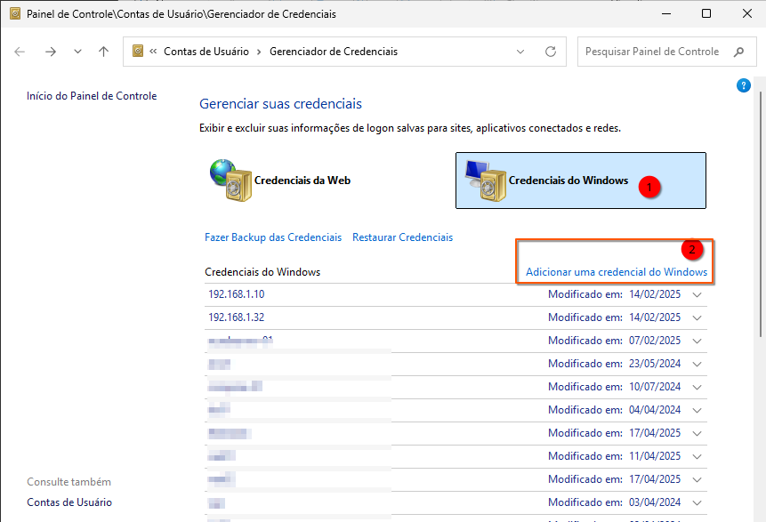
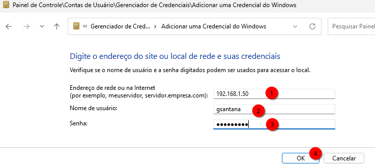
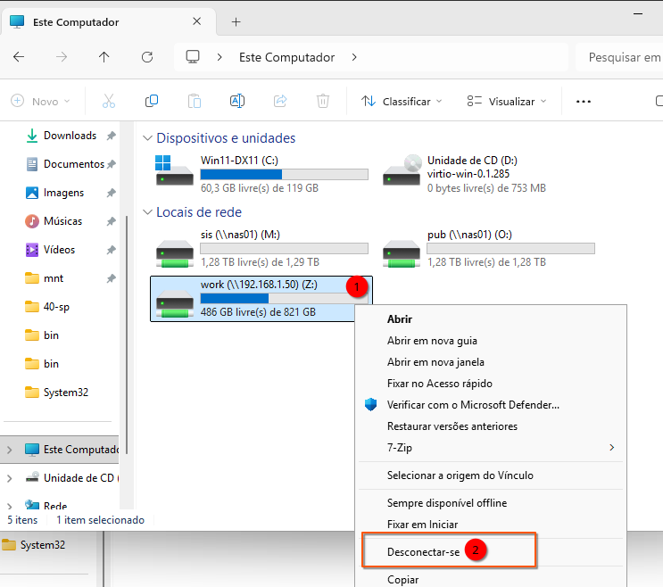
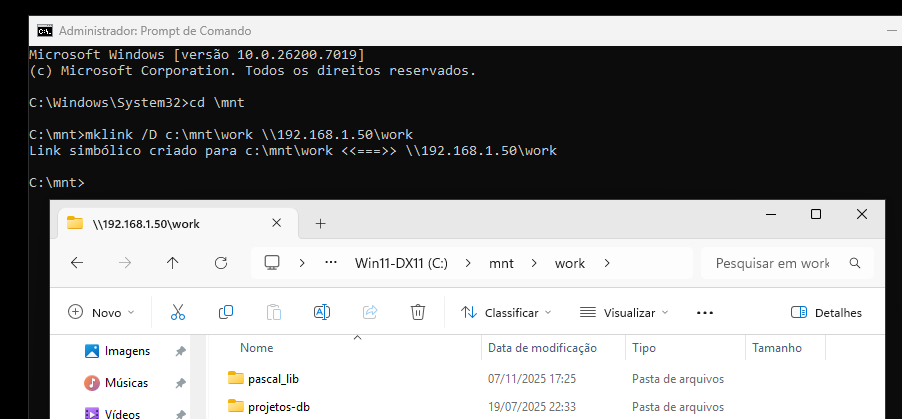

# Compartilhamento de Pastas com Samba no Debian 13 e Acesso via Windows

Este documento fornece um guia completo, passo a passo, para configurar um compartilhamento de rede (SMB/CIFS) seguro usando o Samba no Debian 13 (Trixie) e acessá-lo a partir de um cliente Windows, utilizando um link simbólico local.  
Para o correto entendimento, nos exemplos a seguir, assumiremos que:
**IP do hospedereiro**: 192.168.1.50
**Usuario/conta do hospedeiro**: gsantana

## 1\. Configuração do Servidor Debian/Ubuntu (Samba)

As etapas a seguir devem ser executadas no seu servidor ou máquina Linux Debian/Ubuntu para configurar o compartilhamento da pasta `/home/gsantana/work`.

### 1.1. Instalação do Samba

Instale os pacotes necessários para o servidor Samba e as ferramentas de cliente para testes.

```bash
sudo apt update
sudo apt install -y samba smbclient
```

### 1.2. Criação e Configuração do Usuário Samba

O Samba gerencia sua própria base de dados de senhas para acesso à rede. O usuário do sistema (`gsantana`) deve ser adicionado a esta base de dados.

1.  **Definir a Senha do Samba:**
    Use o comando `smbpasswd -a` para adicionar o usuário `gsantana` ao banco de dados do Samba e definir uma senha de rede.

    ```bash
    sudo smbpasswd -a gsantana
    ```

    (Você será solicitado a digitar e confirmar a nova senha do Samba.)

2.  **Habilitar o Usuário (Garantia):**

    ```bash
    sudo smbpasswd -e gsantana
    ```

### 1.3. Configuração do Compartilhamento (`/etc/samba/smb.conf`)

Edite o arquivo principal de configuração para definir o novo recurso de compartilhamento.

1.  **Backup da Configuração Original:**

    ```bash
    sudo cp /etc/samba/smb.conf /etc/samba/smb.conf.bak
    ```

2.  **Editar o Arquivo de Configuração:**

    ```bash
    sudo editor /etc/samba/smb.conf
    ```

3.  **Solução de Compatibilidade para Links Simbólicos (Symlinks)**  
    A incompatibilidade na visualização de pastas ou arquivos dentro do Windows ocorre frequentemente quando o Samba encontra **links simbólicos** que apontam para fora do diretório compartilhado. Por padrão, o Samba tenta aplicar as extensões e atributos de segurança do UNIX (permissões, proprietário, grupo) à conexão SMB/CIFS, o que pode confundir clientes Windows.  
    
    Para garantir que links simbólicos funcionem e que o Windows consiga interpretar corretamente os atributos das pastas e arquivos:  
    
    Adicione a diretiva `unix extensions = no` na seção `[global]` do arquivo `/etc/samba/smb.conf`. Esta linha desabilita a tentativa do Samba de usar atributos de arquivo UNIX, melhorando a compatibilidade com o Windows, especialmente ao lidar com links simbólicos:  
```Ini, TOML
    [global]
        (...)
        workgroup = WORKGROUP
        unix extensions = no    ; <<< Adicionar esta linha
        (...)
```  
Se você tiver um dominio em sua rede, troque **WORKGROUP** pelo nome do seu dominio, ex **LOCALDOMAIN**. Isso acelera nosso trabalho porque ao mapear unidades não precisamos informar o usuário desse jeito **localdomain\gsantana**, apenas **gsantana** será suficiente.      

4.  **Adicionar o Novo Compartilhamento:**
    Adicione a seção a seguir ao **final** do arquivo. Ela restringe o acesso ao usuário `gsantana` e permite leitura/escrita.

```ini
[work]
    comment = Pasta de Trabalho do gsantana
    path = /home/gsantana/work
    browseable = yes
    read only = no
    valid users = gsantana
    public = no
    writable = yes
    follow symlinks = yes
    wide links = yes

    # Máscaras de permissão
    create mask = 0644
    directory mask = 0755

    # Configurações de segurança para mapeamento de usuário
    force user = gsantana
    force group = gsantana
```

5.  **Salvar e Sair** do editor.

### 1.4. Verificação de Permissões no Linux

Confirme se o usuário `gsantana` possui as permissões corretas no sistema de arquivos para a pasta a ser compartilhada.
Define gsantana como dono (se necessário):  
```bash
sudo chown -R gsantana:gsantana /home/gsantana/work
```

Garante permissões rwx (7) ao proprietário:  
```
sudo chmod -R 755 /home/gsantana/work
```

### 1.5. Reinício e Teste do Serviço

1.  **Verificar a Sintaxe da Configuração:**

    ```bash
    testparm
    ```

    Confirme que o `smb.conf` foi carregado sem erros.

2.  **Reiniciar o Serviço SMB:**

    ```bash
    sudo systemctl restart smbd
    ```

4.  **Iniciar o Serviço SMB após o boot:**

    ```bash
    sudo systemctl enable smbd
    ```
    
4.  **Testar o Acesso Localmente (Opcional):**

    ```bash
    smbclient //localhost/work -U gsantana
    ```

    Digite a senha do Samba. O prompt `smb: \>` confirma a conexão bem-sucedida.

-----

## 2\. Acesso e Mapeamento no Cliente Windows

Após a configuração no Debian, o compartilhamento pode ser acessado em qualquer máquina Windows na mesma rede.

### 2.1. Teste de Conexão Inicial

1.  Obtenha o **Endereço IP** do seu servidor Debian/Ubuntu (e.g., usando `ip a` no terminal Linux). Mapear usando o nome não funciona muito bem com VMs usando NAT(provavelmente nosso caso).  
2.  No Windows, pressione **`Win + R`** para abrir o **Executar**.
3.  Digite o caminho UNC do compartilhamento:
    ```
    \\192.168.1.50\work
    ```
4.  Insira o nome de usuário (`gsantana`) e a **senha do Samba**. Marque a opção para lembrar credenciais.

### 2.2. Credenciais do Windows
Precisamos que o Windows memorize as credenciais de nossa máquina hospedeira, digamos que neste exemplo, o ip dela seja 192.168.1.50, então vá no Windows, procure pelo **Gerenciador de Credenciais**, depois vá em **Credenciais do Windows** e então clique em **Adicionar uma credencial do Windows**:   
  
E então informe as suas credenciais para o host(192.168.1.50):  
  
Agora que nossa credencial está incluída, vamos aos links simbolicos...


### 2.2. Recomendação: Mapeamento Local com Link Simbólico (Symlink)

Uma vez que você manteve sua senha(credencial) "lembrada", o Windows guardará suas credenciais para que uma próxima vez que for mapeá-los não precise mais fornecer senha.  
Isso é muito bom, mas pode ficar ainda melhor, para um acesso mais integrado e transparente, crie um link simbólico que aponta o caminho de rede para um diretório local.  
Iremos criar uma pasta C:\mnt e dentro dela links simbólicos que apontam para nosso compartilhamento e com isso, voce não precisa mais usar letras de drives para acessá-los.  
Mas antes de prosseguir, é importante que letras de drivers mapeadas para nosso hospedeiro sejam removidas porque se o Windows Explorer perceber que c:\mnt\work é o mesmo que Z:, tanto o explorer como também as janelas de dialogo dos programas vão tratar como um simples atalho, fazendo o salto para a letra Z: ao inves de tratar c:\mnt\work como uma pasta igual as demais, então a letra Z: deve ser removida. Simplesmente desconecte-a e remova-a, assim o seus aplicativos, janelas de dialogo tratarão c:\mnt como se fossem pastas reais.


**Requer: Prompt de Comando executado como Administrador.**

1.  **Abrir o Prompt de Comando:**
    Procure por `cmd`, clique com o botão direito e selecione **"Executar como administrador"**.

2.  **Criar o Diretório de Montagem Local:**
    Crie a pasta que servirá de destino para o link simbólico.

    ```cmd
    mkdir C:\mnt   
    ```
    Você pode usar **C:\@mnt**, caso queira que essa pasta seja listado como sendo a primeira pasta a ser vista no seu explorer, fica esteticamente melhor na minha humilde opinião.


3.  **Criar o Link Simbólico:**
    Use o comando `MKLINK` com a opção `/D` (para diretórios), apontando o caminho local (`C:\mnt\work`) para o caminho de rede (UNC).

    ```cmd
    cd \mnt
    mklink /D c:\mnt\work \\192.168.1.50\work
    ```
    O resultado será:  
    > Link simbólico criado para c:\mnt\work <<===>> \\192.168.1.50\work

    Você pode repetir o processo para outras pastas para o hospedeiro e até mesmo para outras unidades de rede. Sinceramente, acho o uso de letras de drives confuso para unidades de rede, é mais interessante usar links simbolicos.
    

6.  **Resultado:**
    A pasta compartilhada do Linux agora é acessível diretamente no seu sistema Windows através do caminho local **`C:\mnt\work`** :


-----
## 3\. Configuração do Firewall (UFW) no Debian/Ubuntu
Se você tem o firewall instalado, então vai precisar liberar as seguintes portas:  
  * **Portas NetBIOS:** UDP 137, UDP 138
  * **Porta SMB/CIFS:** TCP 139 (para compatibilidade legada)
  * **Porta Net Logon/Replication:** TCP 445 (a porta SMB moderna e mais comum)

Recapitule o documento a página sobre [Firewall](debian_firewall.md).    

-----
[Retornar à página de Virtualização nativa com QAEMU+KVM Usando VM/Windows](debian_qemu_kvm_windows.md)
