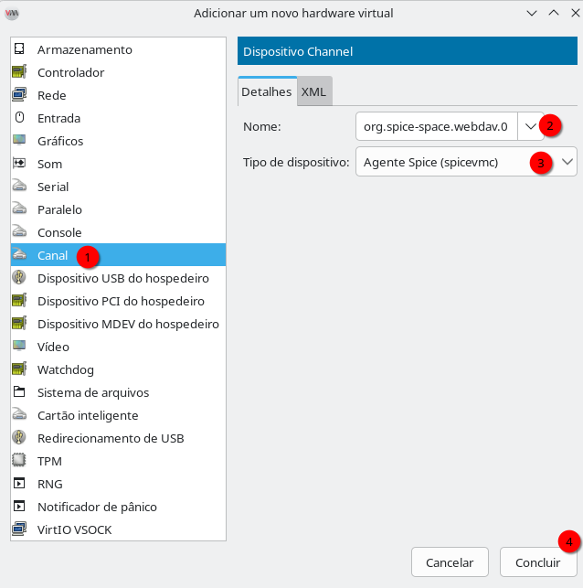

# VIRT-MANAGER - COMPARTILHANDO ARQUIVOS VIA SPICE-WEBDAV
Para compartilhar arquivos entre o sistema hospedeiro e convidado, voce pode usar o SPICE-WEBDAV. Esse é o método conhecido por muitos devs no mundo windows.  
Siga as instruções abaixo:  
(em revisão)
# Introdução ao SPICE WebDAV

**SPICE WebDAV** é uma ferramenta que integra protocolo WebDAV (Web Distributed Authoring and Versioning) com suporte a SPICE (Simple Protocol for Independent Computing Environments), permitindo acesso remoto a máquinas virtuais e compartilhamento de arquivos em ambientes de virtualização. Funciona como extensão para gerenciamento de recursos em infraestrutura virtualizada.

Vale instalar em ambientes que utilizam **hypervisores SPICE** (KVM/QEMU, Proxmox, oVirt) onde é necessário compartilhamento de arquivos bidirecional entre host e máquinas virtuais, além de acesso a storage remoto via WebDAV. É particularmente relevante em sua stack de virtualização com **QEMU+KVM**, facilitando deployments ágeis e gerenciamento centralizado de arquivos em ambientes de desenvolvimento e produção virtualizados—reduzindo necessidade de NFS ou Samba para casos de uso específicos.

Nesta seção, o **SPICE WebDAV** permite compartilhar arquivos entre o **sistema hospedeiro (Linux)** e o **convidado (Windows)** sem precisar configurar Samba, FTP ou serviços de rede. Ele é diferente do **WinSFP** que vimos antes, pois o WebDAV seria uma forma universal de troca de arquivos que você poderá ver sendo usado de formas diferentes dentro de organizações.  
O **SPICE WebDAV** usa um **canal SPICE** interno e o protocolo **WebDAV**, exibindo a pasta compartilhada como uma unidade de rede no Windows.  

## Preparar a VM (Canal SPICE WebDAV)
1. Desligue a máquina virtual.
2. Abra o **virt-manager**, selecione a VM, depois **Detalhes**, depois **Adicionar hardware** e então escolha **Canal**.
3. Configure:
   - **Tipo de dispositivo:** `spicevmc`
   - **Nome do dispositivo:** `org.spice-space.webdav.0`
4. Clique em **Concluir** e **salve as alterações**.

   

Ótimo, agora você tem o canal, vá em Arquivo

(todo)
