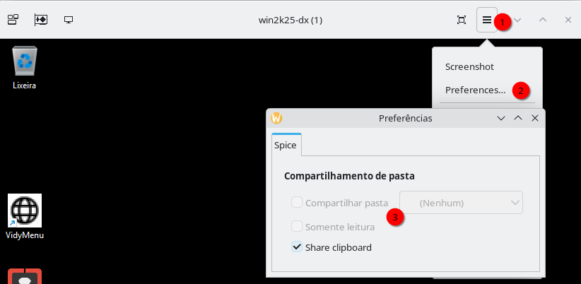

# WEB-DAV - COMPARTILHANDO ARQUIVOS VIA SPICE WebDAV

O **SPICE** (*Simple Protocol for Independent Computing Environments*) é um protocolo de código aberto desenvolvido para acesso remoto de alta performance a ambientes de desktop virtualizados, sendo amplamente utilizado pelo **QEMU/KVM** e `virt-manager`. Ele lida com a compressão, *encoding* e transporte de dados gráficos, áudio e periféricos (como teclado e mouse) entre o host Linux e o convidado Windows.

O **SPICE WebDAV proxy** é um componente do SPICE que permite o compartilhamento de pastas do sistema hospedeiro (Linux) para o sistema convidado (Windows) utilizando o protocolo de rede **WebDAV** (Web Distributed Authoring and Versioning).

> Embora o **Virtio-FS** seja o método de compartilhamento de arquivos mais **rápido e performático**, ele possui limitações notáveis em ambientes Windows devido à diferença na arquitetura dos sistemas de arquivos (Linux é *case-sensitive* e Windows é *case-insensitive*):
>
> 1.  **Permissões e Segurança (ACLs):** O Virtio-FS mapeia permissões POSIX (Linux) para as ACLs (Windows Access Control List), o que é **incompleto** e pode resultar em problemas como **acesso somente leitura** ou falhas ao tentar modificar ou criar arquivos, a menos que as permissões sejam alteradas manualmente no host (ex: `chmod 777`).
>       * **Nota sobre `chmod 777`:** Embora o uso de `chmod 777` (permissão total para proprietário, grupo e outros) em pastas compartilhadas possa resolver rapidamente problemas de permissão de escrita no Virtio-FS, **cuidado ao aplicá-lo em arquivos**. Arquivos executáveis ou de configuração com permissões tão abertas representam um risco de segurança.
> 2.  **Links Simbólicos (*Symlinks*):** O suporte a *symlinks* em pastas compartilhadas com Virtio-FS no Windows pode ser problemático e, em alguns casos, **causar o *crash*** do driver Virtio-FS no sistema convidado, especialmente com *self-symlinks*.
> 3.  **Sistemas Windows Antigos:** O Virtio-FS é tipicamente suportado apenas a partir do **Windows 10** (e requer a instalação de *drivers* e do WinFsp), enquanto o WebDAV pode funcionar com versões mais antigas (como Windows 7).

Dito isso, o WebDAV via SPICE é uma alternativa estável, embora **mais lenta**, para o compartilhamento de arquivos com VMs Windows.

-----
## 1\. Configuração no Hospedeiro (Linux) com `virt-manager`

1.  **Desligue a VM** Windows.
2.  Vá até as **configurações de *hardware*** da VM.
3.  Adicione um novo hardware, escolhendo o tipo **Canal** (*Channel*).
4.  Defina o **Nome** do dispositivo para `org.spice-space.webdav.0`. Deixe os outros campos como padrão.

> **Nota:** A pasta a ser compartilhada do lado do host será configurada posteriormente através do **`virt-viewer`** (o cliente SPICE).

-----

## 2\. Virt-Viwer instalado?
Para prosseguir, você precisa iniciar a VM, mas sem usar **virt-manager**, terá de ser via **virt-viewer**. Isso acontece porque o serviço que instalaremos chamado de **Spice webdav proxy** não é iniciado com uma sessão do **virt-manager** em execução e ele sempre estará caso você inicie uma VM por ele.  

Então, siga as instruções no link abaixo caso queira prosseguir com este artigo:  
[Instalando e executando via virt-viewer](debian_qemu_kvm_virtviewer.md)

-----

## 3\. Configuração no Convidado (Windows)

1.  Tenha certeza de ter iniciado a VM usando o **virt-viewer** e não estar executando nenhuma sessão do **virt-manager**, senão irá falhar.  
2.  Dentro da VM Windows, baixe e instale o **`spice-webdavd`** no Windows convidado. Este pacote contém o serviço necessário para que o Windows se conecte ao canal WebDAV.
      * O instalador pode ser encontrado na página oficial do projeto:
        [spice-webdavd (Download)](https://www.spice-space.org/download/windows/spice-webdavd/)
3.  Após a instalação, verifique se o serviço `Spice webdav proxy` está em execução.
      * Execute `services.msc` no Windows.
      * Localize o serviço **`Spice webdav proxy`**.
      * Defina o **Tipo de Inicialização** como **Automático** e inicie o serviço, se necessário.

> **ADVERTÊNCIA**: O serviço `Spice webdav proxy` pode não iniciar corretamente se você estiver usando o console do **virt-manager** diretamente. Para que o recurso funcione, você pode precisar abrir a VM usando o **`virt-viewer`** separadamente e não estar com nenhuma sessão do **virt-manager** aberta.

-----

## 4\. Mapeando a Pasta Compartilhada

O compartilhamento efetivo da pasta do hospedeiro é configurado através do `virt-viewer`:

1.  **Preparação no Host:** Para maior segurança e organização (seguindo a prática recomendada no seu artigo Virtio-FS), crie e use uma pasta consolidada no seu sistema hospedeiro, por exemplo:
    ```bash
    mkdir -p /home/gsantana/work            # pasta vazia
    mkdir -p /home/gsantana/work/downloads  # pasta vazia
    mkdir -p /home/gsantana/work/docs       # pasta vazia
     
    # usando bind mounts:
    sudo mount --bind /home/gsantana/Downloads /home/gsantana/work/downloads
    sudo mount --bind /home/gsantana/docs /home/gsantana/work/docs
    ```
    Onde:
    * /home/gsantana/downloads é uma pasta real com arquivos dentro que será montada (mount --bind) na pasta vazia /home/gsantana/work/downloads.
    * /home/gsantana/docs é uma pasta real com arquivos dentro que será montada (mount --bind) na pasta vazia /home/gsantana/work/docs.
    E você vai linkando (mount --bind) dessa forma todas as pastas de que precisa dentro de /home/gsantana/work.  
    Isso permite que você exporte um único ponto de entrada para todas as pastas necessárias.  
2.  No `virt-viewer` (a janela que mostra o desktop do Windows):
      * Vá em **Arquivo** (*File*) \> **Preferências** (*Preferences*).
      * Marque a opção **Compartilhar Pasta** (*Share Folder*) e escolha a pasta consolidada que você criou, como `/home/gsantana/work`:
        
        Se a opção de **Compartilhar Pasta** (*Share Folder*) estiver desligada como na imagem abaixo é porque o canal `org.spice-space.webdav.0` não foi adicionado:
        
        
        Então volte aos passos anteriores para corrigir e só então prossiga.  

Alternativamente, dentro do Windows, você pode executar o *script* de mapeamento de unidade (se instalado com o `spice-webdavd`), que é o atalho para montar o compartilhamento WebDAV como uma letra de *drive*:

```bash
"C:\Program Files\SPICE webdavd\map-drive.bat"
```
O arquivo acima já existe e tem esse conteúdo:  
```
net use * http://localhost:9843/

REG ADD "HKCU\Software\Microsoft\Windows\CurrentVersion\Explorer\MountPoints2\##localhost@9843#DavWWWRoot" /v  "_LabelFromReg" /t REG_SZ /d "Spice client" /f
```
O que ele faz por padrão é mapear a unidade compartilhada com a primeira letra de drive disponivel e dar um nome de "Spice client" para ela. No entanto, você pode personalizá-lo se desejar. O script a seguir é um exemplo disso, onde nós podemos escolher uma letra de drive especifica para trabalharmos.  

### Exemplo do Conteúdo do `map-drive.bat`

Este *script* é um arquivo *batch* simples que utiliza o comando `net use` do Windows para mapear um *drive* (unidade) de rede para o canal WebDAV exposto pelo SPICE:

```bat
@echo off
rem Script para mapear a pasta compartilhada do host como uma unidade de rede no guest.

set HOST_SHARE="\\Spice\\org.spice-space.webdav.0"
set DRIVE_LETTER=W:

rem Verifica se a unidade de rede já existe. Se existir, é removida.
net use %DRIVE_LETTER% /delete >nul 2>&1

rem Mapeia a unidade de rede.
net use %DRIVE_LETTER% %HOST_SHARE%

rem Verifica o sucesso da operação.
if %errorlevel% neq 0 (
    echo.
    echo Nao foi possivel mapear a unidade %DRIVE_LETTER%.
    echo O Servico "Spice webdav proxy" esta em execucao?
    pause
) else (
    echo.
    echo Unidade %DRIVE_LETTER% mapeada com sucesso!
)
```

A pasta escolhida no **`virt-viewer`** aparecerá no Windows geralmente mapeada como a letra de unidade (`W:` no exemplo acima) ou como um **local de rede**.

Você também pode tentar acessar digitando o caminho na barra de endereços do Explorador de Arquivos do Windows:

```
Spice://org.spice-space.webdav.0
```

Isso pode fazer com que o Windows reconheça o compartilhamento.

-----

### Esclarecendo `virt-manager` vs. `virt-viewer`

O **virt-manager** é a ferramenta de **gerenciamento** que cria e configura a máquina virtual e seus dispositivos (como o canal WebDAV no Passo 1). O **`virt-viewer`** é o programa **cliente/visualizador** que se conecta à saída gráfica (desktop) da VM. Quando você abre uma janela para visualizar a VM rodando por dentro do **virt-manager** você está usando uma versão que se parece com o `virt-viewer`, mas não é ele, daí você não encontra algumas opções que só o `virt-viewer` possui, por exemplo. você não irá achar no menu hamburguer a opção para configurar o compartilhamento de pastas.  

-----

## SEGURANÇA

1.  Não é recomendado exportar o seu diretório `$HOME` inteiro.
2.  Para máxima segurança e organização, crie uma pasta consolidada similar ao exemplo **/home/gsantana/work** e use *bind mounts* para incluir apenas as subpastas desejadas. Em seguida, exporte apenas esta pasta consolidada através do `virt-viewer`.
3.  Lembre-se que o WebDAV via SPICE é mais lento que o Virtio-FS, no entanto, é mais compativel com as permissões de arquivos do Windows, ele entende melhor os links simbolicos que usamos no hospedeiro Linux.  

-----

## Dicas do YouTube

Este vídeo demonstra o poder e o uso do **Virtio-FS** no Proxmox, reforçando a performance da tecnologia e mostrando a diferença de velocidade em relação a métodos mais lentos como o WebDAV:

[COMPARTILHANDO ARQUIVOS ENTRE VMs NO PROXMOX? VEJA O PODER DO VIRTIO-FS\!](https://www.youtube.com/watch?v=1kGtxAVFIqc)

-----

[Retornar à página de Virtualização nativa com QAEMU+KVM Usando VM/Windows](debian_qemu_kvm_windows.md)
