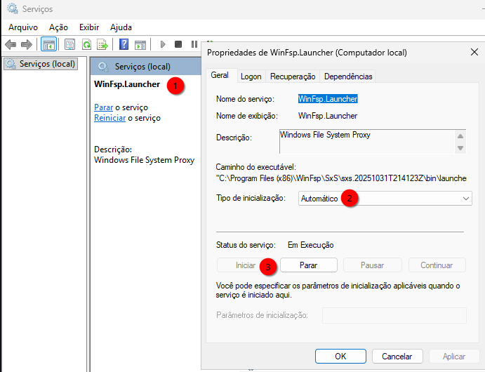
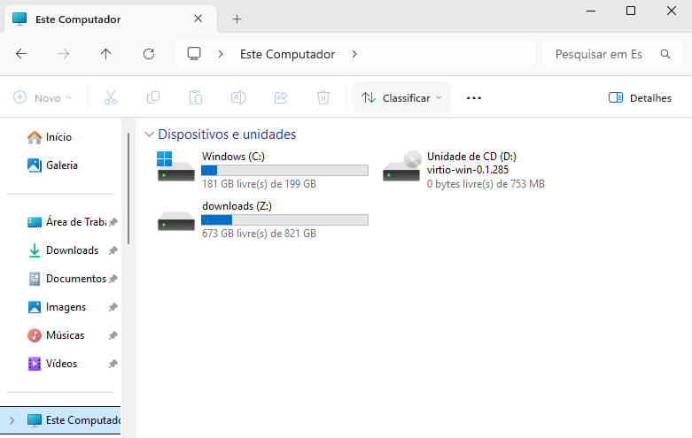

# VIRT-MANAGER - COMPARTILHANDO ARQUIVOS VIA Virtio-FS+WinSFP
Para compartilhar arquivos entre o sistema hospedeiro e convidado, voce pode usar o virtiofs+WinSFP. Esse é o método mais performático que existe.  
Siga as instruções abaixo:  

Desligue a VM. 
Crie um novo *pool*
Vá até as configurações dela, adicione um novo hardware e escolha um novo hardware **Sistema de arquivos(FileSystem)**, tenha certeza de:  
* **Driver**: virtiofs  
* **Source path**: escolha uma pasta de seu sistema como **/home/gsantana/Downloads**, ele não aceitará se **Downloads** não estiver dentro de um **pool**, assim você precirá nesta tela, criar um pool chamado de **home** apontando para a pasta onde a **Download&** está, isto é, **/home/gsantana**, só assim, conseguirá selecionar a pasta de **Downloads** e funcionar. **ADVERTÊNCIA**: possivel selecionar Downloads sem criar um pool, mas não funcionará.       
* **Target path**: escolha um nome para este compartilhamento como **downloads**   
Se quiser impedir da estação windows escrever nesta pasta você pode marcar a opão **Exportar sistema de arquivo como montagem somente leitura**.

Tenha certeza de ter instalado dentro da VM WIndows o programa `WinFsp`.  
Depois de iniciar a VM, acesse a a página WinSFP no link abaixo:  
[https://github.com/winfsp/winfsp/releases](https://github.com/winfsp/winfsp/releases)  
E baixe a ultima versão disponivel:   
  

Execute `services.msc` e veja se os serviços estão habilitados:  
**VirtIO-FS Service**  
   

**WinFsp.Launcher**  
   

Sem O `WinFsp`, o serviço `Virtio-FS` não inicia, e portanto, a unidade que representa o `Source Path` escolhido não aparecerá. Voce até pode chamar o `services.msc` no menu do Windows e verá que este serviço não inicializa sem o `WinFsp` instalado.  
Isso acontece porque o programa `WinFsp` é convocado assim que o serviço `Virtio-FS`  é iniciado, e então ele lê o `Source Path` e cria então a unidade como Z:, mas temos um problema, ele lê o primeiro `Source Path`, mas não executa os demais se existirem. Caso crie um outro `Source Path` com o nome de `docs` apontando para algum lugar do hospedeiro, essa unidade não será mostrada. Isso corre porque dentro do Windows, o `WinFsp` só consegue executar uma instância de cada vez quando o serviço `Virtio-FS` é iniciado. Assim, caso precise de mais unidades, temos duas soluções alternativas:  

### OPÇÃO 1 - CONSOLIDE TUDO NUM ÚNICO PONTO DE ENTRADA
Consolide todas as pastas necessarias numa unica pasta maior, poderá tentar usar links simbolicos usando a opção de `bind`:
```
mkdir -p /home/gsantana/work            # pasta vazia
mkdir -p /home/gsantana/work/downloads  # pasta vazia
mkdir -p /home/gsantana/work/docs       # pasta vazia

# usando bind mounts:
sudo mount --bind /home/gsantana/Downloads /home/gsantana/work/downloads
sudo mount --bind /home/gsantana/docs /home/gsantana/work/docs
```
Onde:  
* **/home/gsantana/downloads**  é uma pasta real com arquivos dentro que será montada (mount --bind) na pasta vazia **/home/gsantana/work/downloads**.  
* **/home/gsantana/docs**  é uma pasta real com arquivos dentro que será montada (mount --bind) na pasta vazia **/home/gsantana/work/docs**.  
E você vai *linkando* (mount --bind) dessa forma todas as pastas de que precisa para dentro de **/home/gsantana/work**.   
E agora voce exporta o `Source Path` como `/home/gsantana/work` e obterá todas as pastas dentro de uma unica que poderá ser usada dentro da VM Windows.  
Essa é a minha opção preferida, inclusive já tenho um script para montar as todas as pastas que preciso dentro de **~/work/** .


### OPÇÃO 2 - MAPEIE UNIDADES POR DENTRO DO WINDOWS
Essa é uma opção que reluto em usar porque vai criando letras de drive para cada `Source Path`.  
Dentro do windows, execute outra instancia manualmente com o comando:  
```
   "C:\Program Files\Virtio-Win\VioFS\virtiofs.exe" docs X:
```
Isso criará a letra Z: (ou que estiver disponível) para `Source Path` definido como **docs**.  Você terá de criar um `.bat` para mapear cada letra de drive para cada `Source Path` e depois colocá-lo na auto inicialização do seu perfil, assim não precisará executar estes comandos todas as vezes.  

Assim, que estes serviços forem iniciados, olhe novamente para o explorer e notará que as pastas que foram exportadas, em nosso exemplo apenas a pasta `Downloads` serão reconhecidas como unidades:  

   

## SEGURANÇA
Para a segurança de seu sistema hospedeiro e convidado:  
1. Você pode criar uma pool para seu $HOME, mas não deve exportar seu $HOME inteiro para dentro de uma VM.  
2. Aprenda a exportar como `Source Path` apenas as pastas de que aquela VM precisará.
3. Minha preferencia, crie uma pasta similar ao exemplo **work** e use *bind mounts* para indicar apenas as pastas desejadas dentro desse `Source Path`.

Além de mais seguro, essas dicas, interrompem programas erroneamente chamados de **telemetria** que acompanham produtos comerciais e gratuítos, mas que no fundo são **spywares** como qualquer outro.  


---

[Retornar à página de Virtualização nativa com QAEMU+KVM Usando VM/Windows](debian_qemu_kvm_windows.md)   


