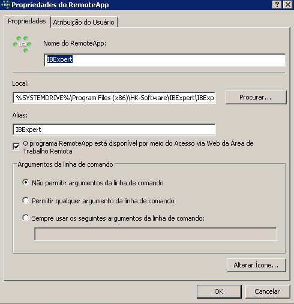
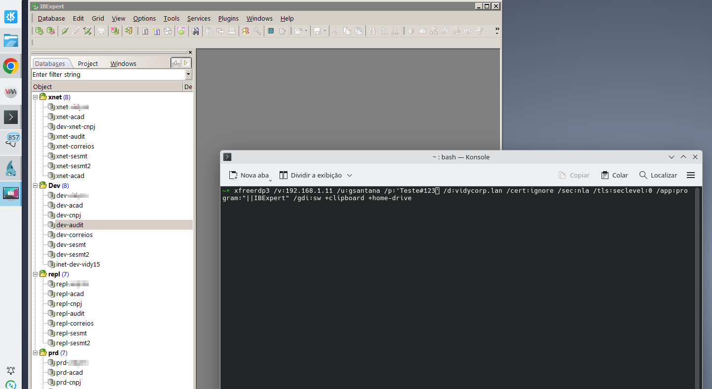

# EXECUTANDO REMOTE-APPS NO WINDOWS

Hoje é o seu dia de sorte, o que vou explicar aqui é um material dificil de encontrar na internet.  
Primeiro, o que é são RemoteApps?  
Para explicar melhor vamos a um cenário real, é comum que algumas empresas queiram controle sobre certos aplicativos que rodam na empresa, por exemplo, o ERP da empresa, eu posso tranquilamente instalar em cada computador que irá usá-lo a sua porção cliente, mas computadores podem falhar e em casos assim a pessoa ficaria sem o programa de uso dela. Então, a solução pode ser ter um computador com todos os programas licenciados de uso da empresa num unico lugar que chamaremos de servidor de aplicação e as estações de trabalho usam um protocolo chamado RDP que permite executar aplicações remotas como se estivessem no computador do usuário e usando recursos como memória e CPU do servidor e não do desktop do usuário, se o equipamento do usuário quebrar ele pula para outro computador e apenas cria um atalho novamente para sua aplicação sem se preocupar em instalar a aplicação novamente, essa é a idéia do RemoteApps. Você pode inclusive acessar o desktop inteiro do Servidor, mas nos dias atuais deixar um desktop inteiro para o usuário pode ser perigoso porque se ele fizer algo que congele o computador, todas as aplicações também vão congelar e se inadivertidamente um usuário desligar o computador, todos os programas deixarão de funcionar para os demais e isso pode ser uma tremenda dor de cabeça, então a solução mais viável e exportar para os desktops apenas os aplicativos sem acesso a área de trabalho.  

Para que isso funcione, o serviço chamado de RDS (antigamente chamava-se de Terminal Services) precisa estar ativo e usando a porta **3389**. Claro, o firewall deve ter esta porta liberada. Sem essas diretrizes, o que faremos não irá funcionar.
Uma vez que faça isso, já será possivel usar o [Remmina](debian_remmina.md) para testar o acesso remoto. Como eu disse, o remmina acessará o desktop inteiro e para alguns isso já resolve, mas a intenção deste guia é usar um modo conhecido como **SeamLess**, isto é, como rodá-lo como **RemoteApp** onde o comportamento deste programa seja exatamente como no ambiente do hospedeiro, se eu minimizar o programa ele minimizará dentro do meu Desktop Linux e não dentro da janela do Remmina.  


## Windows Server
RemoteApps podem ser feitos usando diversos programas, neste guia usaremos um Windows Server.   
No Windows Server, você não pode dizer que deseja executar "C:\Program Files (x86)\HK-Software\IBExpert\IBExpert.exe" porque isso não funciona, você precisa criar um alias (apelido) para esse programa, por exemplo, **IBExpert** e dizer que ele aponta para **C:\Program Files (x86)\HK-Software\IBExpert\IBExpert.exe** e então publicá-lo para que todos na rede tenham acesso, quando for rodá-lo em forma de atalho, apenas dizer que quer executar **IBExpert** - nome como foi publicado - e o Windows se encarrega do resto.   

Para descobrir o **Alias** (apelido) ou publicar o programa corretamente no seu **Windows Server**, você precisa acessar o servidor (via Área de Trabalho Remota normal) e usar o **Gerenciador de Servidores (Server Manager)**.

Aqui está o passo a passo exato para encontrar o nome que o Linux precisa:

### Passo 1: Abrir o Gerenciador de RemoteApp

1.  No Windows Server, abra o **Server Manager** (Gerenciador de Servidores).
2.  No menu da esquerda, clique em **Remote Desktop Services** (Serviços de Área de Trabalho Remota).
3.  Clique em **Collections** (Coleções) e depois no nome da sua coleção (geralmente chama-se *QuickSessionCollection* ou algo que você criou). Mas há variações de nomes, no Windows mais antigos pode chamar-se `Gerenciador de RemoteApp`.

### Passo 2: Descobrir o Alias do IBExpert

1.  No painel principal, procure a seção **RemoteApp Programs** (Programas RemoteApp).remote
2.  Verifique se o **IBExpert** está na lista.
      * **Se NÃO estiver:** Você precisa publicá-lo (veja o Passo 3 abaixo).
      * **Se ESTIVER:** Clique com o botão direito nele e escolha **Properties** (Propriedades).  
          
3.  Na aba **General** (Geral), olhe o campo **Alias**.
      * Este é o nome exato que você deve usar no Linux.
      * *Exemplo:* Se o Alias for `IBExpert`, no Linux você usa `/app:name:"||IBExpert"`.

### Passo 3: Publicar o IBExpert (Se ele não estiver na lista)

Se o programa não aparecer na lista do Passo 2, o Windows recusa a conexão porque o app não está "autorizado".

1.  Na mesma seção **RemoteApp Programs**, clique no menu **Tasks** (Tarefas) no canto superior direito da caixa e selecione **Publish RemoteApp Programs** (Publicar Programas RemoteApp).
2.  O Windows vai varrer os programas instalados.
      * Se o IBExpert aparecer, marque-o.
      * Se não aparecer, clique em **Add...** (Adicionar) e navegue até `C:\Program Files (x86)\HK-Software\IBExpert\IBExpert.exe`.
3.  Conclua o assistente.
4.  Agora, faça o **Passo 2** novamente para confirmar qual **Alias** o Windows criou para ele.

-----

## Linux: Acesso a RemoteApps via FreeRDP

Para rodar aplicações Windows integradas ao Linux (modo Seamless/RemoteApp), a melhor solução é utilizar o cliente **freerdp3** em sua versão X11 (via XWayland), que oferece melhor recorte de janela e compatibilidade que o Remmina ou o cliente Wayland nativo.

### 1\. Instalação

Abra o terminal e instale o pacote X11 do FreeRDP:

```bash
sudo apt install -y freerdp3-x11
```

### 2\. O Cenário

Utilizaremos o `xfreerdp3` para rodar aplicações centralizadas em um servidor Windows. Exemplo: `IBExpert`.
A estação Windows atua como um servidor de aplicações, onde programas licenciados ou exclusivos (AutoCAD, ERPs, Ferramentas de BD) estão instalados. O objetivo é rodá-los no Linux como se fossem locais.

### 3\. Parâmetros Essenciais do xfreerdp3

Abaixo estão os parâmetros obrigatórios para a nova sintaxe do FreeRDP v3.x.  

| Parâmetro | Função | Exemplo | Nota Importante |  
| :--- | :--- | :--- | :--- |  
| **Executável** | O cliente RDP. | `xfreerdp3` | Usamos a versão X11 pela estabilidade visual. |  
| **`/v:`** | **Servidor** (IP/DNS). | `/v:192.168.1.11` | Endereço do Windows Server. |  
| **`/u:`** | **Usuário**. | `/u:gsantana` | Seu login de rede. |  
| **`/p:`** | **Senha**. | `/p:'Senha#123'` | **Atenção:** Use **aspas simples** `'` se a senha tiver caracteres especiais (\#, \!, @). |  
| **`/app:`** | Modo **RemoteApp**. | `/app:program:"\|\|IBExpert"` | Use `program:"||Alias"`. As duas barras `||` indicam que é um apelido publicado no servidor. |  
| **`/gdi:sw`** | **Renderização**. | `/gdi:sw` | **Crucial:** Força renderização por software. Corrige telas pretas, fantasmas e recortes errados no Linux. |  
| **`/tls:seclevel:0`** | **Compatibilidade**. | `/tls:seclevel:0` | Necessário no Debian 13+ para aceitar a criptografia de servidores Windows antigos. |  

-----

### 4\. Executando a Aplicação (Comando Final)

Baseado nas configurações acima, o comando completo para rodar o **IBExpert** é:

```bash
xfreerdp3 /v:192.168.1.11 /u:gsantana /p:'Senha#123' /d:vidycorp.lan /cert:ignore /sec:nla /tls:seclevel:0 /app:program:"||IBExpert" /gdi:sw +clipboard +home-drive
```

**Explicação dos parâmetros adicionais:**

  * **`/d:vidycorp.lan`**: Especifica o domínio da rede (caso necessário).  
  * **`/cert:ignore`**: Ignora erros de certificado autoassinado (comum em redes internas).   
  * **`+clipboard`**: Habilita o Copiar/Colar entre o Linux e o programa Windows.  
  * **`+home-drive`**: Mapeia sua pasta `/home` do Linux como um disco dentro do programa Windows.  


**OBSERVAÇÕES IMPORTANTES**: Existem versões `freerdp3` para `sdl` e `wayland` que seriam muito mais apropriadas para o cenário de sistemas modernos usando o `Wayland`, mas ao testar elas, notei que não estão funcionando corretamente embora os parametros estejam certos, então ainda precisaremos usar o X11 para ter o efeito seamless e talvez num futuro breve os ports para wayland funcionem plenamente.   

### 5\. Criando um atalho
Executar comandos no terminal não é prático, então vamos criar um atalho para o comando acima, execute:
```bash
editor ~/.local/share/applications/ibexpert.desktop
```
E cole o seguinte conteúdo:
```
[Desktop Entry]
Version=1.0
Type=Application
Name=IBExpert Remoto
Comment=Acesso remoto ao IBExpert via RDP
Exec=xfreerdp3 /v:192.168.1.11 /u:gsantana /p:'Senha#123' /d:vidycorp.lan /cert:ignore /sec:nla /tls:seclevel:0 /app:program:"||IBExpert" /gdi:sw +clipboard +home-drive
Icon=network-server-database
Terminal=false
Categories=Network;Development;
```
Onde **Senha#123** deve ser a senha real, claro. 
Resultado: Agora, se você abrir o menu do KDE/GNOME e digitar "IBExpert", o ícone aparecerá. Ao clicar, ele abre a janela flutuante direto.


## CLIENTE GRÁFICO COM SUPORTE A REMOTE APP - Thincast Client
Se você quer uma interface gráfica de verdade, moderna e que gerencia várias conexões, o Thincast Client é, na minha opinião, o melhor para RemoteApps hoje. Ele é desenvolvido pela mesma empresa que mantém o projeto FreeRDP que usamos no terminal. A vantagem dele é ter suporte nativo e visual para RemoteApps, suporte a arquivos .rdp e uma interface muito polida.  
Para instalar no Debian 13/Ubuntu, você precisa ter o suporte a flatpak instalado, daí basta executar:  
```bash
flatpak install --system com.thincast.client
```

Após instalar, nas configurações da conexão, ele tem caixas de seleção específicas para "RemoteApp" e opções avançadas para forçar o TLS e renderização. Mas não funcionará sem TLS habilitado no servidor.  

A Thincast fornece seu cliente gratuitamente porque ela visa o solução paga dela que envolve as mesmas coisas que o serviço RDS da Microsoft fornece só que mais(bem mais) barato, incluindo rodar seus aplicativos via navegador, sim, a solução dela permite que voce possa criar um portal com os aplicativos exportados e rodar ele via navegador, maiores informações você obtêmn diretamente do site deles:   
[https://thincast.com/en](https://thincast.com/en)  

----


