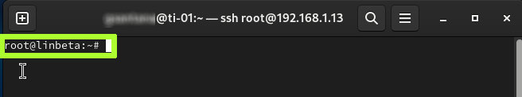

# AJUSTANDO O PROMPT DO TERMINAL
Às vezes o prompt do terminal pode incomodar alguns usuários.  
Por exemplo, é justo que ao logarmos em servidores o terminal revele no prompt o **usuário** e o **nome do computador**:  
  

Porém, ao usarmos o desktop, já sabemos quem somos e qual computador estamos usando.  
Então, vamos ajustar o terminal para que ele **não mostre essas informações**.  

A variável de ambiente responsável por controlar o formato do prompt chama-se **PS1**, e se executarmos no terminal:  
```bash
echo $PS1
```
Veremos o conteúdo dessa váriavel:  
```
\[\e]0;\u@\h: \w\a\]${debian_chroot:+($debian_chroot)}\[\033[01;32m\]\u@\h\[\033[00m\]:\[\033[01;34m\]\w\[\033[00m\]\$
```
Esse é um conjunto de escapes com codigos de cores ANSI para deixar o terminal colorido, voce poderá entender melhor lendo este artigo:  
[https://www.ibm.com/developerworks/linux/library/l-tip-prompt/](https://www.ibm.com/developerworks/linux/library/l-tip-prompt/)  

Por hora, basta saber que podemos modificá-la, por exemplo, ao inves do nosso prompt mostrar `$` no final, podemos fazer mostrar o `> `, basta trocar no final da string:  

```bash
export PS1='\[\e]0;\u@\h: \w\a\]${debian_chroot:+($debian_chroot)}\[\033[01;32m\]\u@\h\[\033[00m\]:\[\033[01;34m\]\w\[\033[00m\]> '
```
Também podemos mudar as cores se você entender o que os mineumonicos significam, veja:
```bash
export PS1='${debian_chroot:+($debian_chroot)}\[\033[32;40m\]\w:\[\033[00m\] '
```
Agora temos um prompt com um visual “old school”, colorido:
  

Na imagem acima, o prompt deixou de mostrar o **usuário** e o **computador**, exibindo apenas o **caminho da pasta atual** em verde.  
Se você não gosta de exibir o caminho completo, pode trocá-lo para algo mais simples substituindo `\w` por `\W`.  
A diferença é que `\W` mostra apenas o nome do diretório atual (sem o caminho completo).  
Muitas pessoas preferem assim, e, quando precisam do caminho completo, usam o comando `pwd`.  

Exemplo de prompt clássico, agora na cor **azul**:
```bash
export PS1='${debian_chroot:+($debian_chroot)}\[\033[01;34m\]\w:\[\033[00m\] '
```
  

Ou o mesmo prompt acima, mas na cor **verde**:
```bash
export PS1='${debian_chroot:+($debian_chroot)}\[\033[32;40m\]\w:\[\033[00m\] '
```
   

Os “:” podem ser trocados por um caractere Unicode mais elegante:
```bash
export PS1="\e[32;40m\w➤\e[00m "
```
  

Bem melhor, não é?  
Há uma página que descreve diversas formas de personalizar o prompt:  
[https://www.ibm.com/developerworks/linux/library/l-tip-prompt/](https://www.ibm.com/developerworks/linux/library/l-tip-prompt/)  

Experimente todas as opções que quiser e, ao final, escolha a que mais combina com você.  

No entanto, não queremos precisar executar `export PS1=...` toda vez que abrirmos o terminal.  
Vamos **automatizar isso**.  

Primeiro, descubra o tipo de terminal que você usa:
```bash
echo $TERM
```

Saída esperada:  
> xterm-256color

Agora que sabemos o tipo de terminal, edite o arquivo `~/.bashrc` (o til representa sua pasta `$HOME`):  
```bash
editor ~/.bashrc
```

Em seguida, adicione no final do arquivo (ou em uma seção adequada, após os `if`s que discriminam terminais coloridos) o seguinte trecho:  
```bash
# Meu ajuste de terminal ao estilo old school
export PS1='${debian_chroot:+($debian_chroot)}\[\033[32;40m\]\w➤\[\033[00m\] '
```

Seu arquivo ficará mais ou menos assim:  
```
(...)   
# User specific aliases and functions  
if [ -d ~/.bashrc.d ]; then  
    for rc in ~/.bashrc.d/*; do  
        if [ -f "$rc" ]; then  
            . "$rc"  
        fi  
    done  
fi  
  
# Meu ajuste de terminal ao estilo old school  
export PS1='${debian_chroot:+($debian_chroot)}\[\033[32;40m\]\w➤\[\033[00m\] '
  
unset rc
```

A partir de agora, toda vez que abrir o terminal, seu prompt será assim:  
  

Muito bacana, hein?  

Mas evite fazer ajustes de prompt em servidores, eles podem não entender bem cores ANSI e UNICODE quando são acessados por SSH. O mais comum para servidores é o bom e trivial:
```
export PS1='\[\e]0;\u@\h: \w\a\]${debian_chroot:+($debian_chroot)}\[\033[01;32m\]\u@\h\[\033[00m\]:\[\033[01;34m\]\W\[\033[00m\]> '
```


----

[Clique aqui para retornar a página principal](../README.md#ajustando-o-prompt-do-terminal)
