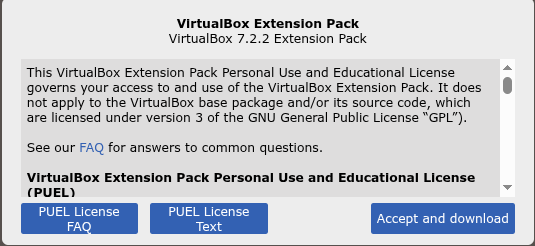

O VirtualBox é outro virtualizador, ele é do tipo "2" e isto significa que é um pouco inferior em performance ao qemu+kvm, no entanto, ele tem muito mais recursos para desktop do que o QEMU+KVM, por exemplo, o SEAMLESS que permite puxar um aplicativo Windows dentro da VM para fora, isto é, para o sistema hospedeiro, causando a impressão que estamos rodando uma aplicação Linux nativa.  
No entanto, ele enfrenta alguns bugs chatos desde que os ambientes Linux estão migrando do Xorg para o Wayland. Alguns são problemas grandes, o SEAMLESS não funciona mais, e outros são problemas aleatórios e irritantes como o conteúdo da área de clipboard entre anfitrião e convidado deixar de funcionar, cursor do mouse que deixa de funcionar e coisas assim. Espero que as próximas versões corrijam isso, afinal o VirtualBox é um bom virtualizador e tem uma opção que qemu+kvm não tem: transportar a VM para outros sistemas operacionais, isto é, você pode copiar a VM criado no Linux para rodar num hospedeiro Windows ou Mac OS.  

Para instalar é fácil, você precisa acessar a página de Downloads do Oracle VirtualBox que começa no link abaixo:  
(https://www.virtualbox.org/)  

Você irá baixar a versão .deb, e dar um duplo clique no arquivo e seguir as instruções na tela.  
Depois de instalado, você volta a página de download e procura por "VirtualBox Extension Pack", baixe ele:  
   

Depois dê duplo clique nele e o próprio VirtualBox o instalará.  
O "VirtualBox Extension Pack" é um pacote adicional oficial da Oracle que amplia as funcionalidades do VirtualBox, adicionando recursos que não vêm na instalação padrão, por exemplo, a VM acessa dispositivos USB mais recentes (pen drives, HDs externos, impressoras, etc.), acesso remoto via VRDP que é similar ao RDP da Microsoft, acesso a WebCAM do hospedeiro, encriptação de disco e tem outras coisas também, mas você terá de ler diretamente no site.    

O "VirtualBox Extension Pack" é gratuito para uso pessoal e educacional, mas tem uma licença diferente chamada de PUEL(Personal Use and Evaluation License) o que impede das distros empacotarem ele ou até remover completamente o VirtualBox de seus repositórios. Se você usar o virtualBox dentro de uma empresa, o **uso pessoal** será questionável.   

Uma vez que tanto o **VirtualBox** como também o **Extension Pack** estão instalados, agora vamos fazer alguns ajustes.   

>**IMPORTANTE**: O principal concorrente do VirtualBox é o **VMWare WorkStation** que recentemente também tornou-se gratuito para alguns fins, se você considera instalá-lo, preciso te alertar, também sofre de alguns bugs nesta transição de Xorg para Wayland. Além disso, é fácil de instalar e complicado de manter já que a cada atualização de kernel, seus módulos precisam ser recompilados e nem sempre funcionam na versão recente. Em distros como 'Debian' ou 'Ubuntu LTS' que tem pouca atualização de kernel - apenas patches - é até um mundo tranquilo para usá-lo, mas em distros _blending-edge_ como o Fedora ou Ubuntu não-LTS, é um inferno.   


### VIRTUALBOX - ACESSO AO GRUPO 'VBOXUSERS'
Você precisa adicionar o usuário ao grupo **vboxusers** para que ele tenha permissão de acessar dispositivos USB, configurar redes em modo bridge e usar outros recursos específicos do VirtualBox. Sem isso, o VirtualBox não consegue gerenciar esses recursos de forma segura e controlada. Assim precisaremos executar:  
```
sudo usermod -a -G vboxusers $USER
```
Para verificar se você mesmo foi incluído no grupo ‘vboxusers’, execute:
```
groups $USER
```
E então, veja o resultado:  
> gsantana : gsantana cdrom floppy audio dip video plugdev users systemd-journal netdev scanner bluetooth lpadmin firebird vboxusers

Se aparecer seu login(gsantana), depois do comando acima, então tá tudo certo, vamos prosseguir.

### VIRTUALBOX - HABILITAR O SERVIÇO 'VBOXDRV'
Para garantir o desempenho consistente do VirtualBox, é essencial iniciar o serviço vboxdrv e configurá-lo para iniciar automaticamente sempre que o sistema inicializar. Isso garante que o VirtualBox esteja sempre pronto para operar sempre que você precisar. Execute o seguinte comando para conseguir isso:  
```
sudo systemctl enable vboxdrv --now
```
Depois disso, vamos conferir:  
```
$ systemctl status vboxdrv
● vboxdrv.service - VirtualBox Linux kernel module
     Loaded: loaded (/usr/lib/virtualbox/vboxdrv.sh; enabled; preset: enabled)
     Active: active (exited) since Wed 2025-10-15 08:50:37 -03; 7h ago
 Invocation: 5bcba9dd3cdc4396a6ab37f00a45c68b
   Mem peak: 26.9M
        CPU: 359ms
```
Se mostrar 'active' então tá tudo certo.  

### VIRTUALBOX - PERMISSÕES DE ACESSO A DISPOSITIVO USB
Sob algumas circunstâncias, o VirtualBox às vezes reclama de não ter acesso aos dispositivos USBs, o 'Extension Pack' deveria resolver isso, mas nem sempre.  
Se você sentir este problema, algo que faço nessas situações é acrescentar uma regra **udev** ajustando as permissões do dispositivo reconhecido, crie o seguinte arquivo:  
```
sudo editor /etc/udev/rules.d/60-vboxusb.rules
```
E insira:  
```
SUBSYSTEM=="usb_device", GROUP="vboxusers", MODE="0664"
SUBSYSTEM=="usb", GROUP="vboxusers", MODE="0664"
```
Salve e feche o arquivo (`Ctrl+O`, `Enter`, `Ctrl+X`). 
E depois recarregue as regras:  
```
sudo udevadm control --reload-rules
sudo udevadm trigger
```
Para testar, plugue um pen drive>abra o menu Dispositivos>USB dentro da janela da VM>selecione seu dispositivo.
Ele deve desaparecer do sistema host e aparecer dentro da VM.  

### VIRTUALBOX - CONFLITO COM A INTEGRAÇÃO DO MOUSE
Pois é, talvez por causa da transição do Xorg para o Wayland, algumas coisas ainda possam apresentar pequenos travamentos ou falhas de integração.
Um problema comum é a perda da integração do mouse dentro da máquina virtual — o ponteiro pode ficar travado, desaparecer ou não responder corretamente, especialmente quando a VM está em tela cheia (Full Screen).  

Quando isso acontecer, uma boa solução é desativar a MiniBarra de Ferramentas do VirtualBox, para isso:   
1. Selecione a sua máquina virtual no VirtualBox.  
2. Vá em Configurações → Interface do Usuário.  
3. Localize a opção MiniBarra de Ferramentas e desative.  
Com isso, a interação entre o mouse e a VM tende a voltar ao normal, mesmo em tela cheia.  

Outro ajuste que ajuda bastante é desativar o recurso de Arrastar e Soltar (Drag and Drop) da VM, para isso, vá em Configurações>Geral>Avançado e, na opção Arrastar e Soltar, selecione **Desligado**.

Com essa configuração, junto com a MiniBarra de Ferramentas desativada, o problema de travamento do mouse praticamente desaparece — mesmo em modo Tela Cheia (Full Screen).


### VIRTUALBOX - CONFLITO COM O QEMU+KVM
Quando você prcisa usar o VirtualBOx e também o QEMU+KVM ocorre um conflito, não é possível usar o **QEMU+KVM** junto ou simultaneamente com o **VirtualBox**, e agora?   
É possivel chavear o uso, isto é, é possivel usar o VirtualBox enquanto não usar QEMU+KVM. Funciona assim, quando você dá boot no sistema, um dos modulos chamados de **kvm_intel** ou **kvm_amd** é carregado e impede qualquer VM do VirtualBox ser iniciada, e aparecerá essa mensagem de erro:  
> VirtualBox can't operate in VMX root mode.  
> Please disable the KVM kernel extension, recompile your kernel and reboot (VERR_VMX_IN_VMX_ROOT_MODE).  
ou:  
> VirtualBox can't enable the AMD-V extension. Please disable the KVM kernel extension, recompile your kernel and reboot (VERR_SVM_IN_USE). Código de Resultado: NS_ERROR_FAILURE (0x80004005)

Então o que precisa fazer é, antes de chamar o VirtualBox, descarregar este modulo da memória, execute:   
```bash
sudo modprobe -r kvm kvm_amd kvm_intel
```
E então veja se os módulos 'kvm_intel' ou 'kvm_amd' sairam da memória, execute:   
```bash
lsmod | grep kvm
```
Mas, se irá usar o VirtualBox por um certo período de tempo é irritante ficar executando os comandos acima todas as vezes, então neste caso, crie/edite o arquivo `blacklist-kvm.conf`, execute:  
```bash
sudo editor /etc/modprobe.d/blacklist-kvm.conf
```
E acrescente as linhas:  
```
# Impede o carregamento automático do KVM para uso do VirtualBox
blacklist kvm
# Para processadores amd:
blacklist kvm_amd
# Para processadores Intel:
blacklist kvm_intel
```
Salve e feche o arquivo (`Ctrl+O`, `Enter`, `Ctrl+X`). 
E depois atualize o `initramfs`:
```bash
sudo update-initramfs -u
```
Depois poderá reiniciar o sistema com 'sudo reboot' e notará que o VirtualBox finalmente conseguirá carregar suas VMs.   
Quando precisar reverter, isto é, usar **QEMU+KVM** apenas comente as linhas no arquivo 'blacklist-kvm.conf' e repita `sudo update-initramfs -u` e depois do boot, estará concluída nossa reversão.  


**Reinicie o computador** e notará que agora é possivel iniciar as VMs dentro do VirtualBox.  
