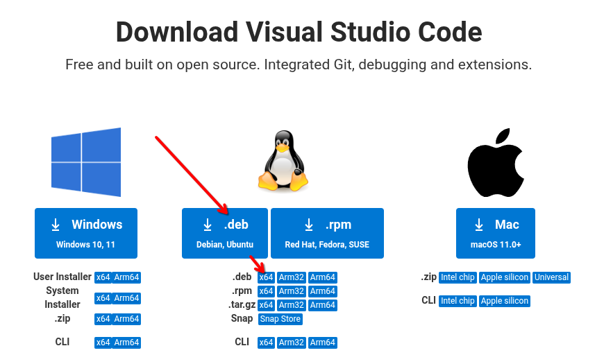

# INSTALANDO O VSCODE
O **Visual Studio Code (VS Code)** é uma IDE leve, poderosa e multiplataforma desenvolvida pela Microsoft.  
Ele combina a simplicidade de um editor de texto com recursos avançados de programação, como **autocompletar inteligente (IntelliSense)**, **depuração integrada**, **controle de versão com Git** e uma ampla variedade de extensões para praticamente qualquer linguagem.  

O VS Code tem uma instalação similar ao Google Chrome e Microsoft Edge, tem um .deb disponivel que ao ser instalado pela primeira vez, também acrescenta o repositório oficial. Então visite a página:   

[Site oficial para download do vscode](https://code.visualstudio.com/download)  
E faça o download da versão .deb que aparece na tela:  
  

Depois, apenas dê um duplo clique no arquivo e siga as instruções na tela e ao final do processo, o vscode estará instalado.  

## EXTENSÕES PARA SQL E GERENCIAMENTO DE BANCOS DE DADOS
Execute no terminal:  

```
code --install-extension mtxr.sqltools \
     --install-extension mtxr.sqltools-driver-mysql \
     --install-extension mtxr.sqltools-driver-pg \
     --install-extension mtxr.sqltools-driver-sqlite \
     --install-extension mtxr.sqltools-driver-firebird \
     --install-extension adpyke.vscode-sql-formatter \
     --install-extension cweijan.vscode-database-client2
```
>**COMO USAR**:   
>Após a instalação, abra o Painel SQLTools (Ctrl+Shift+P → “SQLTools: Show Connections”).   
>Clique em + New Connection e configure o banco desejado (MySQL, PostgreSQL, Firebird etc.).    
>Execute consultas com Ctrl+Alt+E ou usando o menu de contexto “Run Query”.     
>Para múltiplos bancos, o Database Client (de Cweijan) exibe uma interface visual de fácil navegação, inclusive com editor gráfico de tabelas.     
>**Dica**: Se for usar o Firebird, certifique-se de que o cliente isql e o driver libfbclient.so estão instalados no sistema.    

---  

## FREE PASCAL E DELPHI
Caso queira instalar o suporte a pascal no vscode, recomendo que leia as instruções no link abaixo, pois uma de suas seções descreve justamente a personalização do vscode para pascal. Segue o link:   
[Instalando o suporte a pascal no vscode](debian_lazarus.md)     

## EXTENSÕES PARA BASH SCRIPT E TERMINAL
Execute no terminal:  

```
code --install-extension mads-hartmann.bash-ide-vscode \
     --install-extension timonwong.shellcheck \
     --install-extension foxundermoon.shell-format \
     --install-extension formulahendry.code-runner \
     --install-extension jeff-hykin.better-shellscript-syntax \
     --install-extension formulahendry.terminal
```

---   

## CONFIGURAÇÕES RECOMENDADAS  
Após instalar as extensões, adicione estas configurações no arquivo ~/.config/Code/User/settings.json (ou use Ctrl + , → Abrir Configurações JSON):
```
{
  "editor.formatOnSave": true,
  "[shellscript]": {
    "editor.defaultFormatter": "foxundermoon.shell-format"
  },
  "code-runner.executorMap": {
    "bash": "bash"
  },
  "shellformat.flag": "-i 2"
}
```
Essas opções ativam:
* Formatação automática ao salvar
* Execução direta de scripts (Ctrl+Alt+N)
* Indentação de 2 espaços padrão

----

[Clique aqui para retornar a página principal](../README.md#instalando-o-vscode)
